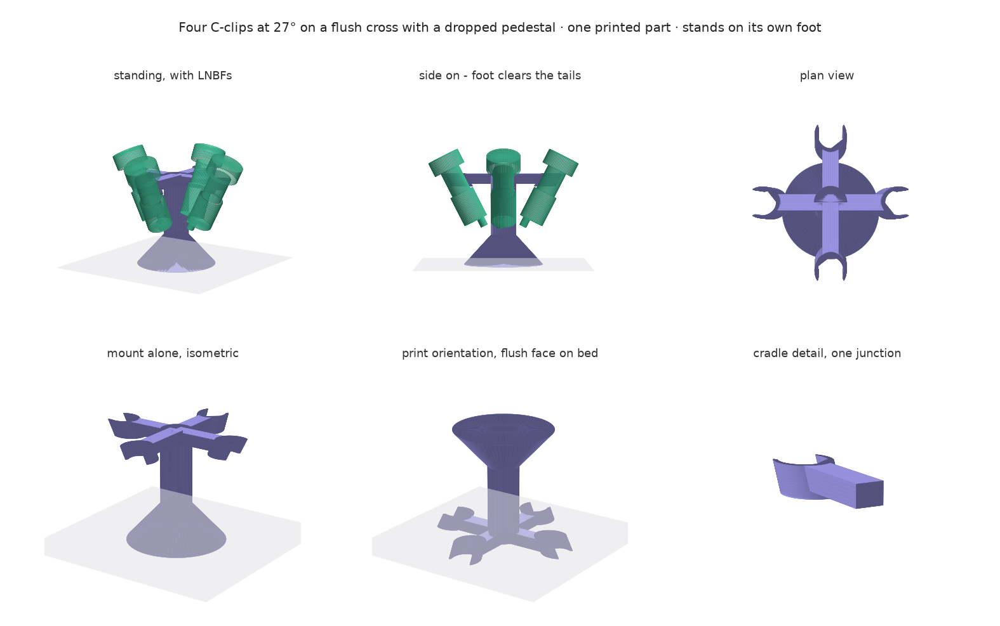

# quad_lnb — four-LNBF all-sky mount

A 3D-printable mount that holds four GEOSATpro UL1PLL Ku-band LNBFs (Ø40 mm feed
neck, no dish) 90° apart in azimuth, each tilted **27° off zenith**. Their broad
feedhorn patterns overlap in a zenith cap and tile the sky into four sectors, so
a LEO track can be handed off between sectors instead of falling off the edge of
one beam. Built for the Starlink Doppler work in this repo — the pointing angles
feed the geometry side of the tracker, which is why the design cares more about
the angles being *known* than about being adjustable.



The whole mount is **one printed part**: four C-clip clamps unioned by a cross
web, with the centre dropped into a pedestal so the assembly stands on its own
foot and holds the LNBFs off the ground. No fasteners, no metal, no supports.
Each LNBF snaps in radially through the mouth of its clamp and is held by
geometry, not by clamping force.

## Contents

| File | What it is |
| --- | --- |
| `assembly.py` | Generates both STLs and the assembly renders |
| `clamp.py` | Renders and documents the clamp geometry (no STL) |
| `quad-clamp.md` | Assembly design notes: cradle, web, why mouths face outward |
| `lnbf-clamp.md` | Clamp design notes: mouth, chamfer, trim, strain |
| **`clamp-fit-test.stl`** | **Print this first.** 12 mm coupon, 7 g, ~15 min |
| **`quad-clamp-print.stl`** | **Then this.** The full mount, on its flush face |
| `test_mesh.py` | Mesh integrity tests — run before trusting an STL |
| `*-views.png`, `*-tilt.png` | Renders, regenerated by the scripts |

Two STLs, in that order. Both come out of `assembly.py`, so the coupon carries
the shipped part's geometry exactly — same bore, same mouth, same chamfer, same
walls. `clamp.py` writes no STL; it renders and documents the clamp geometry
only.

## Regenerating

The scripts are standalone — they build the mesh, write binary STLs and render
the views. Nothing here is imported by `leo_tracker`.

```bash
uv run --with numpy --with matplotlib --with trimesh --with manifold3d \
       --with networkx --with scipy python assembly.py

uv run --with numpy --with trimesh --with manifold3d --with rtree \
       --with networkx --with scipy --with pytest pytest test_mesh.py -v
```

`trimesh` + `manifold3d` do the boolean union; the tests then check the result
is a single watertight solid. **Run the tests after any geometry change** — the
failure mode they catch is invisible in a 3D viewer.

Every dimension is a constant at the top of the script. Change one, re-run, and
it reports the resulting mouth width, grip range, envelope, print height and
mass so you can see immediately whether the change broke something.

## Key numbers

| Property | Value |
| --- | --- |
| Elements | 4 × Ø40 mm D-profile feed neck, 90° apart |
| Tilt | 27° from zenith (63° elevation boresight) |
| Bore-axis spacing | 148 mm adjacent, 210 mm opposite |
| Clamp bore | Ø39.9, 36.6 mm mouth, 241° wrap |
| Land / connector | 35° off inboard (`LAND_AT = -55`) |
| Clamp band | 28 mm, constant — needs 47.3 mm of usable neck |
| Cross web | 24 mm wide × 19 mm deep, 105 mm arms |
| Pedestal | Ø50 × 185 mm tall, solid, flaring to a Ø160 foot |
| Envelope | 237 × 237 × 185 mm (196 mm bed rotated 45°) |
| Ground clearance | 90 mm under the LNBF tails |
| Tip angle | 30.4° at 15% infill |
| Print | 185 mm tall, 953 cm³ solid — **weight is your infill setting** |

## What shapes the design

**The LNBFs set the arm length, not the clamps.** Boresights tilt outward, so
each LNBF body leans *inward* going down and the four tails converge on the
centre. A tail sits 58 mm below its clamp and 30 mm further inboard. At 75 mm
arms the tails land at r = 29 mm, where adjacent bodies overlap each other by
9 mm — the mount could not be assembled. At 105 mm they clear each other by
34 mm and the pedestal by 9 mm. `BODY_D` and `BODY_L` in `assembly.py` are
assumptions about your LNBF; the script reports both clearances every run and
warns below 5 mm.

**The connector direction is set by the land, not by rolling the clamp.** The
neck's flat has to seat on the land, and the connector sits on the flat side, so
wherever the land points is where the coax comes out. `LAND_AT` moves the land
alone: at −90° the connectors aim straight at the mast, and every degree added
swings them away from it. It is currently −55°, i.e. **35° off inboard**.

Rolling the whole clamp instead would work but costs a lot. The mouth would swing
with the land, and the web arm — which always arrives from the centre — would
stop landing on the clamp's stiff back and grip a flexing arm partway along
instead. At 70° of roll that leaves only 50° of arm free to bend, roughly **13×
stiffer**, which wrecks the insertion force and doubles the strain. Moving the
land alone leaves the mouth outboard and the web on the back where it belongs.

**Retention is geometric, so nothing has to stay tight.** A 36.6 mm mouth
against a Ø40 neck leaves 1.7 mm of overhang each side. That is what holds the
LNBF in — not friction and not preload, so nothing is lost when plastic creeps.
The failure mode is not "grip fades" but "the mouth takes a set and widens past
40 mm", which is a single number you can measure. Watch it; replace the part
above ~38.3 mm.

`TIGHTEN` at the top of `assembly.py` takes 0.5 mm off the bore diameter from
the as-tested coupon. It shrinks the whole internal profile together, so the
mouth follows — correct if the coupon was loose because of printer offset, since
that offset lands on bore and mouth alike. The knock-on: capture goes 1.5 → 1.7
mm per side, arm strain 0.35 → 0.40%, insertion force up about 13%.

**The chamfer sits outboard of the constriction, not on it.** A lead-in chamfer
cut into the tips of a 227° wrap eats the bore exactly where it is narrowest — it
raises the effective mouth to 38.7 mm and cuts capture to 0.65 mm, less than half
the grip, from a feature only meant to ease insertion. The wrap is 241° instead,
putting the constriction 7° *inside* the material and letting the chamfer flare
the entry to 39 mm above it. This was found by building the solid and measuring
it, not by inspection.

**The pedestal is modelled solid, and density is a slicer setting.** It used
to carry a 5 mm wall, which baked one particular hollowness into the geometry
and forced anyone who wanted it lighter or heavier to edit the model. A solid
body says what shape the part is; infill says how dense it is. That is the right
split, and it also removes the internal cavity entirely, so there is nothing to
trap water.

The cost is that the number on the box got big — **948 cm³** — so pick infill
deliberately:

| Infill | Weight | Time |
| --- | --- | --- |
| 10% | ~136 g | 12–17 h |
| **15%** | **~204 g** | **19–25 h** |
| 25% | ~340 g | 31–42 h |
| 40% | ~544 g | 49–68 h |

15% is plenty: the pedestal is a compression column carrying under a kilo, and
nothing about the design depends on it being dense.

**The extra mass sits where it helps.** Filling the base moved the loaded centre
of gravity down to 136 mm above the foot, holding the tip angle at **30.4°**
despite the mount being taller. `assembly.py` now computes this from the union's
real centre of mass and the LNBF mass, rather than assuming the mount weighs
nothing.

**The cross gets deeper toward the centre, it does not slope.** The top face
stays flat all the way across; the centre extends *downward* into the column.
Sloping arms would put their upper surfaces in overhang once the part is
inverted for printing — a flat top with a deeper middle prints as a slab with a
column rising out of it. The foot flares only below the LNBF tails, where there
is nothing left to hit.

Ground clearance is set by the coax, not by looks: an F connector and boot need
~40 mm and turning a drip loop needs ~50 more, so the foot sits 90 mm below the
LNBF tails. That raises the CG one-for-one, and foot diameter only helps as a
ratio — Ø160 is what restores the tip angle the shorter version had. The flare is
confined to the bottom 60 mm so the cone does not grow with the column; the cap
is `FOOT_D ≤ PED_D + 2 × FLARE_H` at the 45° overhang limit.

**Both ends of the clamp are cut by horizontal planes, so the band is
constant.** Trimming only the forward end left a wedge: the C-tips ran the full
`LEN_MAX` as long thin prongs while the arm root was starved to `LEN_MAX −
19.3`. Cutting the aft end with a second horizontal plane removes the prongs and,
because both planes are horizontal and the clamp is a prism along the tilted
bore, **the wedge cancels exactly** — every point of the profile spans the same
`CLAMP_W` along the neck.

Two things fall out of that:

- **The whole clamp now lies between the two planes**, so the web can reach its
  back over the full band. `WEB_T_MAX` jumps from 7.8 mm to `CLAMP_W × cos 27° =
  24.9 mm`, and the web goes back to 19 mm — roughly **16× stiffer** arms than
  the single-trim version allowed.
- **The clamp needs more neck**, not less. Its band is 28 mm but it still walks
  19.3 mm along the neck as it wraps, so it occupies **47.3 mm** end to end.
  `NECK_SPAN = CLAMP_W + profile height × tan 27°` is reported every run.

Insertion force rises with the band: uniformly 28 mm of arm width gives about
**63 N**, against 51 N when the root was 22.7 mm. `CLAMP_W` is the knob for both
that and the neck length.

**One horizontal cut makes it printable.** All four clamps' forward ends and the
web's top face lie in a single plane. Flipped onto that plane, every surface is
within 27° of vertical: the bores are near-vertical channels with no ceiling to
bridge, the outer walls overhang at most 27°, and the aft ends are upward-facing
27° slopes. Hence no supports anywhere, and the part comes off the bed already at
its installed angle.

## Printing

Slice `quad-clamp-print.stl` as it comes. **Do not re-orient it** — any other
orientation either needs supports in the bores or puts the clamp arms' bending
stress across layer lines, and they crack at a layer boundary on first insertion.

- 0.2 mm layers, 5 perimeters, 40% infill. The clamp walls are almost all
  perimeter; the web is where infill goes.
- The web forms a solid 19 mm slab in the first layers, so the footprint is large
  and no brim is needed. (The fit-test coupon does need one — its first layer is
  a thin C.)
- PLA is fine for a first article. Outdoors use ASA: PLA's glass transition is
  55–60 °C and a part in direct sun reaches it, after which the arms soften and
  the mount droops permanently. Print light-coloured either way — it is worth
  20–25 K.

### The STL is a real boolean union, and it has to be

An earlier version of this folder shipped the STL as a *soup of overlapping
closed shells* — four clamps, four web arms, a pedestal — on the assumption that
slicers would union them. **They do not, reliably.** Many use the even-odd fill
rule: count surface crossings along a ray, odd means inside. Where two shells
overlap you get two crossings, the count comes out even, and the overlap is
treated as **empty**. The result is holes precisely at the joins — in the rod
where the cross arms meet it, and in the clamp wall where the web buries into it.

Three defects were present, none of them visible in a viewer:

| Defect | Symptom | Why a viewer hides it |
| --- | --- | --- |
| Inverted winding on every clamp shell | volume −14.5 cm³ each | a viewer draws back-faces the same |
| 9 overlapping shells instead of a union | parity read the joins as void | overlapping solids look continuous |
| 144 zero-area triangles | degenerate faces | invisible at any zoom |

`assembly.py` now builds each part as its own shell, runs `fix_normals()`,
drops degenerate faces, and **asserts each shell is watertight with positive
volume before unioning** — hand-winding faces is easy to get backwards and an
inverted shell renders identically to a correct one. The shells are then unioned
with `manifold3d` into one closed solid. Sum of shells is 394 cm³; the union is
349 cm³, and that 45 cm³ difference is exactly the overlap that used to read as
holes.

`test_mesh.py` locks this down: single body, watertight, positive volume, no
degenerate faces, and a set of probe points inside the rod, the arms and the
junctions that must all read solid under both containment *and* raw even-odd
parity.

## Before committing 15 hours of filament

1. **Measure the LNBF.** Three numbers drive the geometry: the usable neck
   between the feedhorn flange and the body (`LEN_MAX`, currently 42 mm — the
   clamp is captured axially between those two features and will not fit at all
   if the neck is shorter), and the body diameter and length below the clamp
   (`BODY_D`, `BODY_L`), which set how far the tails converge and therefore
   `R_ARM`.
2. **Print `clamp-fit-test.stl`** — 7 g, about 15 minutes. It is a 12 mm slice
   of one clamp with the same bore, mouth, chamfer, land and walls, printed the
   same way up, so the bore fit and the mouth-versus-neck geometry are exactly
   what the full part will have. Check that the neck seats, that the mouth
   springs fully back, and that the flat lands on the land.

   **It will feel softer than the real thing.** Arm stiffness scales with axial
   width, and the coupon is 12 mm against 22.5 mm at the real arm root — so the
   full clamp needs roughly **1.9×** the push you feel. The script prints that
   ratio, and it moves if you change `TEST_D` or the trim.

   FDM holes come out 0.1–0.4 mm undersize, so the mouth width is the dimension
   to tune. Tuning it on a 7 g coupon beats discovering it on a 200 g print.
3. **Check the flat's clock position.** The land at the bottom of the bore keys
   the LNBF's roll against the moulded flat on its neck. Mount one LNBF with its
   connector pointing down, see where the flat actually lands, and set `LAND_Y`
   and the clamp's clocking to match.

## Related

`docs/quad-lnbf-mount.md` holds the wider system notes — pointing budget,
GEO-beacon calibration, weatherproofing, cable routing, and what the four
independent LNBF local oscillators mean for cross-sector Doppler continuity.
It predates this folder and its mounting-hardware sections are superseded by the
one-piece design here; the pointing and calibration material still stands.
