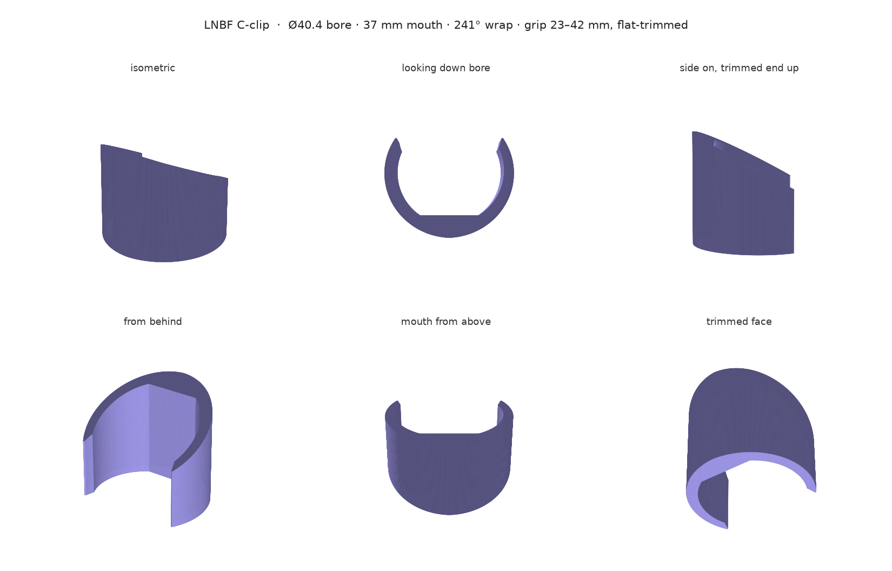
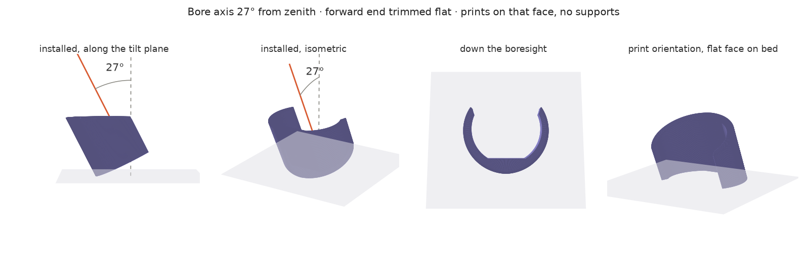

# LNBF clamp — single C-clip, flat-trimmed for supportless printing

A semicircular snap clamp for one GEOSATpro UL1PLL (Ø40 mm feed neck). Push the
neck in through the mouth, it springs closed. The forward end is cut by a
horizontal plane so the part prints on that flat face with no supports and comes
off the bed already at its installed angle.

## Dimensions

| Feature | Value |
| --- | --- |
| Bore | Ø40.4 (for a Ø40.0 neck) |
| Mouth opening | 37 mm between tip inner faces |
| Entry flare | 39 mm at the tips, funnelling down to the 37 mm constriction |
| Wall | 5 mm at bottom dead centre, tapering to 3 mm at the tips |
| Wrap | 241° (tips at ±59° from top) |
| Grip length | 23 mm at the mouth side to 42 mm at the land side |
| Boresight tilt | 27° from zenith (63° elevation) |
| Envelope | 47.4 wide × 37 tall × 42 long |
| Print height | 37.4 mm, first-layer footprint 462 mm² |
| Volume | 13.9 cm³ → ~16 g in PLA |

`clamp.py` builds this geometry and renders it, reporting the resulting mouth,
grip, footprint and mass. It writes no STL — the two printable files both come
from `assembly.py`, so the fit-test coupon cannot drift from the shipped part.

## The four numbers that matter

**Mouth 37 mm against a Ø40 neck.** The 1.5 mm of overhang each side is what
holds the LNBF in. Each arm flexes 1.5 mm on insertion — about 0.29% strain,
comfortably inside what PLA takes repeatedly. Expect roughly 45–55 N to push in
with PLA, 25–30 N with ASA. Check it on a test print; the analytic models bracket
this rather than pin it.

**The wall came down from 6 mm to 5 mm when the clamp was lengthened.** This is
the consequence of extending it that is easy to miss: the flexing arms are now up
to 42 mm wide axially instead of 28, and bending stiffness scales with that
width, so the same wall would have needed ~80 N to open. Thinning the root from
6 to 5 mm cuts stiffness by (5/6)³ and brings it back to ~48 N. It also drops
peak strain from 0.35% to 0.29%, which matters more in PLA than in ASA.

**The chamfer sits outboard of the constriction, not on it.** A lead-in chamfer
cut into the tips of a 227° wrap eats the bore right where it is narrowest: it
raises the effective mouth from 37 to 38.7 mm and cuts capture from 1.5 mm to
0.65 mm — less than half the grip, from a feature only meant to help insertion.
So the wrap is 241° instead, putting the 37 mm constriction 7° *inside* the
material and letting the chamfer flare the entry to 39 mm above it. The neck
funnels in and the retention diameter is untouched. Leave the underside of the
tips square, so it is harder to pull out than to push in.

**`LEN_MAX` must not exceed your usable neck length.** 42 mm is an assumption —
measure the clear neck between the feedhorn flange and the LNBF body before
printing. If it is shorter, drop `LEN_MAX` to match; the trim geometry follows
automatically and the mouth side shortens with it.

## Why the trim works

The cut plane is horizontal in the installed attitude, so once the part is
flipped onto it every surface is within 27° of vertical:

- the bore is a channel 27° off vertical — a near-vertical hole has no ceiling
  to bridge;
- the outer wall overhangs at most 27°, well inside the 45° rule;
- the aft end stays perpendicular to the bore, so it becomes an upward-facing
  27° slope — stair-stepped but supportless.

**27°** is the design point from the 25–30° brief: it puts four boresights 54°
apart, so adjacent patterns cross near their −3 dB contours while all four still
overlap within about 20° of zenith. That overlap is the handoff region.

Four of these on a cross web are in [quad-clamp.md](quad-clamp.md), which is the
part that actually ships. Two things differ there: the mouth points the other
way, because a cross arm arriving from the centre has to land on the closed back
of the ring rather than in the gap; and the walls are 6.0/3.5 mm rather than
5.0/3.0, because flipping the mouth flips which side of the clamp the trim
leaves short, and that side is the arm root. This file documents the standalone
clamp and emits no STL.

The single part is rotated so the **mouth goes uphill and the land downhill**. Gravity's
in-plane component then pushes the neck away from the opening and onto the roll
key rather than toward the mouth — only 0.8 N against ~48 N of ejection
resistance, so it is not what holds the LNBF in, but it is free. The land and its
weep groove end up at the low point and drain, and the connector points 27° off
straight down.

**Axial location changed with the trim.** The forward face is no longer square to
the bore, so it is not a flange seat any more. The LNBF is instead captured
between the feedhorn flange above the clamp and the LNBF body below it — which
works precisely because the neck enters radially through the mouth, so an axial
constraint at both ends does not obstruct assembly. This is why `LEN_MAX`
matters: too long and the clamp will not fit between them at all.

## Optional but cheap

- **Flat land at the bottom of the bore**, 17.2 mm off the axis and 20.4 mm
  wide, matching the flat on the LNBF neck. Stops the LNBF rotating. It sits on
  the long side of the trim, so it keeps close to the full 42 mm of key length.
  Leave it rib-free and rigid.
- **Four axial ribs 0.5 mm proud** elsewhere in the bore, to take up print
  tolerance and stop the LNBF rattling. Not on the land.
- **6 × 2 mm weep groove** down the centre of the land if it will sit outdoors.

## Printing

This file emits no STL. To print, use `clamp-fit-test.stl` (a 12 mm slice of the
shipped clamp) or the full `quad-clamp-print.stl`, both from `assembly.py`. The
orientation rule is the same either way: **the flat face goes on the bed and the
part is not re-oriented.** Any other orientation either needs supports in the
bore or puts the ring arms' bending stress across layer lines, and they crack at
a layer boundary on the first insertion.

- 0.2 mm layers, 5 perimeters, 40% infill. The arms are almost all wall.
- **Use a brim.** The first layer is a thin C only ~4 mm wide in section holding
  up a 37 mm tall part; 462 mm² is not much footprint for that height.
- 37.4 mm tall, about 1.5 hours, ~16 g.
- PLA is fine indoors or for testing. Outdoors use ASA — PLA softens near 55 °C
  and a part in direct sun gets there.
- **Print one and try it on a real neck before printing four.** FDM holes come
  out 0.1–0.4 mm undersize; the mouth width is the number to tune. If it is too
  stiff to push in, thin the tips, not the bottom.
