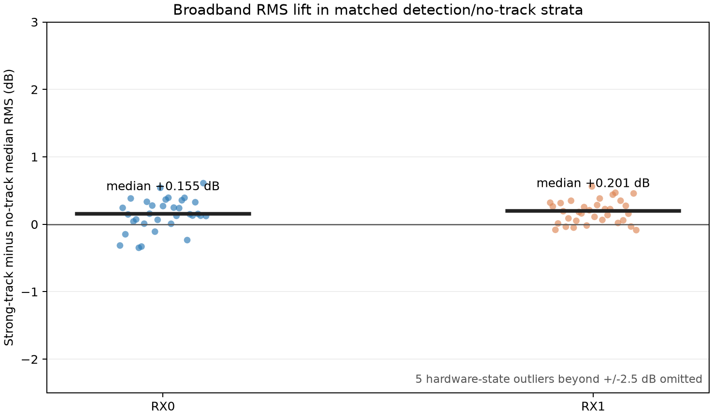
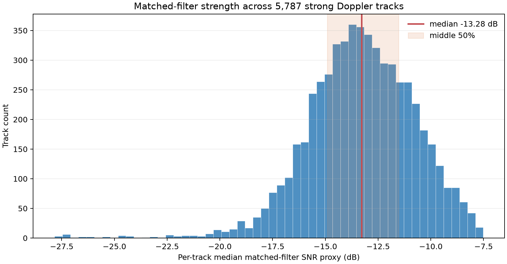
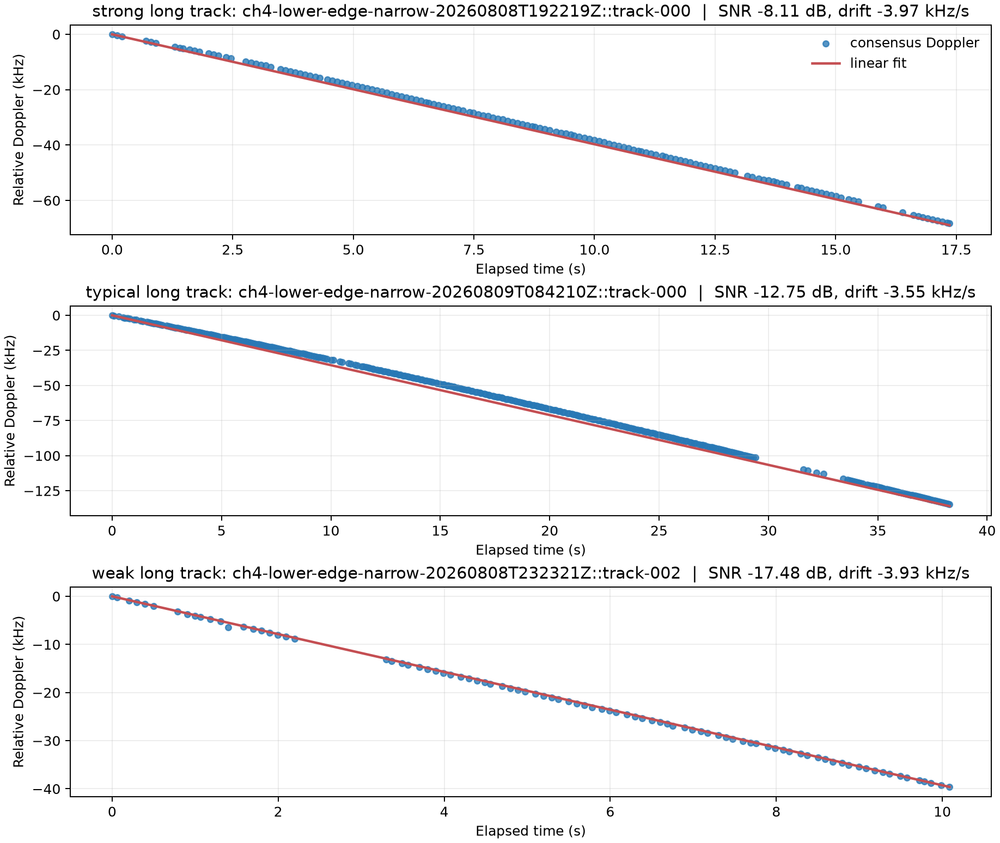
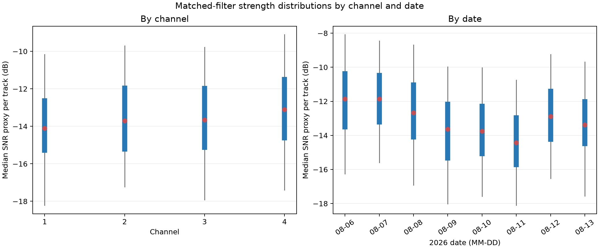

# Starlink-candidate Doppler-track signal strength

Date: 2026-08-17

Source: `/mnt/qnap01/mouse9911/leo/reports/tracks`

Scope: all mounted `*narrow*.json` continuous-track reports available during the scan

## Bottom line

The analysis did not stop at 50 detections. It read 4,761 reports, retained
4,751 unique captures after deduplicating re-analysis, and measured 10,152
continuous track events. Of these, 6,136 contain at least three consensus
Doppler samples and 5,787 also pass the strong dual-receiver gate.

Across those 5,787 strong Doppler tracks, the median formal matched-filter SNR
proxy is **-13.28 dB**. The middle 50% spans **-14.91 to -11.53 dB**, and the
5th-to-95th-percentile range is **-17.47 to -9.26 dB**. In linear terms, the
median proxy is S/N = 0.047: the template-matched component is only about 4.7%
of the residual power in a 1.333 ms frame. Coherent waveform processing is what
makes these signals trackable below the raw noise level.

The best defensible broadband comparison is much smaller. After matching
captures within date, gain mode, radio, channel, and band edge, captures with a
strong Doppler track have a median total-RMS lift of:

| Receiver | Matched median difference | Linear power difference | 95% stratum-bootstrap interval |
|---|---:|---:|---:|
| RX0 | **+0.155 dB** | **+3.6%** | +0.124 to +0.298 dB |
| RX1 | **+0.201 dB** | **+4.7%** | +0.110 to +0.275 dB |

Thus, a useful single-number answer is: **a tracked transmission raises the
whole-capture broadband power by only about 0.18 dB, or roughly 4%, in a typical
matched comparison.** This is a population association, not an event-local
on/off measurement or calibrated satellite flux.



*Each point is one matched date x gain mode x radio x channel x edge stratum.
The horizontal bars are the medians reported above. Five failed or materially
different hardware-state strata beyond +/-2.5 dB are omitted from the displayed
scale but remain in the robust median calculation.*

## Cohort definitions

- `dual_valid`: both receiver inputs validate at least two observations.
- `slope_qualified`: dual-valid, with at least three valid consensus-frequency
  samples from which a Doppler slope can be fitted.
- `strong`: dual-valid and the best weaker-receiver exact-minus-control
  correlation margin is at least 0.10. This is the existing project T3 rule.
- Main cohort: both `strong` and `slope_qualified`, 5,787 events in 2,834
  captures. Every event used the same 2.5 MS/s narrow acquisition rate.

These are distinct continuous pipeline tracks. They are not necessarily 5,787
different satellites: a spacecraft or beam can be detected in more than one
capture, and individual TLE association remains ambiguous.

## Strength distributions



*The broad distribution is centered at -13.28 dB. The shaded interval is the
middle half of the 5,787-event population, not an uncertainty interval on the
median.*

| Event-level metric | p05 | p25 | median | p75 | p95 |
|---|---:|---:|---:|---:|---:|
| Matched-filter SNR proxy (dB) | -17.47 | -14.91 | **-13.28** | -11.53 | -9.26 |
| Exact-template correlation | 0.133 | 0.177 | **0.212** | 0.256 | 0.326 |
| Rolled-template control correlation | 0.0146 | 0.0152 | **0.0155** | 0.0158 | 0.0163 |
| Exact-minus-control margin | 0.118 | 0.161 | **0.196** | 0.241 | 0.310 |
| Exact/control discrimination (dB) | 18.94 | 21.09 | **22.58** | 24.23 | 26.35 |
| Formal frequency uncertainty (Hz) | 33.0 | 44.1 | **54.2** | 67.3 | 99.0 |

The 22.58 dB discrimination is not RF SNR. It says that normalized correlation
with the exact frame template is about 13.5 times the amplitude correlation
with the deliberately rolled control template. It measures waveform
specificity after coherent integration.

## Doppler morphology

| Track metric | p05 | p25 | median | p75 | p95 |
|---|---:|---:|---:|---:|---:|
| Dual-valid duration (s) | 0.50 | 1.50 | **4.09** | 9.23 | 28.58 |
| Fitted drift (kHz/s) | -6.72 | -4.09 | **-3.73** | -3.43 | -2.99 |
| Linear-fit RMS (Hz) | 10.2 | 28.3 | **75.9** | 186.8 | 703.2 |

The slope population is tightly concentrated on LEO-scale negative drifts. Its
median duration is only four seconds, explaining why slope is measurable while
orbital curvature and unique spacecraft identity usually are not.

### Three concrete tracks



| Example | Event | Duration | SNR proxy | Drift | Fit RMS |
|---|---|---:|---:|---:|---:|
| Strong long | `ch4-lower-edge-narrow-20260808T192219Z::track-000` | 17.36 s | -8.11 dB | -3.97 kHz/s | 305 Hz |
| Typical long | `ch4-lower-edge-narrow-20260809T084210Z::track-000` | 38.28 s | -12.75 dB | -3.55 kHz/s | 1,144 Hz |
| Weak long | `ch4-lower-edge-narrow-20260808T232321Z::track-002` | 10.09 s | -17.48 dB | -3.93 kHz/s | 119 Hz |

All three are lower-edge channel-4 tracks. Frequency is plotted relative to
each event's first consensus sample because the absolute offset includes the
LNB/receiver oscillator bias. The weak example is especially instructive: its
power proxy is low, yet its 10-second slope is clean to 119 Hz RMS. Conversely,
the longer typical-strength example has visible gaps and 1.14 kHz fit scatter.
Signal strength and track quality are related, but they are not interchangeable.

## Configuration splits

| Split | Events | Median SNR proxy | Median margin |
|---|---:|---:|---:|
| Channel 1 | 458 | -14.11 dB | 0.178 |
| Channel 2 | 520 | -13.70 dB | 0.186 |
| Channel 3 | 417 | -13.66 dB | 0.188 |
| Channel 4 | 4,392 | -13.10 dB | 0.200 |
| Lower edge | 5,067 | -13.21 dB | 0.198 |
| Upper edge | 720 | -13.84 dB | 0.184 |
| Manual gain | 2,874 | -13.24 dB | 0.197 |
| Slow-attack gain | 2,913 | -13.31 dB | 0.195 |



*Red dots mark medians, thick bars span p25-p75, and thin whiskers span
p05-p95. Channel 4 is somewhat stronger, while the larger date-to-date motion
warns against interpreting the channel split as an EIRP measurement.*

Manual and slow-attack results differ by only 0.06 dB in the normalized
strength proxy, which is reassuring. Channel 4 dominates the population and is
about 0.6-1.0 dB stronger than channels 1-3, but exposure and receiver history
are not balanced enough to interpret that as a channel EIRP difference.

Strength changes by date more than by gain mode: the daily median ranges from
-11.86 dB on August 6-7 to -14.43 dB on August 11. That can include propagation,
beam scheduling, radio assignment, antenna state, and selection changes; it is
not evidence for day-to-day satellite transmitter-power changes by itself.

## Broadband background comparison

Raw pooling is misleading: it gives detected-minus-no-track differences of
-0.060 dB on RX0 and -0.078 dB on RX1 because manual gain, AGC, radio state, and
failed/very-low-power captures are mixed together. The matched result above was
computed separately in 36 strata defined by date x gain mode x radio x channel
x edge, requiring at least five no-track and five strong-track captures per
stratum, then taking the median stratum difference.

A `no-track` capture is only a practical background proxy. It means this
pipeline did not retain a continuous track; it does not prove that the band was
free of Starlink energy. Likewise, capture RMS covers the full sampled band and
the full capture, so a short narrow signal is heavily diluted. The approximately
0.18 dB result should therefore be read as an observed broadband lift associated
with detections, not as carrier-to-noise ratio.

## Relation to the first 2026-08-02 candidate

The first reported dual-LNB candidate showed a 0.41-0.46 dB *depression* in a
stationary-median-subtracted waterfall, reaching 0.9-1.6 dB in its strongest
segment. That detector measured moving novelty relative to a persistent spectral
baseline. The present analysis measures exact-frame correlation and whole-capture
RMS. Their signs and magnitudes are not directly comparable.

The early event was also later downgraded to an externally moving Ku candidate.
The thousands of events here are stronger evidence for a repeatable
waveform-tracking population, but the absence of per-event calibrated power and
unique orbital association still prevents calling these measurements the
transmit power of identified satellites.

## Strongest 50

For auditability, `strongest_50.csv` lists 50 separate slope-qualified events.
Their median SNR proxy is -7.41 dB and their range is -7.92 to -6.41 dB. This is
an intentionally selected tail, not the population estimate: 48 of 50 are
channel 4 and 44 of 50 come from the early single-radio naming epoch.

## Reproduction and artifacts

```bash
find /mnt/qnap01/mouse9911/leo/reports/tracks -maxdepth 1 \
  -type f -name '*narrow*.json' -print0 \
  | tar --null -cf - -T - \
  | .venv/bin/python scripts/doppler-signal-strength-summary.py \
      reports/doppler_signal_strength_20260817
```

- `summary.json`: machine-readable distributions and matched background result.
- `events.csv`: all 10,152 event-level measurements.
- `captures.csv`: all 4,751 deduplicated capture-level measurements.
- `strongest_50.csv`: the requested 50-event audit cohort.
- `strength-distribution.png`: population strength histogram.
- `background-lift.png`: matched capture-RMS comparison.
- `configuration-strength.png`: channel and date quantile comparison.
- `example-tracks.png`: three observation-level Doppler examples.
- `scripts/doppler-signal-strength-summary.py`: reproducible analyzer.
