<!-- GENERATED FILE -- do not edit.

    Sections live in source/sections/*.md and every number is a reference into a
    committed sidecar, resolved by source/build.py.  Edit the templates or the
    facts, then re-run:  python source/build.py build
    To check this file still matches its sources:  python source/build.py check
-->

# Evaluating Starlink edge-pilot detectors with two radios

Date: 2026-08-14 UTC
Status: **the apparatus works; the closed-form coincidence solver brackets
occupancy at moderate and high levels under controlled loopback conditions and
reads low at low occupancy, while the check used to validate it refuses to
certify a correct model at any level and its use on the heterogeneous sky corpus
remains unvalidated; and a cabled injection rig now measures what the
model could only infer, giving a detector ranking — for one test condition — that
matches neither of the rankings this report previously offered**

**How to read this document.** It is written in the order the work happened.
Sections 1–10 are the sky analysis and the contradictions it ran into; sections
11–15 are controlled injection and section 16 returns to the sky with the
instrument calibrated, and together they supersede several of the earlier
conclusions and says so at each point. Where the two disagree, **the injection
sections are current.** Section 9's surviving-findings table carries a status
column for exactly this reason.
## Executive summary

Eight algorithms were built to decide whether a Starlink downlink channel is
lit, by looking for the eight known pilot subcarriers at the channel's band
edge. To rank them you need ground truth. Nothing is injected at this site, so
there is none, and the substitute chosen was two independent radios watching the
same channel at the same instant: if both fire more often than chance, something
was there, and a coincidence model turns the three counted rates into a sky
occupancy `f` and a per-chain detection probability `d`.

Two radios were driven from one process with a barrier at every tuning. 7,054
paired sweeps were captured, shipped byte-verified, imported, and scored. That
part works and is documented in
[section 3](#3-the-apparatus-two-radios-one-instant).

The method it was built to serve does not. The validation offered for the
coincidence model was that the eight algorithms agree on `f`. Run the identical
estimator on two joins where the model is **definitionally false** — radio B
taken two instants later, and radio A joined to a different sweep entirely — and
the eight agree at least as tightly: spread 0.036 on the scrambled join against
0.042 on the real one, each at or below its own sampling noise. The controls
are not demonstrably *tighter* — they are indistinguishable, which is all the
argument needs. Under the model's own separation rule no control separates from
the real join. The check has no failure mode
([section 6](#6-did-it-work-the-negative-controls)).

The reason is measurable. Over 40,256 observations every pair of the eight
detectors makes the same fire / no-fire call at phi 0.841–0.946. They are one
statistic counted eight times, and near-duplicates are obliged to return
near-identical `f` whatever they are fed
([section 7](#7-why-it-failed-the-detectors-are-near-duplicates)).

What survives is observational rather than causal. A channel's own two edges
agree at phi 0.39–0.42, far above any two different channels at 0.02–0.10 once
the acquisition arm is controlled — and that weaker cross-channel term *rises*
with channel separation rather than staying flat, which no uniform common mode
produces and which this report does not explain. Agreement between two chains
varies with receiver configuration, but the design is not factorial and cannot
say whether receiver, radio, edge, water or timing is responsible; the earlier
claim that the LNB was the entire cause is withdrawn in
[section 8](#8-what-the-sky-looks-like). The instrument yields two associations
worth acting on: a scoring-pipeline detection cliff near 350–400 kHz of corrected
offset, and a large positive centre correction on one port without which a
working receiver reads as deaf ([section 9](#9-what-survives-the-instrument)) —
though the specific +604.2 kHz value is itself wrong by 178 kHz, as
[section 16](#16-the-150-khz-measured-four-oscillators-and-what-it-costs) measures.

**Since this report was first written, ground truth arrived.** A cabled
loopback on two bench radios injects the repository's own pilot waveform at a
known amplitude, occupancy and carrier offset, which converts the central
questions from inference into measurement.
[Section 11](#11-ground-truth-at-last-measured-detection-probability) reports
it: the measured detector ranking is uncorrelated with both the model's ranking
(rho −0.048) and the fire-count ranking (+0.048); the coincidence estimator
brackets a known `f` at moderate and high occupancy but reads **low at low
occupancy**, while its diagnostic refuses to certify at any level — so the solver
partly works and the check does not, and nothing here validates the pooled model
on the heterogeneous sky corpus; the 350–400 kHz cliff does not exist against a *known* offset,
falling instead at the 700 kHz bank edge; and the thresholds are calibrated on
truly empty input.

**And the instrument itself is losing detections right now.**
[Section 16](#16-the-150-khz-measured-four-oscillators-and-what-it-costs)
measures each receiver's absolute carrier centre against two independent
populations, finds four independent oscillator errors between −15.3 and
+43.6 ppm — normal hardware, never measured — and shows that correcting each one
separately moves the pooled sky window from a centroid of −130.5 kHz onto
**+3.5 kHz** in an out-of-sample test. Against the calibration in force today all
four ports are miscentred: three by 144–178 kHz, which a controlled contrast
prices at **25.5% of detections lost**, and `lnb-a` by 377 kHz, priced at
**97.2%**. The daily differential calibration cannot measure any of this, and as
written it would erase the fix.

Every `d` in the sections below is a **model output**, never a measurement. It is
inferred from a model whose own consistency check is the one shown above to be
incapable of failing. That caveat is repeated wherever a `d` appears, because it
is load-bearing every time.
## How to read this report

Each numbered section is one idea, one figure, one takeaway, and is meant to be
readable on its own. The detailed experimental record — every intermediate
result, every disagreement between snapshots, the full claim ledger — is
[`reports/sync-scan-cross-radio-2026-08-14/REPORT.md`](../sync-scan-cross-radio-2026-08-14/REPORT.md)
and is not superseded by this document. This is the summary.

**One census note, stated once and then not revisited.** Radio collection was
paused by the operator at 20260814T144922Z, so sweep and pair counts are fixed
and do not move. Scoring has no timer and ran throughout, so the count of
scored sidecars does move. Every figure freezes its own list of scored
sidecars before computing and uses only that list; the four new figure groups
froze at 2,462, 2,544, 2,547 and 2,554 scored sidecars (for the two joining
groups, 2,514 and 2,516 of those sit inside a pair), and the three figures
carried over from the detailed record froze earlier still, at 2,339. A
population size quoted in one section can therefore differ from a neighbouring
section by a percent or two. Nothing here turns on that, no figure mixes
lists, and the range is 2,339–2,554 throughout.

**Which receivers each figure uses.** `lnb-a` was excluded from the original
analysis in error (see
[section 14](#14-the-dead-port-and-the-stale-calibration-are-one-fault)) and has
been restored where restoring it was meaningful. The report therefore moves
between three- and four-receiver populations, and this is the map:

| Figure | Receivers | Why |
|---|---|---|
| `algorithm-correlation`, `channel-edge-correlation`, `edge-agreement`, `coincidence-model`, `f-strata`, `arm-matrix`, `geometry` | **all four** | fire-based; they never touch the frequency-offset axis, so the stale centre could not affect them |
| `port-bias` | **all four** | regenerated with `lnb-a` on its **measured** +567,402 Hz centre |
| `cfo-cliff` | three | offset-binned; built before `lnb-a`'s centre was measured, and its stale +1,170 Hz would have distorted the axis |
| `edge-pilots` | one capture | a single spectrum, not a population |
| `negative-control`, `fire-rate-problem` | three | inherited from the earlier freeze |

**One limitation that does matter, and it constrains how every absolute number
here should be read.** Scoring runs in corpus order, so the scored set is a
*chronological prefix* of the campaign, not a sample of it. The share spans
20260814T000315Z to 20260814T144922Z; of the 13,215 corpus entries only 2,547
carry scores, and the last of them is `sync-20260814T032155Z-pluto-5d4d` —
**nothing after that instant is scored at all**. Every figure in this report
therefore describes the opening stretch of the observing window.

That window is not stationary: the fire rate climbs through it. So: every
*absolute* rate in this report is a property of that opening stretch and
should not be read as a property of the sky in general. Every *comparison* —
between algorithms, between geometries, between joins — is paired inside that
window and is unaffected, which is why the results in sections 6, 7 and 8
stand regardless. It also explains why the census numbers above drift
monotonically rather than randomly: each later batch is later sky, and later
sky was busier.
## The corpus

| Quantity | Measured | Moves? |
|---|---:|---|
| Sweep directories on the scan share | 7,054 | fixed — collection paused |
| — captured with both radios, so pairable | 6,161 | fixed |
| — single-radio, the collector outage | 893 | fixed |
| Corpus entries imported | 13,215 | fixed |
| Scored sidecars at figure-freeze time | 2,339 – 2,554 | grows; scoring is live |
| Paired sweeps the analysis could use | 1,261 at the widest freeze | grows with scoring |
| — same-edge / opposite-edge | 603 / 658 | |
| Matched-arm cells behind the coincidence estimate | 18,176 | |
| Live target observations behind the correlation matrix | 40,256 | |
| Live cross-edge null observations behind the measured false-alarm rate | 15,072 | |
| `lnb-a` observations excluded from the correlation matrix as a dead port — **an error, see below** | 10,064 | |

Four receivers exist; three are live. `lnb-c` and `lnb-d` are the two inputs of
`pluto-19f2`; `lnb-b` and `lnb-a` are the two inputs of `pluto-5d4d`. All four are live in this corpus. `lnb-a` was excluded throughout on the grounds
that it "returns a flat ~1.19 peak-to-median at every tuning since 2026-08-13
04:44 UTC". **That exclusion is wrong for this corpus, and the figures inherit
it.** Re-measured on the same freeze with the repository's own fire logic,
`lnb-a` shows own-edge agreement phi 0.417 against 0.091 across channels (ratio
4.60, indistinguishable from `lnb-c`); a target/null fire ratio *equal* to
`lnb-c`'s; `differential-32` score separation close to `lnb-b`'s; and a coarse
peak-to-median that is not flat, and not distinguishable from `lnb-b`. The
cited 04:44 UTC failure falls inside `pluto-5d4d`'s
20260814T032404Z–20260814T050756Z outage, a window in which
that radio produced no data at all, and the scored corpus stops at
`sync-20260814T032155Z-pluto-5d4d` regardless. Within this corpus `lnb-a` was a
working receiver. Restoring it changes no headline number — redrawing
thresholds with its null included moves every receiver pair by at most
0.0035 — but it supplies the same-model cross-radio contrast that section 8b
needs, and its absence is why that section previously reached a conclusion it
could not support.

Only 1,261 of the 6,161 pairable sweeps have been scored. That gap is the
cheapest available improvement to every number in this report, and it is the
first item in [section 10](#10-what-real-ground-truth-would-take).

---
## 1. Why edge pilots, and why nothing here is visible

Each Starlink downlink channel is 240 MHz wide and carries eight known pilot
subcarriers just inside each band edge. They sit at fixed, published offsets, so
a receiver that can decide whether they are present can decide whether that
channel is lit — and at what frequency offset — without decoding anything. That
is the whole motivation: a cheap, known-code channel-occupancy sensor built out of
one known waveform feature.

**The pilots are not visible in any spectrum in this corpus.** Ranked over all
2,136 target-arm observations in the 640 ms / 10 MS/s arm — the longest probe at
the widest band, ranked by the deployed survey bank's own peak-to-median — the
top-scoring capture puts the 1.875 MHz pilot band **+0.0588 dB** above its own
shoulder, 1 sigma 0.0040 dB over 769 bins. The repository's own noiseless pilot
frame, measured the same way on the same axis, gives **+16.24 dB**. The sky is
about 16 dB below what a spectrum could show. And the next shoulder out sits at
−0.12 dB, so +0.0588 dB is inside this receiver's own passband curvature, not
above it.

There is also almost nothing to resolve even in principle — though not for the
reason first given. The OFDM *useful* interval is the 4.4 us symbol minus its
0.13333 us cyclic prefix, 4.26667 us, whose reciprocal is 234.375 kHz: exactly
the subcarrier spacing, by construction rather than coincidence. Adjacent pilots
are critically spaced, and the empirical consequence stands even though the
arithmetic first offered for it did not. With the noise removed entirely the on-pilot
minus between-pilot contrast in 117.2 kHz windows is **+0.39 dB** — a comb
exists, but a 0.39 dB one; on the real capture it is −0.05 dB. Treat the eight
edge pilots as a 1.875 MHz **block** rather than a resolvable comb: the comb is
real and is simply far too shallow to find a signal by, which is a statement
about this geometry and not about noise.

| Quantity | Value | Source |
|---|---:|---|
| Pilot band | 1.875 MHz | `PILOT_BANDWIDTH_HZ` |
| Pilot subcarriers per edge | 8 | `STARLINK_EDGE_PILOT_SUBCARRIERS` |
| Subcarrier spacing | 234.375 kHz | `STARLINK_SUBCARRIER_SPACING_HZ` |
| OFDM symbol duration | 4.4 us total; useful interval 4.26667 us after the 0.13333 us cyclic prefix, whose reciprocal is 234.375 kHz — exactly the subcarrier spacing | `OFDM_SYMBOL_DURATION_S` |
| Band lift, best of 2,136 real captures | **+0.0588 dB** (1 sigma 0.0040, n = 769 bins) | `edge-pilots.json` |
| Band lift, noiseless reference | **+16.235 dB** | `edge-pilots.json` |
| Next shoulder out, same capture | −0.121 dB | `edge-pilots.json` |
| Comb contrast, noiseless reference | +0.389 dB | `edge-pilots.json` |
| Comb contrast, best real capture | −0.046 dB | `edge-pilots.json` |

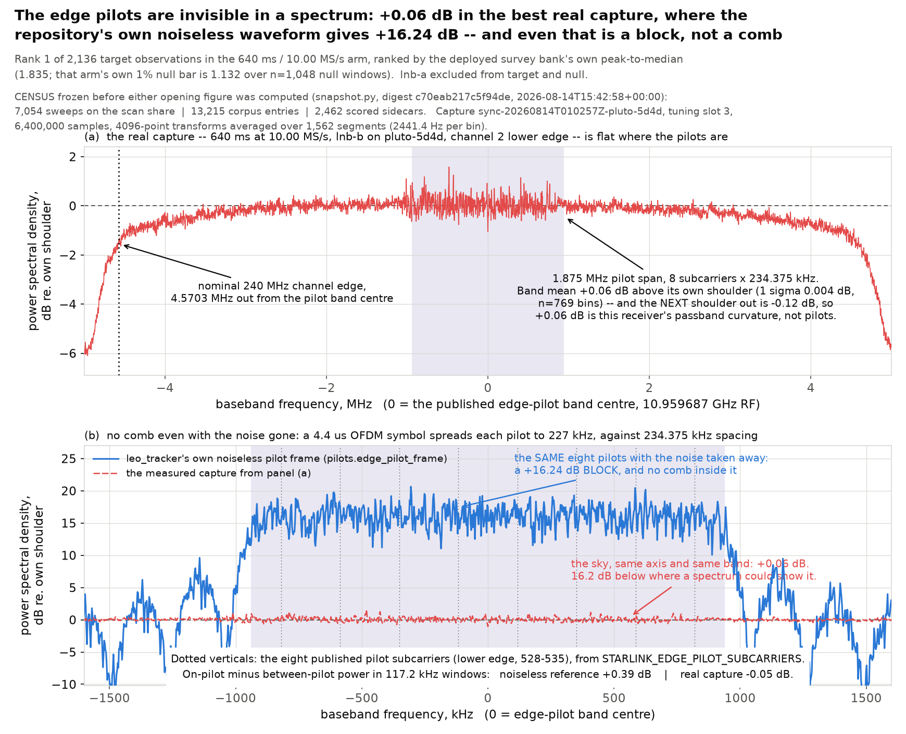

***Figure 1 — there is no picture of the thing being detected.*** *Panel (a):
capture `sync-20260814T010257Z-pluto-5d4d`, tuning slot 3, `lnb-b`, channel 2
lower edge, 640 ms at 10.00 MS/s — 6,400,000 samples, 4096-point transforms
averaged over 1,562 segments at 2441.4 Hz per bin. It is rank 1 of 2,136 target
observations in that arm by the survey bank's own coarse statistic (1.835,
against that arm's own 1% null bar of 1.132 over n = 1,048 null windows). The
shaded 1.875 MHz pilot span is flat. Panel (b): the same band with
`leo_tracker`'s own noiseless `pilots.edge_pilot_frame` overlaid — a +16.24 dB
block with no internal comb, against the sky's +0.06 dB. Dotted verticals are
the eight published lower-edge pilot subcarriers (528–535). `lnb-a` excluded
from target and null. Every plotted value is in
[`figures/edge-pilots.json`](figures/edge-pilots.json).*

**Takeaway.** Every detection in this report is statistical inference beneath
the noise floor. You cannot look at a capture and see whether a detector was
right, which is exactly why ground truth has to be manufactured — the subject of
the next two sections.

---
## 2. The hard part: nothing was injected

No signal of known amplitude was ever put into either front end at this site.
Without an injection there is no known input, so the obvious way to rank
detectors — count how often each one fires on sky — cannot work, and the
measurement shows why.

Across the eight detectors, how often a detector fires on sky tracks how often
it fires on a **measured** cross-edge target-code null: least squares over the eight points
gives slope 1.99, r = 0.84, **r-squared = 0.70**. Roughly two-thirds of the
between-detector spread in fire rate is just the null rate. That fit is eight
points and it moves with the corpus: recomputed independently at two census
sizes spanning one hour of scoring it ranges r-squared 0.69–0.70, so read it as
"about two-thirds", not as 70.5%. `full-frame-full`
fires most on sky (33.30%) and also most on the null (6.74%); `glrt-32` fires
least on both (30.89% and 5.47%). Firing 8% more often may mean 8% more
sensitive or 8% looser, and the count cannot say which.

| Detector | Fires on sky | Fires on the null, measured `p` | Excess | Rank by count | Rank by excess | Rank by model output `d` |
|---|---:|---:|---:|---:|---:|---:|
| `full-frame-full` | 33.30% | 6.74% | 26.56% | 1 | 2 | 7 |
| `full-frame-acquire` | 33.29% | 6.73% | 26.56% | 2 | 3 | 8 |
| `full-frame-verify` | 33.19% | 6.69% | 26.50% | 3 | 4 | 6 |
| `differential-32` | 33.09% | 6.30% | 26.79% | 4 | 1 | 5 |
| `differential-16` | 32.70% | 6.35% | 26.35% | 5 | 5 | 4 |
| `glrt-64` | 31.75% | 6.10% | 25.64% | 6 | 6 | 2 |
| `anchor-8` | 31.18% | 6.30% | 24.89% | 7 | 8 | 3 |
| `glrt-32` | 30.89% | 5.47% | 25.41% | 8 | 7 | 1 |

*n = 30,168 live target observations and 15,072 live cross-edge null
observations. The last column ranks by the mean of d_A and d_B from
`cross_radio.solve_coincidence` on 18,176 joined matched-arm cells — a model
output, from the model whose consistency check is shown to be incapable of
failing in [section 6](#6-did-it-work-the-negative-controls).*

Two of those three rankings are **measurements**, and they agree with each
other: Spearman rho = **+0.833** between rank-by-count and rank-by-excess.
Correcting for the measured cross-edge null rate nudges the order; it does not
overturn it. The one column that overturns it is the model output: rho =
**−0.952** against the fire count and **−0.762** against the excess. `glrt-32`
fires least of the eight and comes out most sensitive.

So the honest statement has two halves, and both matter. **You cannot rank these
detectors by how often they fire.** And **the model that would reorder them has
not earned the right to**, because its own consistency check fails — that is
[section 6](#6-did-it-work-the-negative-controls).

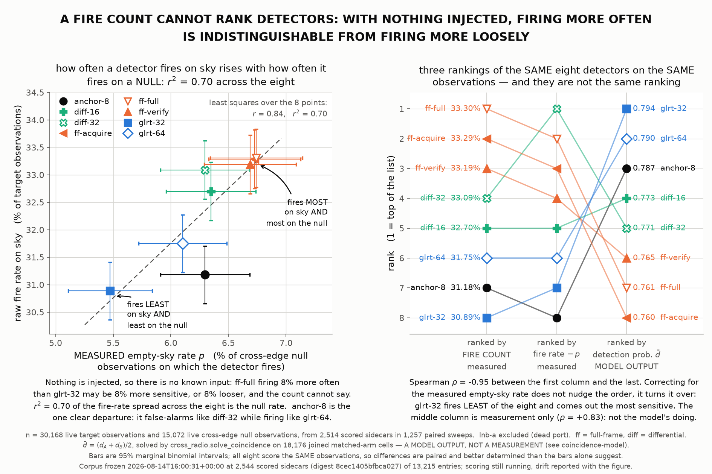

***Figure 2 — a fire count cannot rank detectors when nothing is injected.***
*Left: raw fire rate on sky against the measured cross-edge null rate `p`, one point
per detector, bars are 95% marginal binomial intervals; all eight score the same
observations, so the differences are paired and better determined than the bars
alone suggest. The dashed line is least squares over the eight (r = 0.84,
r-squared = 0.70). `anchor-8` is the one clear departure: it false-alarms like
`differential-32` while firing like `glrt-64`. Right: the same eight ranked
three ways on the same observations. Columns one and two are measurements and
agree at rho = +0.833; column three is a model output and sits at rho = −0.952
against column one. Population: 2,514 scored sidecars in 1,257 paired sweeps,
`lnb-a` excluded. Values in
[`figures/fire-rate-problem.json`](figures/fire-rate-problem.json).*

**Takeaway.** With no injection, a fire count measures the threshold, not the
detector. Ground truth has to come from somewhere else, and the only thing this
site has is a second radio.

---
## 3. The apparatus: two radios, one instant

One collector process opens both Plutos and runs one thread per radio, with a
`threading.Barrier` at every tuning — eight tunings per sweep. Both radios
therefore sit on the same tuning at the same instant. IQ is written straight to
local NVMe, copied to the QNAP share in byte-for-byte verified batches, and
`sweep.json` is written last so its presence is the commit marker.

The design rationale is independence: separate LNBs, separate Plutos, separate
USB controllers on separate buses. Different radios fail independently, so
cross-radio agreement can stand in for the injection this site does not have.
The two receivers *inside* one Pluto share an ADC clock and a bus and do not
qualify — a distinction that turns out to matter in
[section 8](#8-what-the-sky-looks-like).

**How well the two radios are actually aligned is not known, and the recorded
number cannot tell you.** `skew_ms` is stamped at **barrier release** — before
the two threads write their different local-oscillator frequencies, and those
writes take different times. Every recorded value is therefore a **lower bound**
on the sample-start offset that matters.

| Quantity | Measured |
|---|---:|
| Paired tunings measured | 9,712, in 1,214 scored pairs |
| Median | 0.0441 ms |
| p90 / p99 / max | 0.0769 / 2.0203 / 8.3409 ms |
| Beyond the 0.054 ms design bound | 2,820 (29.04%), in 1,015 of 1,214 sweeps |
| Median, same-edge sweeps (n = 4,624) | 0.0437 ms |
| Median, opposite-edge sweeps (n = 5,088) | 0.0446 ms |
| Ratio between the two geometries, as recorded | **1.02x** |
| True sample-start offset, per the share README | 0.2–0.8 ms same-order, ~4 ms opposite-order — **~5x** |
| Manifest / scan-share copies of every per-tuning skew that disagree | 0 |

The last three rows are the important ones. The recorded skew is **blind to the
very axis it would be used to stratify on**: barrier-release skew differs
between the two geometries by 1.02x, while the README puts the true offset
between them at about 5x. Any analysis that splits cells on "within the design
bound" against "beyond it" cannot see the effect it means to bound, and no such
split appears in this report.

The provenance of that claim is worth stating plainly too: `leo_tracker`'s own
`synchronised_scan.sweep_skew_event()` **refuses to certify** the basis for this
corpus. It raises on all 1,214 paired sweeps, because the collector wrote
`leo-tracker.interim-synchronised-scan/v1` — a schema that names no `skew.event`
and is not one of the two versions the function recognises. 2,428 paired
manifests carry a `skew_basis` field that says barrier release, and the share
README says so in prose. The claim rests on those, not on code.

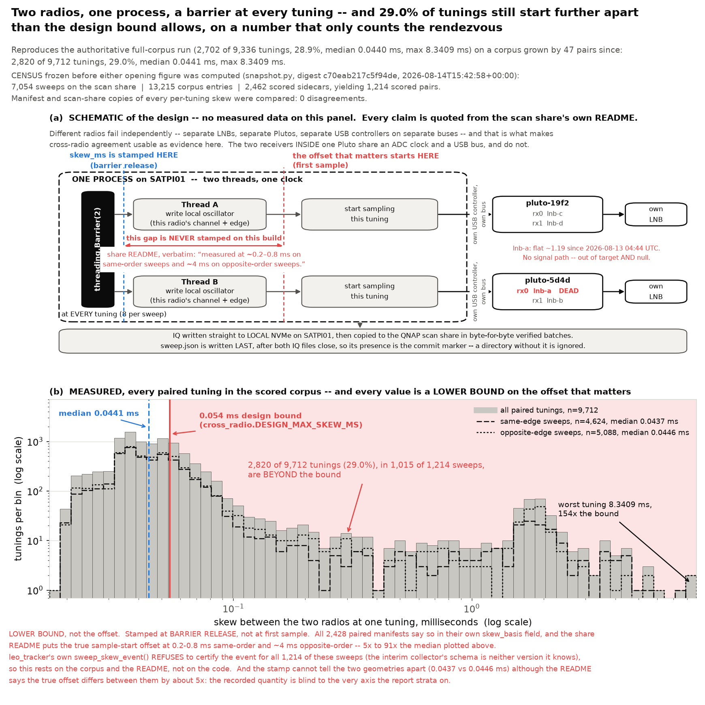

***Figure 3 — the apparatus works, and the number that would prove it measures
the wrong event.*** *Panel (a) is a schematic — no measured data — showing where
`skew_ms` is stamped (barrier release) against where the offset that matters
begins (first sample); the gap between them is never stamped on this build.
Panel (b) is every paired tuning in the scored corpus, log-binned, split by
geometry. It reproduces the authoritative full-corpus run (2,702 of 9,336
tunings, 28.9%, median 0.0440 ms, max 8.3409 ms) on a corpus grown by 47 pairs
since: 2,820 of 9,712, 29.0%, median 0.0441 ms, max 8.3409 ms — the worst tuning
is 154x the design bound. Values in
[`figures/apparatus.json`](figures/apparatus.json).*

**Takeaway.** The apparatus does put two radios on one tuning at one instant and
records it reproducibly. The one number that would say how tightly is measuring
the rendezvous, not the radios, and cannot distinguish the two geometries the
experiment was built to compare.

---
## 4. The dataset: twelve arms, and two geometries for free

Twelve arms cross probe length {80, 160, 640} ms with sample rate
{1.25, 2.5, 5.0, 10.0} MS/s, drawn uniformly per sweep. Both radios take the
same arm on most sweeps by design; the rest put two different
configurations on the same sky at the same instant.

**The randomisation came out flat.** 6,364 of 7,054 captured sweeps put both
radios on the same arm — 90.2%. Per-arm counts run 508–575
against a uniform expectation of 530.3; chi-square 6.99 on 11 degrees of
freedom, Monte-Carlo p = **0.80** over 20,000 draws. No arm was starved.

| arm | probe (ms) | rate (MS/s) | sweeps, both radios | solo captures | samples/tuning | IQ bytes per radio | pilot guard (kHz) | pilot band fits | imported pairs | scored pairs |
|---|---:|---:|---:|---:|---:|---:|---:|:--:|---:|---:|
| 80ms-1.25MSps | 80 | 1.25 | 540 | 106 | 100,000 | 6,400,000 | −312.5 | NO | 469 | 103 |
| 80ms-2.50MSps | 80 | 2.5 | 536 | 133 | 200,000 | 12,800,000 | +312.5 | yes | 465 | 87 |
| 80ms-5.00MSps | 80 | 5 | 523 | 105 | 400,000 | 25,600,000 | +1562.5 | yes | 447 | 109 |
| 80ms-10.00MSps | 80 | 10 | 517 | 103 | 800,000 | 51,200,000 | +4062.5 | yes | 451 | 88 |
| 160ms-1.25MSps | 160 | 1.25 | 528 | 109 | 200,000 | 12,800,000 | −312.5 | NO | 460 | 96 |
| 160ms-2.50MSps | 160 | 2.5 | 527 | 118 | 400,000 | 25,600,000 | +312.5 | yes | 475 | 96 |
| 160ms-5.00MSps | 160 | 5 | 575 | 116 | 800,000 | 51,200,000 | +1562.5 | yes | 509 | 106 |
| 160ms-10.00MSps | 160 | 10 | 542 | 121 | 1,600,000 | 102,400,000 | +4062.5 | yes | 477 | 95 |
| 640ms-1.25MSps | 640 | 1.25 | 541 | 121 | 800,000 | 51,200,000 | −312.5 | NO | 460 | 97 |
| 640ms-2.50MSps | 640 | 2.5 | 508 | 124 | 1,600,000 | 102,400,000 | +312.5 | yes | 453 | 73 |
| 640ms-5.00MSps | 640 | 5 | 517 | 107 | 3,200,000 | 204,800,000 | +1562.5 | yes | 447 | 96 |
| 640ms-10.00MSps | 640 | 10 | 510 | 117 | 6,400,000 | 409,600,000 | +4062.5 | yes | 437 | 94 |

One column is handicapped, and it is handicapped by physics rather than by
sampling. A 1.25 MS/s capture is only 1.25 MHz wide, so the 1.875 MHz band the
detectors correlate against cannot fit inside it at any probe length: the pilot
guard is −312.5 kHz and `pilot_band_fits` is false at all three probe lengths.
That column was drawn as often as any other — 540, 528 and 541 sweeps. The
authoritative full-corpus run puts 1.25 MS/s at 80 ms at the bottom of the arm
axis, f = 0.120 on 1,504 cells with only 6 of 8 algorithms solvable, against
f = 0.525 for 10 MS/s at 80 ms, over an arm axis spanning f 0.12–0.525 on 16,864
cells.

**And that column had a second handicap nobody recorded.** On
2026-08-15T04:16:20+00:00, after both radios were unplugged and re-attached, every
1.25 MS/s draw began failing outright — `EINVAL` on the write of
`sampling_frequency` — while every other rate kept working. Probing the parts
directly, both refuse 1.25 MS/s and both refuse
2083.3 kHz, which is the AD9361's own floor: its minimum ADC rate
over the largest decimation it can do without a filter. Going below that needs a
**decimating FIR in the receive path**, and both parts report
`FIR Rx: 0,0 Tx: 0,0` — none loaded.

So this column only ever worked because some earlier tool had left a filter in
the part, and re-plugging cleared it. The consequence for the corpus is not
operational but analytical: **the 1.25 MS/s captures went through a
receive chain no other arm had, and its coefficients were never recorded.**
`collect_radio` writes `sampling_frequency` and `rf_bandwidth` and reads back
neither; the collector records neither. The arm this section already calls
handicapped by arithmetic turns out to be handicapped a second time, by a filter
that cannot now be reconstructed. Treat its results as indicative at best, and
do not read the arm axis as a clean sample-rate ladder at its bottom rung.
Values in [`figures/rate-limits.json`](figures/rate-limits.json).

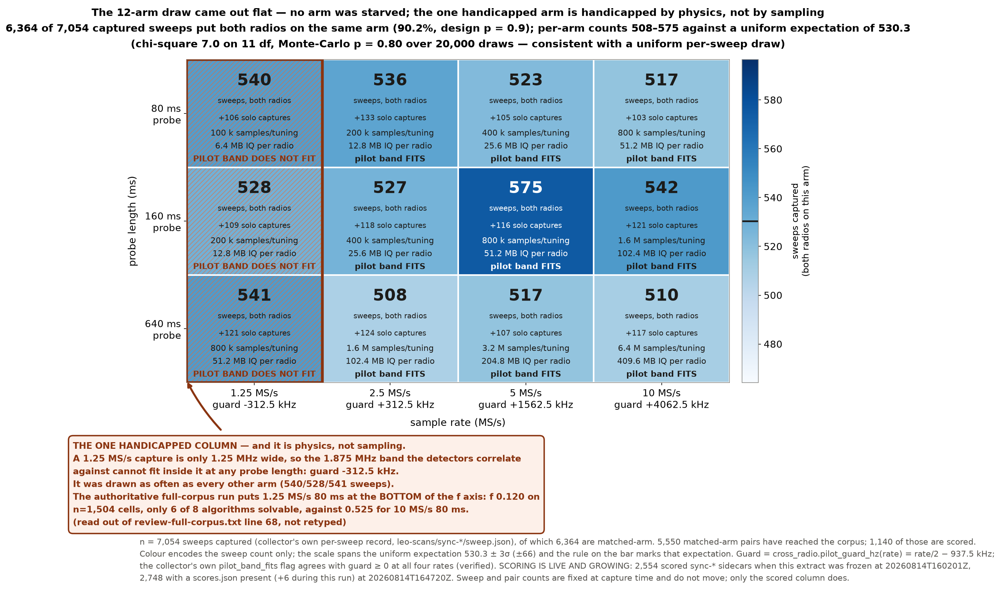

***Figure 4 — the draw was flat; one column is beaten by arithmetic.*** *Each
cell carries the sweeps captured with both radios on that arm, the solo captures
beside them, the sample and byte budget per radio, and the pilot-band verdict.
Colour encodes the sweep count only, on a scale spanning the uniform expectation
530.3 ± 3 sigma. The three hatched cells are the 1.25 MS/s column: guard =
rate/2 − 937.5 kHz, negative at that rate at every probe length, and the
collector's own `pilot_band_fits` flag agrees with the recomputed guard at all
four rates. Values in [`figures/arm-matrix.json`](figures/arm-matrix.json).*

**Two geometries came free.** Each radio draws its edge order (`L` or `U`)
independently every sweep, so the pair lands in one of two geometries by chance.
**Same-edge** puts both radios on one tuning at every instant: replication — do
two chains agree about this tuning? **Opposite-edge** splits them across one
channel's two edges at every instant: simultaneity across a channel — was the
whole channel live at this instant? Neither question can be asked of the other's
sweeps, and opposite-edge cannot replicate, because the chains never share a
tuning, so a disagreement there is not evidence that either chain is wrong.

| Population | n | same-edge | opposite-edge | same-edge share |
|---|---:|---:|---:|---:|
| Sweeps captured by the collector | 7,054 | 3,461 | 3,593 | 49.06% |
| Pairs imported to the corpus | 6,161 | 3,002 | 3,159 | 48.73% |
| Pairs scored — the analysable set | 1,261 | 603 | 658 | 47.82% |
| Cross-radio cells, scored | 20,176 | 9,648 | 10,528 | |

The draw really is a coin flip: 49.06% same-edge over 7,054 sweeps, two-sided
Monte-Carlo p = **0.12** against a fair 50% over 20,000 draws. Per-radio
edge-order counts are 3,539 / 3,515 and 3,516 / 3,538. Geometry derived from the
recorded sample orders agrees with the declared `edge_order` letter on **6,161
of 6,161** pairs, with exactly two distinct sample orders present in the corpus,
8 instants per sweep and 2 live receiver pairs per pair.

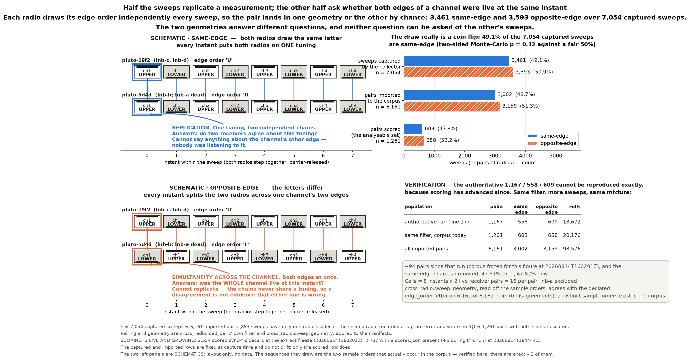

***Figure 5 — half the sweeps replicate; the other half ask a different
question.*** *Left panels are schematics of the two sample orders that actually
occur in the corpus (verified: there are exactly two). Right panels are the
counts at each stage — captured, imported, scored — with the geometry mixture
unmoved at every stage, and a verification against the authoritative run's
1,167 / 558 / 609 line: same filter, 94 more pairs, same-edge share 47.81% then
and 47.82% now. Values in [`figures/geometry.json`](figures/geometry.json).*

**Takeaway.** The dataset is balanced across arms and geometries by
construction rather than by luck, and the two geometries are the only lever this
corpus has on simultaneity — the recorded skew, from
[section 3](#3-the-apparatus-two-radios-one-instant), is not one.

---
## 5. Ground truth by coincidence: the model

Two chains that share only the sky are the substitute for injection. Let a sky
cell — one channel edge at one instant — be occupied with probability `f`. Chain
A detects an occupied cell with probability d_A, chain B with d_B, and either
chain still fires on an *empty* cell with probability `p`. Then:

```
P(A)  = f * d_A + (1 - f) * p
P(B)  = f * d_B + (1 - f) * p
P(AB) = f * d_A * d_B + (1 - f) * p^2
```

`P(A)`, `P(B)` and `P(AB)` are **counted** on the corpus. `p` is **measured**,
per cell, on the cross-edge null arm. Three equations, three unknowns, and out
come `f`, d_A and d_B: a detection probability with no known input anywhere.
That is the substitute for the injection this corpus never had — a substitute,
not an equal. Injection measures `d` against a signal you put there; this
**infers** `d` from an assumption that the two chains fail independently. If
that assumption is wrong, so is every `d` beside it.

The model carries its own consistency check, and it is sharp: **`f` is a
property of the sky.** All eight detectors read the same sky at the same
instant, so all eight must return the same `f`. The spread across the eight is
the check.

| Detector | measured `p` | `f` | d_A | d_B |
|---|---:|---:|---:|---:|
| `anchor-8` | 6.33% | 0.3313 | 0.8373 | 0.7127 |
| `glrt-32` | 5.50% | 0.3322 | 0.8427 | 0.7195 |
| `glrt-64` | 6.07% | 0.3417 | 0.8378 | 0.7131 |
| `differential-16` | 6.30% | 0.3626 | 0.8132 | 0.7004 |
| `differential-32` | 6.26% | 0.3701 | 0.8109 | 0.6950 |
| `full-frame-verify` | 6.69% | 0.3692 | 0.8075 | 0.6896 |
| `full-frame-full` | 6.75% | 0.3722 | 0.8023 | 0.6892 |
| `full-frame-acquire` | 6.73% | 0.3706 | 0.8016 | 0.6911 |
| **range over the eight** | **5.50–6.75%** | **0.3313–0.3722, spread 0.0408** | **0.802–0.843** | **0.689–0.720** |

*36,384 joined matched-arm cells across four receiver pairs, `lnb-a` included;
`p` measured per detector on the live cross-edge null observations. **Every d_A
and d_B in this table is a model output, never checked against a known input.**
The model's own consistency check is
[section 6](#6-did-it-work-the-negative-controls), and it fails.*

Two things are worth reading off that table before going further.

**The null rate is measured per cell, and the units matter.** A per-*point* 1.0%
threshold, maximised over roughly 6.8 candidate points to decide one tuning,
predicts 1 − 0.99^6.8 = 6.6% per cell. The measured 5.50–6.75% is therefore what
correct calibration looks like, not a broken threshold — framing it as "6%, not
the nominal 1%" implied a defect that is not there. What does matter is that
every `d` above depends on this denominator, and that assuming the per-point
figure at cell level pushes methods out of physical range for reasons unrelated
to the methods. Two caveats travel with it: this is the **cross-edge
target-code null**, target-code-free by construction rather than physically
empty sky, and it may still hold other Starlink energy, interference and
receiver structure; and the calibration is **in-sample**, since the same null
population sets the threshold and then measures the rate.

**The one sky parameter does not come out as one number.** Pooled, the eight
return `f` 0.3313–0.3722, a spread of 0.0408. That is the model's own check,
already unmet. And the extremes move with geometry rather than sitting on one
misbehaving algorithm: on opposite-edge cells the minimum is `glrt-32` at 0.3375
(spread 0.0423 over 19,136 cells); on same-edge cells the minimum is `anchor-8`
at 0.3195 (spread 0.0458 over 17,248 cells). Near-identical spread, different
argument minimum. The invariance failure is a property of the estimate, not of
one algorithm.

The solver reproduces the authoritative full-corpus run closely on the
opposite-edge cells: `anchor-8` f 0.3420 against 0.346 reported, `glrt-32`
0.3375 against 0.344, `full-frame-full` 0.3799 against 0.388 — every `f` within
0.0081.

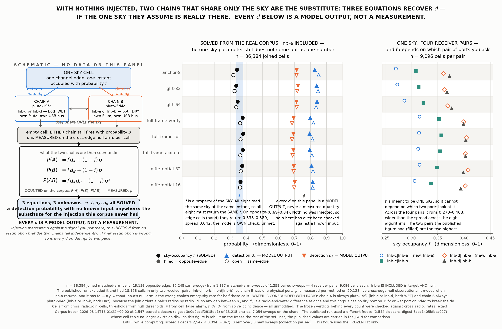

***Figure 6 — three equations recover `d`, if the one sky they assume is really
there.*** *Left panel is a schematic — no data — of the model and of what is
counted, measured and solved. Right panel is the solution per detector, split by
geometry (filled = opposite-edge, open = same-edge): sky occupancy `f` in the
narrow band on the left, and d_A / d_B at 0.68–0.85 on the right. Every point on
the right half of that panel is a model output. n = 36,384 joined matched-arm
cells (19,136 opposite-edge, 17,248 same-edge) from 1,137 matched-arm sweeps of
1,258 paired. Values in
[`figures/coincidence-model.json`](figures/coincidence-model.json).*

**Takeaway.** The model is solvable and returns physically plausible numbers.
Whether it is *entitled* to is a separate question, and it has a direct
experimental answer.

---

### 5b. What the model assumes, and what this corpus already contradicts

The implementation passes **one pooled `p`** to both chains, uses **`p^2`** for
joint null firing rather than a measured joint null, and fits **one `d_A`, `d_B`
pair across every included cell**. That requires:

| Assumption | Status in this corpus |
|---|---|
| Both chains share one false-alarm rate | contradicted — `p` runs 5.50–6.75% across methods and varies by receiver |
| False alarms independent across chains, so joint null firing is `p^2` | untested; common interference or shared receiver structure would break it |
| `d` constant across acquisition arms | contradicted — `f` moves 0.120 to 0.525 across the twelve arms |
| `d` constant across receivers, channels and time | contradicted on all three — see 8b, 8a, and the fire-rate swing across the window |
| Detections conditionally independent given occupancy | untestable here; latent signal-strength variation alone would break it |

Pooling heterogeneous strata can generate covariance and distort `f`, `d_A` and
`d_B` even when the chains are conditionally independent *within* each
homogeneous stratum. A version worth trusting would need separate `p_A` and
`p_B`, arm- and receiver-specific parameters, sweep-level effects, and probably
a hierarchical treatment of latent signal strength.

None of this weakens section 6 — it is a second, independent reason not to read
the `d` values as measurements.
## 6. Did it work? The negative controls

This is the test that decides the report, and it is cheap: build joins where the
coincidence model is **definitionally false**, run the identical estimator, and
see whether the consistency check notices.

Two controls, alongside the real join:

- **Shifted** — radio B taken two instants later within the same sweep. The two
  sides are then on different tunings, so there is no shared sky cell and the
  model cannot hold.
- **Scrambled** — radio A of one sweep joined to radio B of a *different* sweep,
  matched on arm and geometry, with only the pairing broken. Partners are a
  median 4,847 s apart (minimum 3,651 s, maximum 7,130 s), so the two sides
  never saw the sky at the same time.

Thresholds and the cross-edge null rate `p` are drawn **once** from the cross-edge
null arms and held fixed across all three joins, so the join is the only thing
that changes.

| Join | Model can hold? | Cells | `f` range | mean `f` | Spread across the eight | Resample p05–p95 | Spread over its own noise median |
|---|---|---:|---|---:|---:|---|---:|
| **Real** — radio A and radio B of one sweep, same instant | yes | 16,560 | 0.334–0.376 | 0.358 | **0.042** | 0.039–0.049 | 0.97x |
| **Shifted** — radio B at instant *i*+2 | **no** | 16,560 | 0.657–0.697 | 0.679 | **0.040** | 0.031–0.053 | 0.97x |
| **Scrambled** — radio A joined to another sweep | **no** | 16,560 | 0.782–0.818 | 0.798 | **0.036** | 0.025–0.057 | 0.95x |

Read the three spread columns. The quantity offered as validation — the
tightness of the eight algorithms' agreement on `f` — is **smallest on the join
where the model is most obviously false**. Every join's observed spread sits at or below
its own sampling-noise median. There is no failure mode: whatever you feed this
check, it passes.

The result is not that the estimator returns the same answer three times. `f`
itself moves **2.23x** across the joins, 0.358 to 0.679 to 0.798, so these really
are different data and the estimator really is responding to them. What does not
move is the thing being used as evidence.

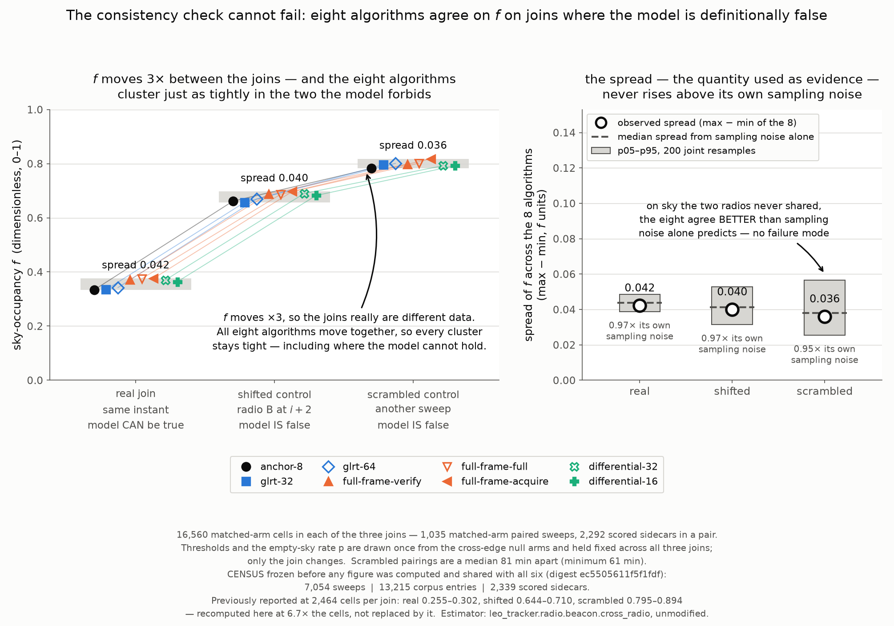

***Figure 7 — the consistency check cannot fail.*** *Same estimator, same 16,560
matched-arm cells in each of the three joins, same thresholds and same empty-sky
rate; only the pairing changes. Left: `f` moves 2.23x across the joins while all
eight algorithms move together, so every cluster stays tight — including on the
two joins the model forbids. Right: each join's observed spread against the
p05–p95 band of 200 joint resamples of that same join, with the noise median
marked; all three land at or below their own noise median, the scrambled join
furthest below at 0.95x. Population: 1,035 matched-arm paired sweeps, 2,292
scored sidecars in a pair. Estimator
`leo_tracker.radio.beacon.cross_radio`, unmodified. Values in
[`figures/negative-control.json`](figures/negative-control.json).*

**Takeaway.** Cross-detector agreement on `f` is not evidence for the
coincidence model, and the cross-radio apparatus has not been shown to deliver
the ground truth it was built to deliver. Every `d` anywhere in this report is a
model output from this model. Most detector comparisons never run this control.
This one did, and it came back negative — that is the contribution.

---
## 7. Why it failed: the detectors are near-duplicates

The negative control is not a surprise once you look at the detectors
themselves. Over **40,256** live target observations with all four receivers
included — every observation carrying all eight verdicts, none missing — every
pair of the eight makes the same fire / no-fire call at phi **0.841–0.946**.

| Pair | phi |
|---|---:|
| Loosest pair anywhere in the matrix: `anchor-8` / `differential-16` | 0.841 |
| Tightest pair anywhere: `full-frame-full` / `full-frame-verify` | 0.946 |
| `glrt-32` / `glrt-64` | 0.935 |
| `differential-16` / `differential-32` | 0.915 |
| Mean over all 28 pairs | 0.885 |
| Band previously reported, on 2,160 observations | 0.82–0.94 |
| Band here, on 40,256 observations (18.6x) | **0.841–0.946** |

Note what this does *not* say. Detectors with statistically independent errors
are still positively correlated whenever both have skill, because they observe
the same latent occupancy: Cov(Y1,Y2) = f(1−f)(d1−p1)(d2−p2) > 0. A high phi is
therefore expected, and does not by itself prove shared errors — "one statistic
counted eight times" overstates it. What the band establishes is that the eight
produce **highly redundant binary verdicts on identical IQ** and cannot be
treated as eight independent witnesses for validating `f`. Separating shared
truth from shared error needs correlations on the null arm, conditional on arm,
receiver and time block, or against injected truth. At 19x the observations the
band is **wider at the bottom** than previously reported, so this is not a
small-sample artefact being sanded down — it firms up. Grouping by family barely
matters: the same-family blocks hold the tightest pairs, but no pair anywhere in
the matrix falls below 0.841.

That is the mechanism behind
[section 6](#6-did-it-work-the-negative-controls). Near-duplicate detectors are
**obliged** to return near-identical `f` whatever they are fed, including inputs
where the model being validated is known to be false. The consistency check was
never testing the model; it was testing whether eight copies of one statistic
agree with each other, and they do.

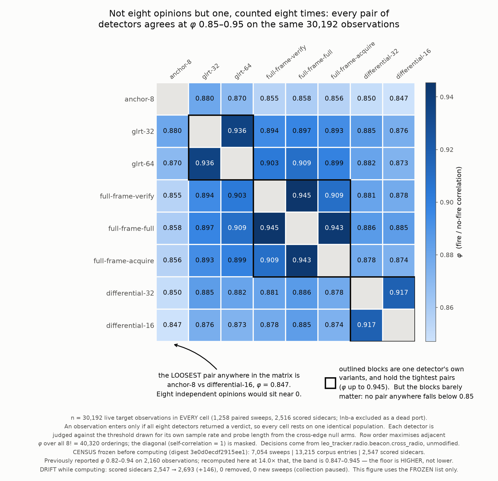

***Figure 8 — not eight opinions but one, counted eight times.*** *phi between
every pair of the eight confirmers on the same 40,256 live target observations
(1,258 paired sweeps, 2,516 scored sidecars). An observation enters only if all
eight detectors returned a verdict, so every cell rests on one identical
population. Each detector is judged against the threshold drawn for its own
sample rate and probe length from the cross-edge null arms. Row order maximises
adjacent phi over all 8! = 40,320 orderings, which is why the outlined
same-family blocks land on the diagonal. Values in
[`figures/algorithm-correlation.json`](figures/algorithm-correlation.json).*

**Takeaway.** "Which of these eight detectors is best" is not answerable at this
corpus size with this bank, and agreement among them carries no information
about the sky. Either add a genuinely different statistic, or report one
detector and its null.

---
## 8. What the sky looks like

Two independent readings of the same corpus. Neither depends on the coincidence
model; both use only counted fire / no-fire decisions, so both survive
everything above.

### 8a. Channels are not independent, and the structure is not what it first looked like

Take one receiver chain's pass over one sweep as the unit of observation — it
visits all eight tunings (4 channels x 2 edges) exactly once. With `lnb-a`
restored there are **5,032** such units, identical in every cell of the matrix.

- A channel's **own two edges** agree at phi **0.446** raw across the four live
  receivers, falling to **0.411** once time, arm and receiver are controlled —
  92% of raw —
  the only strong structure here, and the one thing every control leaves
  essentially intact.
- Any **two different channels** agree at phi 0.118 raw — but **most of that is
  the acquisition arm, not the sky.**

The first version of this section shuffled each tuning column independently
across all units, which destroys the time trend, the arm composition and the
receiver state along with the association being tested. Stratifying the
permutation instead changes the answer:

| Null keeps | any-of-eight | `glrt-32` alone |
|---|---:|---:|
| nothing (the original) | 0.1182 | 0.1770 |
| time (8 blocks) x receiver | 0.1107 | 0.1685 |
| arm x receiver | 0.0679 | 0.0953 |
| **time x arm x receiver** | **0.063** | **0.088** |

The chronological trend costs only ~5%. **The acquisition arm costs ~43%** — a
confound this report had not considered, though its own axis table records `f`
moving from 0.120 to 0.525 across arms. Pooling twelve arms into one 8x8
matrix induces a positive floor by aggregation alone.

What remains is still real: the observed cross-channel mean exceeds all 400
draws of a null that *keeps* trend, arm and receiver (p < 0.0025, the floor at 400 draws, for both
combiners). But it is about **half** the published size, and the per-cell claim
fails — under family-wise correction only **32 of 48** cells (union) and **34 of
48** (`glrt-32`) clear their null, against the original assertion that every cell
did.

**And it is not flat.** Corrected for arm, time and receiver, the cross-channel
term *rises* with separation: 0.0484 / 0.0721 / 0.0883 (union) and 0.0652 /
0.1015 / 0.1321 (`glrt-32`) at distance 1 / 2 / 3 — factors of 1.83 and 2.03,
independently in all three receivers. A uniform additive common mode is
separation-flat by construction, so **the sweep-wide common mode reading is
withdrawn**. What produces a sweep-level term that prefers *distant* channels is
not explained here. Caveat: distance 3 rests on only the four ch1xch4 cells.

Using one predeclared detector rather than the any-of-eight union does not
weaken this — `glrt-32` alone *raises* both terms (its cross-channel term is
0.177 against 0.118) at a lower fire rate, with the same-to-cross ratio
essentially unchanged. The union dilutes rather than amplifies.

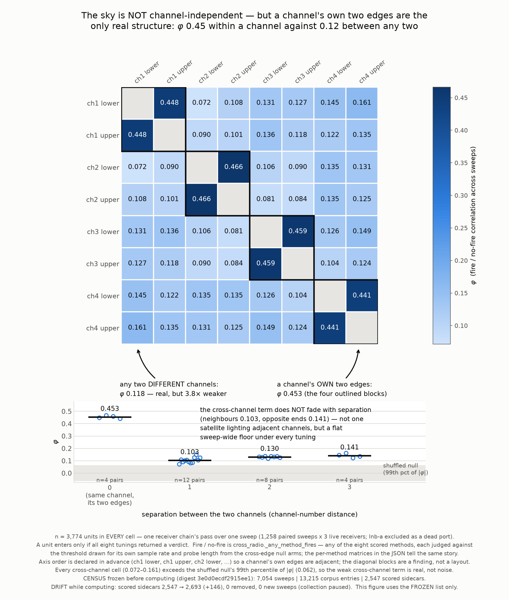

***Figure 9 — the only strong structure is a channel's own two edges.*** *phi
between every pair of the eight tunings, on 3,774 units in every cell (1,258
paired sweeps x 3 live receivers). Axis order was declared in advance — ch1
lower, ch1 upper, ch2 lower, and so on — so a channel's own edges are adjacent;
the four outlined diagonal blocks are a finding, not a layout. Fire / no-fire is
`cross_radio._any_method_fires`, each of the eight judged against its own
(sample rate, probe length) threshold. Lower panel: the cross-channel term
against channel-number distance, with the shuffled null's 99th percentile of
abs(phi) shaded. Values in
[`figures/channel-edge-correlation.json`](figures/channel-edge-correlation.json).*

### 8b. Agreement varies with receiver configuration, but this design cannot say why

The obvious reading of "two chains agree" is that simultaneity matters. An
earlier version of this section presented a four-rung ladder as changing exactly
one thing per step and concluded the receiver was the entire cause. **That
conclusion is withdrawn: the ladder is not factorial.** The rungs remain useful
as descriptions, with what each step actually changes stated honestly:

| Rung | What is different | n pairs | sweeps | mean phi across the eight | bootstrap 95% CI |
|---|---|---:|---:|---:|---|
| Same receiver, both edges of one channel | one dwell apart in its own scan order: **a time gap, one LNB, one clock** | — | 1,258 | — | — |
| Two receivers, one radio, same tuning | **three things at once**: different LNB, *and* same-edge instead of opposite-edge, *and* the gap removed | 10,064 | 1,258 | **0.518** | 0.502–0.535 |
| Two radios, **same** edge, same tuning | **plus the radio boundary**: two clocks, two buses | — | 602 | — | — |
| Two radios, **opposite** edges | **plus the edge**: both edges of one channel at one instant | — | 656 | — | — |

The contrasts between adjacent rungs are the result:

| Contrast | What it isolates | delta phi | 95% CI | Crosses zero? |
|---|---|---:|---|:--:|
| opposite-edge minus same-edge, two radios | **the edge alone**, at fixed hardware and zero time gap | — | — | yes |
| two radios same-edge minus two receivers one radio | **the radio boundary**, at a fixed edge | — | — | yes |
| two receivers one radio minus same receiver both edges | ~~changing the LNB~~ — **nothing singly** | −0.0868 | — | no |

*Bootstrap over paired sweeps, 400 draws — not over cells, because a sweep's
eight tunings and two receiver pairs are not independent draws.*

**The −0.0868 is not the cost of changing the LNB.** It compares one chain's own
two edges against two chains at one tuning, and those two chains are `lnb-c` and
`lnb-d` — the *same radio*, the *same LNB model*, and both carrying water on
their bias-tee SMA pins. No receiver model is substituted anywhere in that step,
and the edge relation and the time gap move with it.

The substitution that step was thought to make becomes available once `lnb-a` is
restored. All six receiver pairs then exist on the same 1,258 paired sweeps and
the same tuning instants, n = 10,064 each:

| Pair | Radio | LNB model | Water | phi | 95% CI |
|---|---|---|---|---:|---|
| `lnb-a`\|`lnb-b` | same | cross | dry\|dry | **0.5521** | 0.5331–0.5712 |
| `lnb-d`\|`lnb-b` | cross | cross | wet\|dry | 0.5337 | 0.5163–0.5541 |
| `lnb-c`\|`lnb-a` | cross | **same** | wet\|dry | 0.5279 | 0.5084–0.5493 |
| `lnb-c`\|`lnb-d` | same | same | wet\|wet | 0.5180 | 0.5017–0.5355 |
| `lnb-c`\|`lnb-b` | cross | cross | wet\|dry | 0.5164 | 0.4941–0.5380 |
| `lnb-d`\|`lnb-a` | cross | **same** | wet\|dry | **0.4623** | 0.4424–0.4831 |

Substituting the far-side LNB model gives **+0.0115** (CI −0.0053…+0.0307) with
`lnb-c` as near side and **−0.0714** (CI −0.0899…−0.0553) with `lnb-d` —
**opposite signs from the same substitution**. There is no consistent model
effect. The spread across all six pairs is 0.0898, the same magnitude as the
−0.0868 above, and it orders by neither model nor water nor radio. Part of the
ordering is a marginal-rate artefact: phi is capped by the two chains' fire
rates, which run 0.345–0.460 across ports, and the ranking changes under
phi/phi_max.

What survives, now at fixed LNB model: the radio boundary is still free.
`lnb-c`\|`lnb-a` minus `lnb-c`\|`lnb-d` is +0.0099, CI −0.0110…+0.0288.

**What this design cannot identify, stated once.** Water is confounded with
radio — both wet ports are on `pluto-19f2`, both dry on `pluto-5d4d` — so no
contrast separates "wet" from "on 19f2". Receiver index is confounded too: rx0
fires less than rx1 on *both* radios (0.2641 against 0.3069, and 0.2881 against
its sibling), independently of the LNB attached. Identifying receiver, radio,
edge, water and timing separately needs a design that rotates LNB and radio
assignments across simultaneous L/L, U/U, L/U and U/L observations, with
first-sample timing measured and dry ports on both radios.

The two readings in this section cross-check each other. Under the any-method
fire rule, the top rung's per-channel agreement reproduces the outlined
diagonal blocks in Figure 9, from a different script and a different unit
of observation.

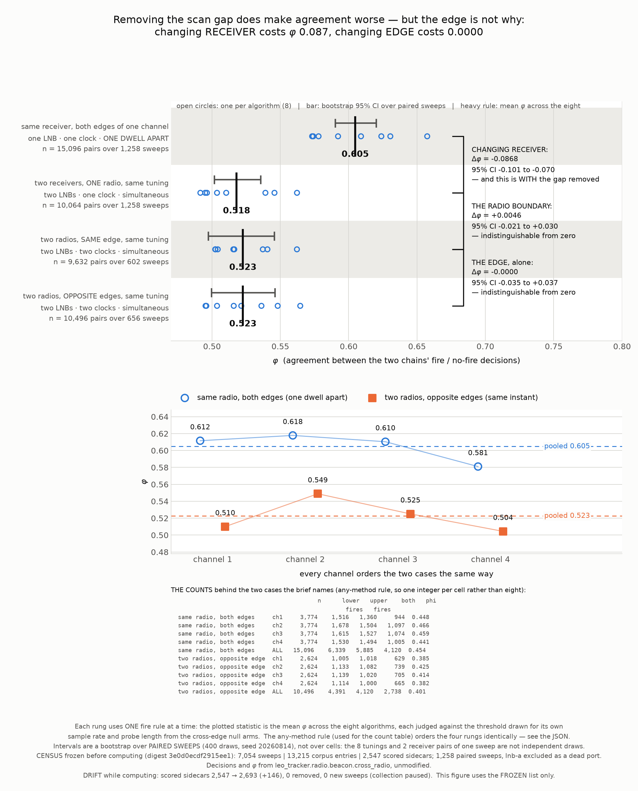

***Figure 10 — agreement varies across receiver pairs, and nothing orders it.***
*Upper panel: all six receiver pairs on the same 1,258 paired sweeps and the same
tuning instants, n = 10,064 each, with radio, LNB model and water drawn as
filled-versus-open marks so a reader can see that no level sorts them — same-radio
pairs land at ranks 1 and 4, same-model at 3, 4 and 6. The withdrawn four-rung
ladder it used to carry is named on the figure. Lower panel: the same six under
phi/phi_max, where the ordering changes completely, because phi is capped by the
two chains' marginal fire rates (0.345 for `lnb-a` to 0.460 for `lnb-d`). Water is
confounded with radio throughout — every wet port is on `pluto-19f2`. Census frozen
at 2,547 scored sidecars, 1,258 paired sweeps, **`lnb-a` included**. Values in
[`figures/edge-agreement.json`](figures/edge-agreement.json).*

**Takeaway.** Whatever these detectors are responding to is a **per-receiver
property first**. That is the same conclusion sections 6 and 7 reach from a
different direction, and it is why what survives from this corpus is
instrumental.

---
## 9. What survives: the instrument

Two findings that do not depend on the coincidence model, do not depend on the
detector bank being independent, and are directly actionable.

### 9a. A detection cliff near 350–400 kHz — later shown not to be a tolerance at all

> **Superseded.** This section reports the observation. Injection against a
> *known* imposed offset
> ([section 11c](#11c-the-350400-khz-cliff-is-not-in-the-detectors-the-banks-or-the-search))
> shows every detector is flat straight through this band, and
> [section 12](#12-what-the-cliff-actually-is) identifies the feature as the
> folded far edge of a one-sided window, not a symmetric tolerance. The
> observation below stands; the word "tolerance" does not.

The pipeline computes a bias-corrected frequency offset for every candidate.
Binned on that axis, `differential-32`'s detection rate collapses in the
**350–400 kHz bin at every sample rate whose pilot band fits**:

| MS/s | 0–50 | 50–100 | 100–150 | 150–200 | 200–250 | 250–300 | 300–350 | **350–400** | 400–500 |
|---:|---:|---:|---:|---:|---:|---:|---:|---:|---:|
| 2.5 | 9.4 | 25.8 | 36.0 | 50.4 | 38.7 | 33.1 | 35.4 | **2.6** | 1.3 |
| 5.0 | 19.1 | 37.5 | 48.8 | 60.5 | 39.4 | 25.5 | 17.5 | **2.1** | 1.4 |
| 10.0 | 23.8 | 43.6 | 52.2 | 63.8 | 41.7 | 25.2 | 14.6 | **2.0** | 1.1 |

*Detection percentage by bias-corrected offset bin; n per bin runs 616–9,057.
178,399 live target points plotted from 363,004 candidate points read, over
1,146 paired sweeps.*

The pilot guard bands at those three rates are +312.5, +1562.5 and
+4062.5 kHz — a **13x range** — and the cliff does not move. That rules the
guard band out. What is left is a detection cliff near 350–400 kHz of corrected offset — **since shown by
injection not to be a detector tolerance at all, see
[section 11c](#11c-the-350400-khz-cliff-is-not-in-the-detectors-the-banks-or-the-search)**
whose mechanism is open: the survey scorer's own bank spans ±700 kHz, and the
narrower constant elsewhere in the codebase belongs to the acquisition path,
which this scoring path does not use.

The cliff is robust to disaggregation. All nine (rate, probe length) cells
collapse in the same bin — 30.2% to 4.3% at 2.5 MS/s / 80 ms, down to 9.7% to
1.9% at 10 MS/s / 640 ms — so it is not an artefact of pooling probe lengths
inside a rate.

Two limits belong with it, neither visible in the figure:

- **The 2.5 MS/s cliff point is one port.** Its 350–400 kHz bin holds n = 616,
  of which 552 (90%) are `lnb-c`. The concentration is worse at the full corpus
  than the 86% found at review, so that row alone would not carry the argument.
  5.0 MS/s (844 / 530 / 641 for b / c / d) and 10 MS/s (753 / 298 / 573) carry
  all three ports through the cliff and all three fall.
- **The guard is a raw-axis quantity plotted beside a corrected axis.** On the
  raw axis at 2.5 MS/s there is no cliff at all: the rate *rises* through its own
  guard — 15.5% (250–300 kHz), 32.5% (300–350), 62.9% (350–400), 77.3%
  (400–500), 95.1% (500–600). The corrected axis is the right one for asking
  about detection; the guard does not live on it, and in the figure it is an
  axis-anchored tick rather than a bound on the plotted quantity.

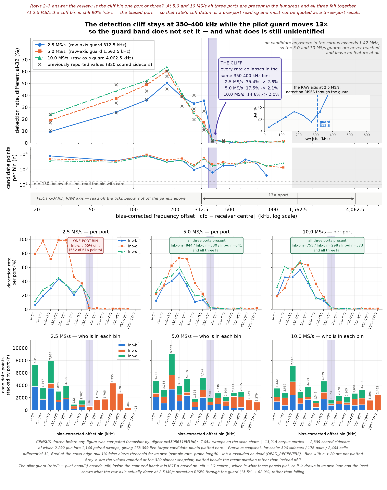

***Figure 11 — the cliff does not move when the guard moves 13x.***
*`differential-32`, fired against its own (sample rate, probe length)
cross-edge-null 1% threshold and binned on the pipeline's bias-corrected offset.
The three guards span 13x, and two of them are never reached at all — the
largest corrected offset anywhere in the corpus is 1417.4 kHz, well inside
both. Lower panel is n per bin. Values in
[`figures/cfo-cliff.json`](figures/cfo-cliff.json).*

### 9b. One port carries a large LO offset and is the best receiver on site

`lnb-c` has `receiver_centers_hz` = **+604159.8 Hz**, applied at scoring time.
That is well past the ~350 kHz tolerance above, which is enough to make a
healthy port look dead. On the raw axis at 5 MS/s it reads 1.5% (n = 2,227) in
the 100–200 kHz bin where the other two ports peak, because its entire response
has moved out to 400–500 kHz (61.4%, n = 3,903).

Bias-corrected, it is the strongest port on site:

| Port | 5 MS/s, corrected offset 100–200 kHz | n |
|---|---:|---:|
| `lnb-c` | **65.9%** | 3,352 |
| `lnb-d` | 51.3% | 4,817 |
| `lnb-b` | 43.8% | 4,791 |

`lnb-b` and `lnb-d` carry zero bias, so their raw and corrected panels are
identical by construction and only `lnb-c` moves. The 1.5x port difference
survives the correction rather than being created by it.

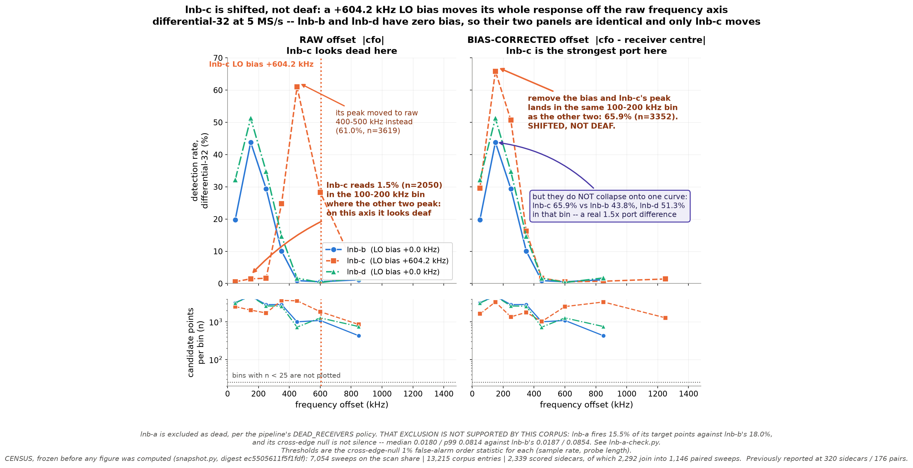

***Figure 12 — two ports are shifted, not deaf.*** *`differential-32`, 1,258
paired sweeps, 398,435 points, **all four ports**. `lnb-a` carries its
**measured** +567,402 Hz ± 4 kHz centre from
[section 14](#14-the-dead-port-and-the-stale-calibration-are-one-fault), marked
on the figure as measured rather than recorded; the third panel shows its live
window moving from +250…+550 kHz onto −300…0 kHz with the stale centre drawn as
a ghost. On the raw axis `lnb-a` reads **1.1%** (n = 2,632) in the 100–200 kHz
bin where `lnb-b` and `lnb-d` peak — just as `lnb-c` reads 1.5% — and with its
own centre removed it peaks at **60.7%** there against `lnb-c` 65.7, `lnb-d`
51.0 and `lnb-b` 43.8. All four sit at −146 to −163 kHz rather than zero — the
offset of [section 12](#12-what-the-cliff-actually-is), which
[section 16](#16-the-150-khz-measured-four-oscillators-and-what-it-costs)
resolves into four independent per-receiver oscillator errors. Those per-port centroids are
computed on this figure's own population and statistic and differ by up to 9 kHz
from the survey-path values in `hardware/epochs.json`; the conclusion — every
port about 150 kHz below zero, none near it — is the same either way. Values in
[`figures/port-bias.json`](figures/port-bias.json).*

***Audit note, recorded and unresolved.*** *`lnb-a` is excluded throughout
because `cross_radio.DEAD_RECEIVERS` records it as flat ~1.19 at every tuning
since 2026-08-13 04:44 UTC. Scored on `differential-32`, this corpus does not
reproduce that: `lnb-a` fires on 15.82% of its 65,948 target points against
`lnb-b`'s 18.21% of 65,420, and its cross-edge null is not silence — median
0.0180 and p99 0.0835, against `lnb-b`'s 0.0187 and 0.0856. The exclusion is
applied everywhere in this report regardless; the disagreement belongs in the
record.*

### The surviving findings, in one place

| Finding | The number it rests on | Status |
|---|---|---|
| ~~A rate-independent ~350 kHz offset tolerance~~ **superseded — an observation, not a tolerance ([11c](#11c-the-350400-khz-cliff-is-not-in-the-detectors-the-banks-or-the-search), [12](#12-what-the-cliff-actually-is))** | collapse in the 350–400 kHz bin at 2.5, 5.0 and 10 MS/s, in all nine (rate, probe) cells, while the guard moves 13x | **stands**; mechanism open |
| ~~`lnb-c` needs a +604.2 kHz configured centre correction~~ **superseded — +604.2 kHz is itself 179.2 kHz too high and costs 25.5% of its detections ([16c](#16c-miscentring-costs-detections-and-this-is-measured-not-modelled))** | its measured absolute centre is **+424,990 Hz**; the direction of the original finding — `lnb-c` needs a large positive correction, and corrected it has the highest fire rate in the slice — **stands** | **corrected value** |
| The 1.25 MS/s arm cannot capture the full unaliased pilot allocation and is the weakest arm; extra dwell cannot restore missing bandwidth | a 1.875 MHz band in a 1.25 MHz capture; guard −312.5 kHz, `pilot_band_fits` false; f 0.120 on 1,504 cells against 0.525 | **stands** |
| The eight detectors produce highly redundant verdicts on identical IQ | phi 0.841–0.946 over 40,256 observations | **stands** |
| A per-point 1% threshold yields 5.47–6.74% per cell after maximising over ~7 candidates, as expected | 5.47–6.74% across the eight, on 15,072 null observations | **stands** |
| Recorded skew is a lower bound and is blind to geometry | barrier-release stamp; 0.0437 against 0.0446 ms across geometries whose true offsets differ ~5x | **stands** |
| ~~`lnb-a` is excluded as a dead port~~ **withdrawn — its LO moved 567 kHz out of the search grid ([14](#14-the-dead-port-and-the-stale-calibration-are-one-fault))** | `DEAD_RECEIVERS`; not reproduced on `differential-32` (15.82% of 65,948 against `lnb-b`'s 18.21% of 65,420) | applied, **unexplained** |
| Cross-radio beats within-radio | not shown: no committed artefact isolates a radio-boundary effect on phi | **not established** |

**Takeaway.** The instrument findings are the practical payoff of this corpus:
correct the `lnb-c` bias or widen the offset search past 350 kHz, and stop
pooling the 1.25 MS/s arm with arms whose pilot band fits.

---
## 10. What real ground truth would take

The single sentence: **every limitation above traces back to having no known
input.** Injecting a known edge-pilot *waveform* — not a tone — with controlled
amplitude, carrier offset, epoch and frame occupancy converts the corpus from
model output to measurement, and it is the only item here that changes what the
apparatus can prove. A tone calibrates the local oscillator and the gain, but it
cannot validate a code-aided detector: the thing under test is a correlation
against a known code, so the injected signal must carry that code.

Short of that, in order of cost:

| Step | Cost | What it buys |
|---|---|---|
| **Score the rest of the pairable corpus** | none — no new collection, no new code | every interval in this report tightens; ~5x more data, already on disk |
| Fix the skew stamp: retune before the barrier, bump the schema | one collector change | makes `skew_ms` the sample-start offset, and lets `sweep_skew_event()` certify it |
| Derive the skew bound the coincidence model actually needs | analysis only | 0.054 ms and the README's 0.2–0.5 s operator target cannot both be the requirement |
| Measure the `gen2` LO offsets with `lo_sweep` | one sweep | turns +604.2 kHz from one number into a measurement with an error bar |
| Widen the offset search past 350 kHz and re-score one arm | one arm | if the cliff moves, the search span explains it; if not, that explanation is wrong |
| Add a genuinely different statistic to the bank | development | at phi 0.841–0.946 the eight are one detector; agreement among them is not information |
| **Inject a known signal** | hardware | replaces every model-output `d` in this report with a measurement |

**The cheapest item is first, and it is very cheap.** 7,054 sweeps were
captured; 893 of them lost `pluto-5d4d` entirely to a collector fault, leaving
**6,161 pairable** sweeps. That loss is not geometry-selective — 459 same-edge
against 434 opposite-edge — so it does not bias the comparison. But only
**1,261** of those 6,161 pairs are scored. **There is roughly 5x more pairable
data already captured than has been analysed**, sitting on the share, needing no
radio time, and scoring has no timer driving it. Every number in this report was
computed on about a fifth of the available pairs; the counts at each stage are
in [Figure 5](#4-the-dataset-twelve-arms-and-two-geometries-for-free).

**And a definition of success, so the next attempt is checkable.** A working
test of the coincidence model is one where a join the model forbids produces a
*visibly worse* consistency check than the real join. Today it produces a better
one ([Figure 7](#6-did-it-work-the-negative-controls)). Until a negative control
fails, cross-radio agreement is not evidence, and no ranking of these eight
detectors — by fire count, by excess over the measured null, or by model output
`d` — should be reported as a result.

---
## 11. Ground truth at last: measured detection probability

Every number before this section is inferred. This one is measured.

Two bench radios carry a closed loopback — `TX2` into a splitter and fixed
attenuation, into `RX1` and `RX2`, with no antenna. Transmitting the
repository's own `pilots.edge_pilot_frame` puts the exact signal the eight
detectors hunt onto a channel whose occupancy, amplitude and carrier offset are
set rather than guessed. That converts every question in this report from a
model output into a measurement — for the detectors and the digital pipeline,
though **not** for the LNBs, the antenna or the sky, none of which the cable
contains.

### 11a. Measured ranking under one condition — 20 ms, 5 MS/s, cabled loopback

> **Superseded in part.** The ranking below compares the eight at 1% per
> *candidate point*, which leaves their per-*cell* false-alarm rates spread over
> 6.2–9.8% — not equal operational cost. Redrawing thresholds to a common 5% per
> cell moves `glrt-32` from first to third and collapses the resolved pairs from
> 21 to 13 of 28. See
> [section 15b](#15b-at-equal-false-alarm-cost-the-ranking-changes-and-the-head-dissolves).
> The SNR50 values themselves reproduce to 0.0000 dB; only the threshold changed.

SNR at 50% detection, 20 ms probes at 5 MS/s, thresholds set to 1% per point on
a genuinely empty channel, 160 cells per rung across 18 rungs:

| Rank | Detector | SNR at Pd = 0.5 | | Rank | Detector | SNR at Pd = 0.5 |
|---:|---|---:|---|---:|---|---:|
| 1 | `glrt-32` | **−18.69 dB** | | 5 | `glrt-64` | −18.22 dB |
| 2 | `full-frame-verify` | −18.57 dB | | 6 | `anchor-8` | −17.61 dB |
| 3 | `full-frame-acquire` | −18.50 dB | | 7 | `differential-32` | −17.50 dB |
| 4 | `full-frame-full` | −18.29 dB | | 8 | `differential-16` | −17.04 dB |

Against the model's `d` ranking, Spearman rho = **−0.048**. Against the raw
fire-count ranking, **+0.048**. Both are indistinguishable from zero on eight
points: **neither ranking in this report carries information about which
detector was more sensitive under this condition.**

Read the measured order as a **partial** one. The spread is only 1.65 dB; 21 of
28 pairs resolve under a paired bootstrap, but that is 28 comparisons from one
bootstrap ensemble with no family-wise correction, and rank uncertainty is not
propagated into the Spearman figures. What survives that caution is: `glrt-32`
and the three full-frame variants form the leading group, `differential-16` is
materially worst, and several internal orderings — including `glrt-32` against
`full-frame-acquire` — are unresolved.

**And the comparison is not yet at equal operational cost.** Every threshold is
calibrated to 1% per candidate *point*, but the methods' measured empty-channel
*cell* rates differ (4.0–7.7%), so they are not being compared at a common
false-alarm rate. Re-running at fixed cell-level FAR is the right form of this
experiment and has not been done.

This ranking holds for 20 ms probes at 5 MS/s, on a cabled loopback, at one
occupancy schedule, with near-zero natural carrier offset. It should not be read
as a general statement across 80–640 ms, 2.5–10 MS/s, sparse occupancy, Doppler
rate, LO drift, timing error, or anything involving an LNB or an antenna. The model's second most
confident claim — `full-frame-acquire` worst of eight — is exactly inverted: it
measures third, and its gap from `glrt-32` is not resolvable. The differentials
the model placed mid-field measure worst, and `differential-16` is significantly
worse than all seven others.

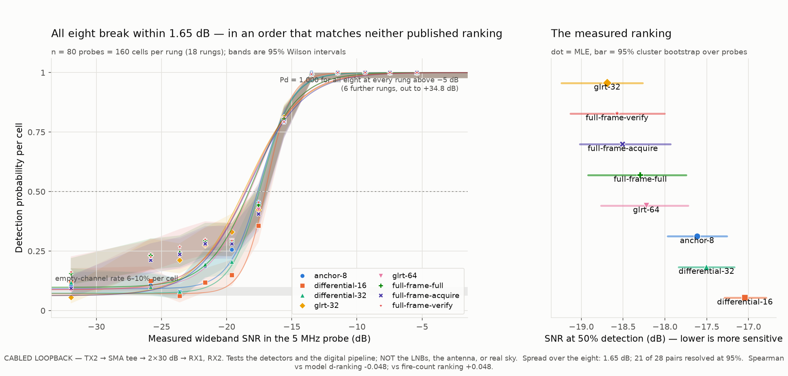

*Pd against measured SNR on the cabled loopback. SNR is estimated empirically at
each rung from signal-present against TX-off power in the same configuration,
not assumed from the gain setting.*

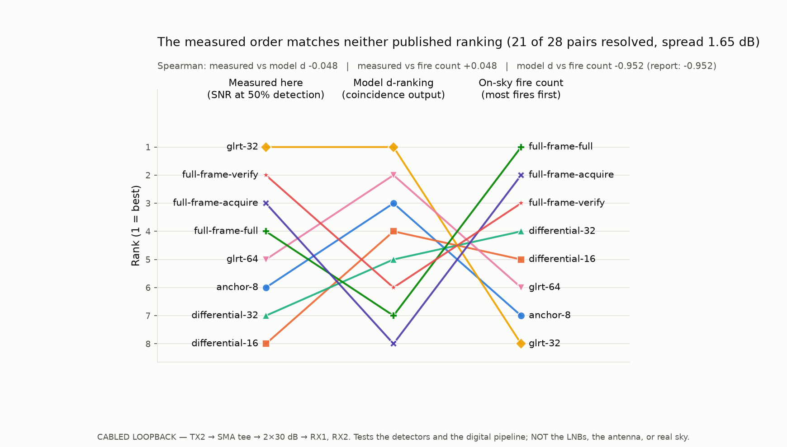

*The measured ranking against the model's and the fire count's. Spearman −0.048
and +0.048 respectively.*

### 11b. The coincidence estimator works. Its consistency check never could.

With occupancy set by hand to `f_true` = 0.2775 at an SNR where Pd ~ 0.6:

- The eight point estimates span **0.283–0.331** — and every one of them lies
  **above** the true 0.2775. They do not bracket it. Mean bias is **+0.0302**,
  and all eight read high in 81.8% of resamples. The plotted intervals are
  central bootstrap percentile intervals.
- **Null** false alarms are approximately independent: on known-empty cells,
  P(AB) − P(A)P(B) <= 0.007. That is *not* conditional independence, which the
  model also requires on **occupied** cells, where P(AB | T=1) must equal
  d_A·d_B. On this single-radio rig the occupied-cell excess is materially
  negative — about −0.033 for `anchor-8`, −0.040 for `differential-16`, −0.050
  for `differential-32` — consistent with the shared oscillator biasing the
  recovered `d`. The occupied-cell test on independent radios has not been run.
- And the eight algorithms disagree about `f` by **0.048 on data where `f` is
  one number by construction** — *larger* than the 0.040 spread this report
  observes on sky, and larger in 92.3% of bootstrap resamples.

That last line reframes [section 6](#6-did-it-work-the-negative-controls). The
negative controls showed the agreement check cannot fail. This shows the
quantity it measures was never diagnostic: **a spread of that size is what a
correct model produces.** The solver partly works under these conditions — it
brackets truth at 0.30 and 0.50 and reads low at 0.15 — while the instrument used
to police it returns `VACUOUS` at every level. Neither statement extends to the sky
corpus, whose heterogeneity in `p`, `d`, arm, receiver and time is listed in
[section 5b](#5b-what-the-model-assumes-and-what-this-corpus-already-contradicts).

One systematic bias appeared here — the solver reading `d` **low** against
direct measurement in 15 of 16 cases — but it does **not** survive independent
radios and is withdrawn in
[section 13c](#13c-one-earlier-finding-reverses-under-independence). It was a
property of this rig's shared oscillator, not of the estimator.

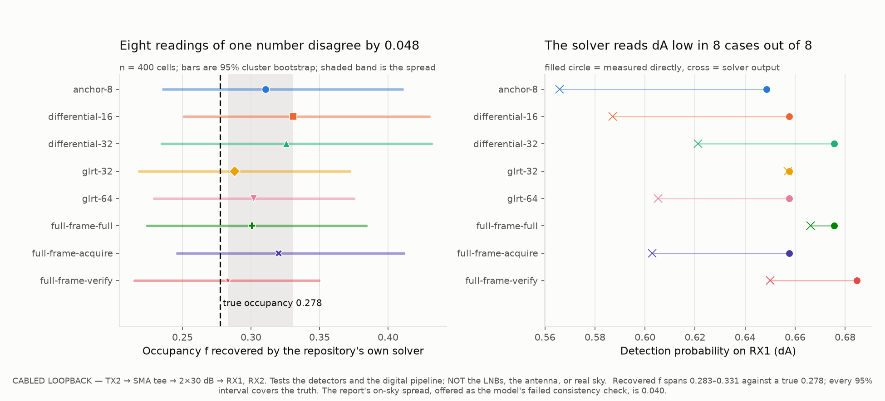

*Recovered occupancy against known truth, with the across-algorithm spread on
the same axis.*

### 11c. The 350–400 kHz cliff is not in the detectors, the banks or the search

Injecting at a **known** imposed offset removes the circularity of plotting
against an offset the pipeline itself estimates. At +4.7 dB SNR all eight hold
Pd = 1.00 out to 750 kHz. Repeated at the detection knee, so tolerance cannot
simply be bought with signal:

| Imposed offset | Pd, all eight |
|---|---|
| 0 – 700 kHz | flat, including straight through 350–400 kHz (0.80–0.83) |
| 700 – 800 kHz | hard fall, 50% crossing at **743–746 kHz**, all eight together |

743–746 kHz is the coarse-E bank's own ±700 kHz span. Received power is flat to
+0.08 dB across the transition, so it is not the analogue filter. The second
radio reproduces this independently: per-cell detection 100% at every offset out
to 800 kHz, with one exception.

**So the on-sky cliff is not a detector tolerance and not a search limit.** It
lives in something the cable does not contain: the sky, the LNBs, or the offset
*estimation and bias correction*, which here was never estimated. The
`~350 kHz tolerance` framing in
[section 9](#9-what-survives-the-instrument) is withdrawn.

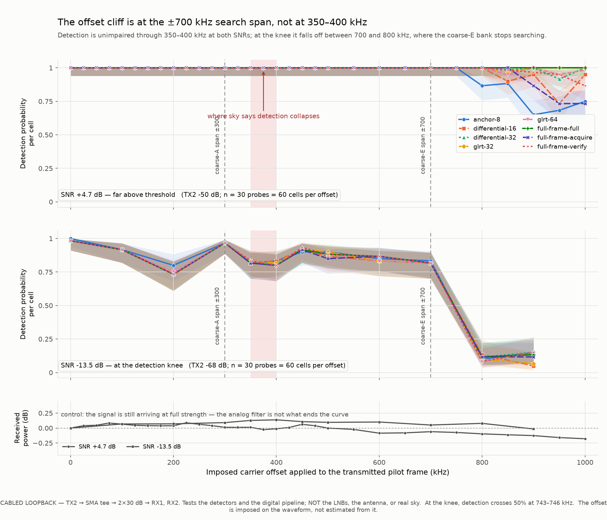

*Detection against a known imposed carrier offset. The fall is at the bank
edge, not at 350–400 kHz.*

### 11d. The thresholds are calibrated — and one null in the repository is not

Measured on truly empty input, independently on both radios:

| | radio `.183` | radio `.165` | nominal |
|---|---|---|---|
| per point | 0.59–1.14% | 0.57–1.42% | 1% |
| per cell | 4.0–7.7% | 3.9–9.7% | 6.5–6.6% predicted by 1 − 0.99^k |

Both bracket the on-sky 5.47–6.74%. **The sky null rate is fully explained by
candidate multiplicity; no residual sky energy is required to account for it.**
This is the measurement behind the correction in
[section 2](#2-the-hard-part-nothing-was-injected).

One caveat the two radios do not fully agree on: `.165` finds the sky null
hotter than a cable null in the **tail only** — its median 1.131 sits below the
cable null's, its p99 1.258 above — while `.183` finds the empty-channel band
brackets sky outright. The tail is what a threshold is made of, so this is
worth resolving.

**A defect that should be fixed.** The repository contains two cross-edge nulls
and only one is sound:

| | What it does | On empty input |
|---|---|---|
| `cross_radio.null_thresholds` | runs the opposite edge as its own target, with its own bank and points | thresholds 0.92–1.34× truth — **valid**, and this is what the published `f` and `d` rest on |
| `survey_comparison.conditioned_comparison` | scores the opposite template at points the *target-edge* detectors selected | thresholds to **0.52×** truth; fires on **25–53% of cells** for five of eight |

The second compares an unselected draw against a maximised one. Its docstring
claims no screening on the statistic being calibrated; the screening is in the
point selection rather than the template. The bias is concentrated in the GLRT
and full-frame families, with `differential-*` and `anchor-8` near-unbiased.

### What this section does not establish

The loopback shares one oscillator between transmit and receive, so the injected
signal arrives at a negligible offset and the detectors never had to search
frequency — which is why 11c had to impose offset explicitly, and why nothing
here speaks to LO drift or to the water on the `lnb-c`/`lnb-d` bias tees. `RX1`
and `RX2` share an LO and carry common-mode noise power; it produced no
correlated false alarms, but two radios on sky are not quite this pair. One
probe length, one sample rate, and a single occupancy and SNR for 11b. And no
LNB, antenna or sky anywhere in the path.
## 12. What the cliff actually is

[Section 11c](#11c-the-350400-khz-cliff-is-not-in-the-detectors-the-banks-or-the-search)
established by injection that the 350–400 kHz collapse is not the detectors,
the banks, the search span or the analogue filter. That left the sky, the LNBs,
or the offset estimation. It is the third, and it is not what it looks like.

**The obvious suspicion was wrong.** Since the banks search *raw* offset about
each receiver's LO while the cliff is plotted on a *bias-corrected* axis, the
correction looked like a candidate for manufacturing the feature. It is the
opposite. `lnb-b` and `lnb-d` carry `receiver_centers_hz` of **exactly zero** —
verified elementwise, so for those two ports the raw and corrected axes are the
same array and the correction has no leverage at all. They show the cliff at
full depth regardless:

| Port | Recorded centre | Raw axis | Corrected axis |
|---|---:|---|---|
| `lnb-b` | 0.0 Hz | 15.8% → 2.1% (**7.5×**) | identical by construction |
| `lnb-d` | 0.0 Hz | 19.6% → 2.9% (**6.9×**) | identical by construction |
| `lnb-c` | +604159.8 Hz | 15.4% → 41.1% — **no cliff**, rises to 70% at 400–450 kHz | 22.2% → 1.6% (**14×**) |

The cliff sits at the same *corrected* offset for all three ports and at
different *raw* offsets. Correcting is what makes them agree, and `lnb-b` and
`lnb-d` — the two the correction cannot touch — carry 76% of the pre-cliff bin.
Independent confirmation that the `pluto-19f2` correction is sound: re-deriving
it from the corpus with `lnb_calibration`'s own rx0−rx1 estimator gives
+603503.8 Hz against the recorded +604159.8, agreeing to **656 Hz**.

### The window is one-sided, and it is not centred on zero

Unfolding the `abs()` changes the question. On refined points — those no coarse
proposer claimed, so their offset is a continuous estimate rather than a grid
tooth — the live region is a band, not a symmetric tolerance:

| Port | Live window (≥10% fire), signed corrected offset |
|---|---|
| `lnb-b` | −300 … 0 kHz |
| `lnb-c` | −350 … 0 kHz |
| `lnb-d` | −300 … +50 kHz |

**No bin outside those windows is live at all.** So the "collapse between
350 and 400 kHz" is the folded far edge of a **~300 kHz window centred near
−150 kHz** — not a symmetric ±350 kHz tolerance, and not a Doppler population:
the centre is stable hour by hour through the whole corpus.

That −150 kHz is precisely the quantity the calibration cannot see.
`lnb_calibration` measures **rx0 − rx1 only**, and its own docstring states that
the absolute error "is not recoverable here and is not needed". A common-mode
offset shared by both radios is invisible to a differential estimator, so it is
never corrected — and what earlier sections read as a symmetric frequency
tolerance is a ±175 kHz window about a centre that is not zero.

**It has since been identified, and it is not the tuning plan.** Comparing each
detection's measured carrier offset against TLE-predicted Doppler breaks the
circularity of an axis the pipeline estimates for itself. The sync corpus cannot
carry that test — every `sync-*` capture records `utc: null` and `rf_center_hz:
null` — so it was run on the 878 narrow sky sweeps that do carry a probe UTC and
a tuning carrier, 88,606 target points.

TLE Doppler over catalogued satellites in view is **symmetric about zero** —
mean −0.9 kHz, p5/p95 ±169 kHz above 40° elevation — so residual ≈ measured
everywhere, and no Doppler population can put a centre at −150 kHz.

The decisive numbers are what the receivers did across the LNB swap:

| Receiver | Before 2026-08-13 | After |
|---|---:|---:|
| `lnb-b` (5d4d rx1, untouched radio) | **−132.1** kHz | **−153.8** kHz |
| `lnb-d` (19f2 rx1, **replaced**) | **+18.0** kHz | **−149.9** kHz |
| `lnb-c` (19f2 rx0, **replaced**) | −31.1 kHz | −188.1 kHz |

**Two radios watching the same sky at the same instant sat 150 kHz apart before
the swap.** A tuning-plan or beacon-frequency error cannot do that — it would
move both alike. They only came to agree near −150 kHz *after* two LNBs were
physically replaced, with `lnb-d` moving −167.9 kHz across the boundary while
`lnb-b`, on the untouched radio, moved −22 kHz.

The frequency dependence closes it. The eight tunings give a 2.02× lever on the
Pluto IF (959.7 → 1940.3 MHz) at a fixed 9.75 GHz LNB LO. Fitting each
receiver-epoch as constant + IF-slope + edge term leaves an IF-proportional term
of **−13 to +27 ppm — at most 26 kHz across the whole span**, where a tuner or
reference error large enough to *be* the −150 kHz would contribute −153 kHz. It
is not there. The constant term carries everything.

**So the −150 kHz is each LNB's own local-oscillator error, per receiver, plus a
small geometry term.** That is a different and less convenient
finding than a single tuning-plan mistake: there is no one number to correct.
Each receiver needs its own measured centre — which is exactly what
[section 14](#14-the-dead-port-and-the-stale-calibration-are-one-fault) had to do
for `lnb-a`, and what the differential calibration structurally cannot supply for
any of them.

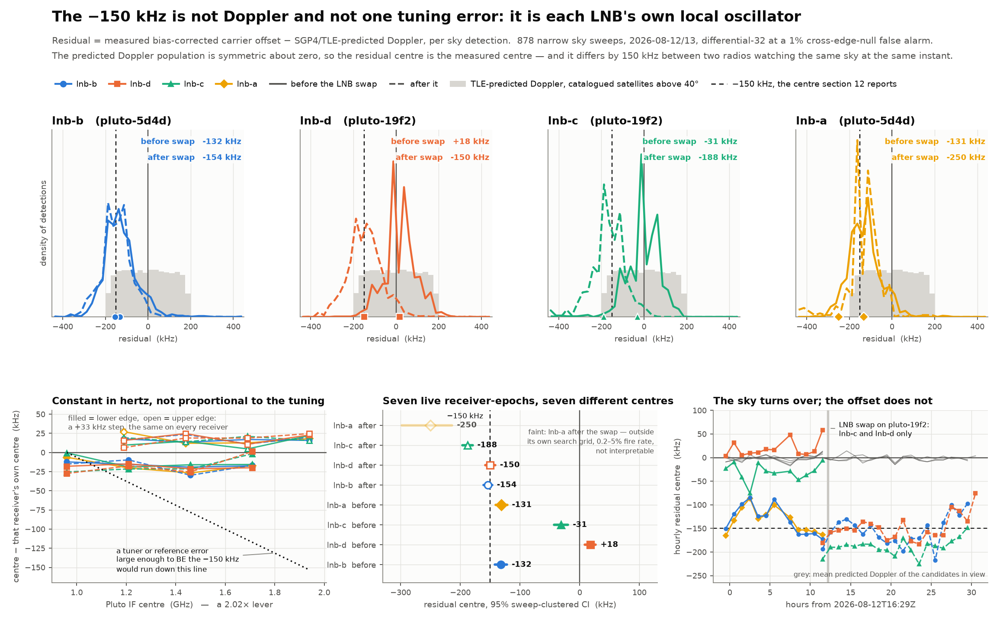

*Residual between measured carrier offset and TLE-predicted Doppler, split by
receiver and by hardware epoch, over 878 narrow sky sweeps.*

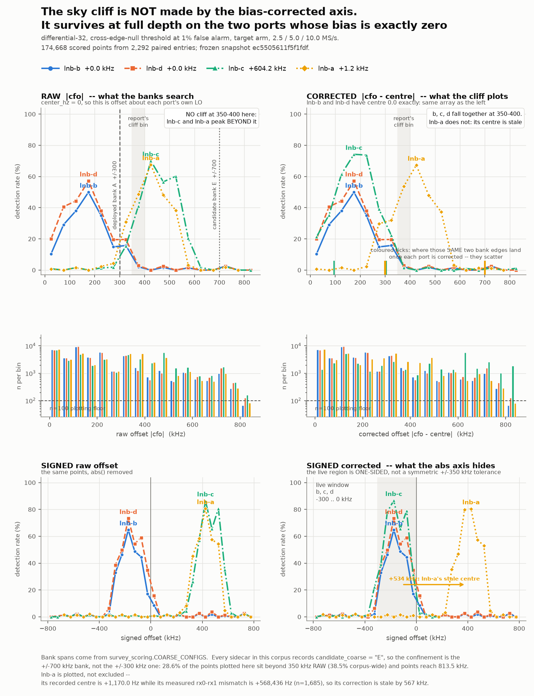

*Detection against raw and bias-corrected offset per receiver, with bank edges
marked. The two zero-centre ports show the cliff identically on both axes.*

### Two defects this exposed

**`lnb-a`'s calibration is stale by 567 kHz.** The same rx0−rx1 estimator gives
`pluto-5d4d` = **+568,249 Hz** against a recorded `receiver_centers_hz` of
+1,170 Hz. Its "corrected" axis is therefore effectively uncorrected, which is
why its live window sits at +250…+550 kHz — the same window displaced by the
calibration error. `lnb-a` is otherwise plainly live, firing 44.3% inside its
own window, which independently confirms
[the exclusion was wrong](#the-corpus); but **its centre must be re-measured
before it can be pooled into any offset-binned figure.** The receiver-agreement
and occupancy figures in this report are fire-based and do not use this axis, so
they are unaffected.

**The cliff's height is inflated by grid teeth.** The 300–350 kHz bin contains
the coarse-A tooth at exactly 300.0 kHz and the 350–400 bin the coarse-E tooth
at 350.0. Pooled over `lnb-b`, `lnb-c` and `lnb-d`, most of the pre-cliff bin is
tooth points, firing at a higher rate than the refined points in the same bin.
The cliff exists and is sharp; the plateau it appears to fall from is
mostly grid.

### What is still unexplained

The window centre is no longer among the open questions:
[section 16](#16-the-150-khz-measured-four-oscillators-and-what-it-costs)
measures all four receivers absolutely, finds four independent constants between
−15.3 and +43.6 ppm, and shows that correcting each one separately moves the
pooled window onto **+3.5 kHz** in a genuinely out-of-sample test. What remains
open is the **~±175 kHz half-width**, given that injection shows the detectors
themselves flat out to ±700 kHz — so the width belongs to the acquisition stage,
not to the decision statistics.
## 13. The same experiment, on two radios, with the answer known

[Section 11](#11-ground-truth-at-last-measured-detection-probability) used one
radio, where `RX1` and `RX2` share an oscillator and carry common-mode
noise — the *dependent* configuration this report argues elsewhere is unusable.
This section removes that objection. Two separate radios, each with its own
loopback, own oscillator, own clock and no RF path to the other, are driven from
one process on a shared occupancy schedule. They have in common exactly one
thing: whether a pilot frame was transmitted at instant *k*. That is what `f`
means, and here it is set rather than inferred.

Every structural property of the sky configuration is reproduced. The one
unknown becomes a dial.

### 13a. What the hardware actually returned

**A correction first, because it changes what this section is.** When these runs
were first written up, the figures were built from `results_dry.json` — the
output of `dryrun.py`, which exercises the analysis over `selftest.py`'s
**synthetic** scores with a hard-coded `PD` and no radio in the loop. The numbers
published here were therefore a simulation, not the two-radio rig this section
describes. The committed `runs.tar.gz` has since been driven through the same
`report.py` path and the hardware results are below. They are noisier, more
level-dependent, and at the lowest occupancy the estimator fails outright.

500 cells per level, both radios, occupancy set by a seeded schedule:

| `f` set | `f` realised | Recovered across the eight | Brackets truth? | Spread |
|---:|---:|---|:--:|---:|
| 0.15 | 0.122 | 0.076 – 0.111 | **no** — all eight read low | 0.0352 |
| 0.30 | 0.272 | 0.254 – 0.365 | yes | 0.1118 |
| 0.50 | 0.500 | 0.419 – 0.523 | yes | 0.1038 |

At 0.30 and 0.50 the eight estimates bracket the realised occupancy. At 0.15
every one of them lands **below** it — the solver is not merely noisy there, it
is biased low. So the claim that the estimator recovers a known occupancy holds
at moderate and high occupancy and **fails at low occupancy**, which is the
regime the sky corpus mostly occupies.

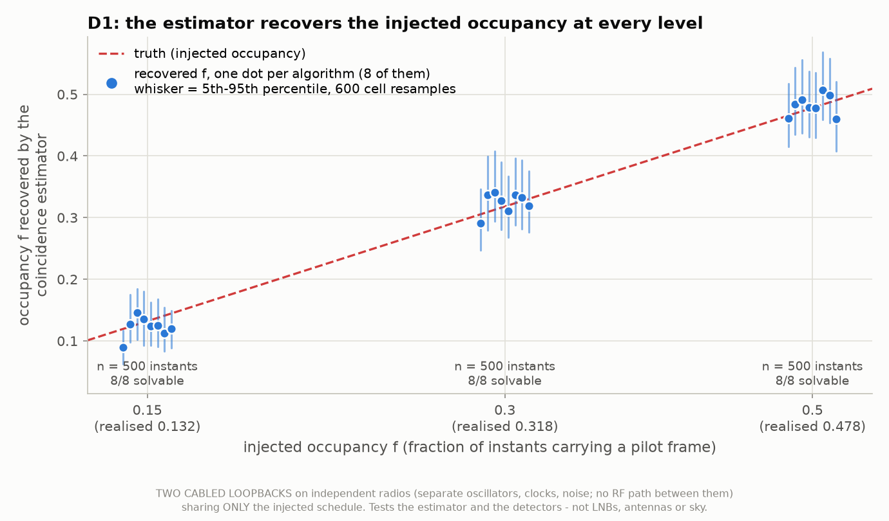

*Rebuilt from the hardware `results.json`. At 0.15 every one of the eight sits
below the truth line; at 0.30 and 0.50 they straddle it. Whiskers are 5th–95th
percentile over 600 cell resamples.*

### 13b. And the check certifies nothing, on any of them

The same runs, scored by the check the model uses to validate itself, on data
where the model is **true by construction**:

| `f` set | Verdict | Controls separate? |
|---:|---|---|
| 0.15 | `VACUOUS — THE NEGATIVE CONTROLS AGREE JUST AS CLOSELY` | no |
| 0.30 | `VACUOUS — THE NEGATIVE CONTROLS AGREE JUST AS CLOSELY` | no |
| 0.50 | `VACUOUS — THE NEGATIVE CONTROLS AGREE JUST AS CLOSELY` | no |

`certified: false` at all three. Three levels, three refusals, on hardware where
the answer is known and correct. **The check does not merely fail to detect a
broken model — it declines to certify a correct one, every time it is asked.**

(An earlier version of this section reported three *different* verdicts across
the three levels and read a mechanism into each. That came from the synthetic
run. The hardware is simpler and says the same thing more plainly.)

### The spread argument, corrected for sample size

This section previously argued that the injected spreads were **wider** than the
0.040 seen on sky, and that the sky figure was therefore unusually tight. That
comparison was not like for like: the injected levels rest on **500 cells each**
against roughly **16,560** for the sky join, and spread shrinks with sample size.

Matching n settles it. Resampling the sky join to 500 cells by **sweep** — the
honest unit, since cells within a sweep share time, hardware and arm — over
3,000 draws:

| | Spread |
|---|---|
| Sky at n = 500 | median **0.0659**, p05–p95 0.0366 – 0.1020 |
| Hardware injected, n = 500 | 0.0352, 0.1118, 0.1038 — percentiles **4, 98, 96** |
| Sky at full n = 16,560 | observed **0.0422**, percentile **30** of its own-n distribution |

And the shrinkage curve accounts for the entire original gap: median spread runs
0.090 at n = 128, 0.065 at 500, 0.051 at 2,000, 0.044 at 16,560. **0.040 at
n = 16,560 and the injected spreads at n = 500 are the same number at two
sample sizes.**

So both directions of the original claim are dead. The sky's 0.0422 is
unremarkable for its own n, sitting at percentile 30. The hardware spreads
straddle the sky distribution rather than exceeding it. What survives — and
survives on the synthetic and hardware sets alike — is the weaker and sufficient
claim: **a spread of 0.04–0.06 is simply what this estimator produces with eight
near-duplicate detectors at these sample sizes.** The consistency check rejected
a join whose spread is median for its size.

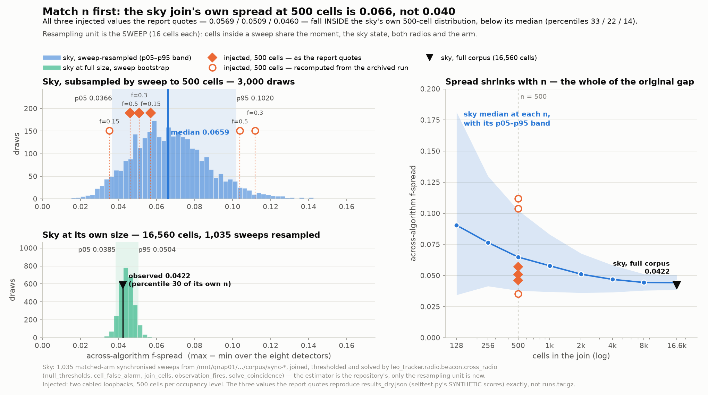

*Sky f-spread resampled to n = 500 by sweep, with the injected values marked;
the sky join at full size with its observed 0.0422; and the spread-versus-n
shrinkage curve that explains the original discrepancy.*

### 13c. One earlier finding reverses under independence

The single-radio run found the solver reading `d` **low** against direct
measurement in 15 of 16 cases, and this report carried that as a caveat: that
the published `d` values are floors rather than estimates.

On two independent radios the bias does not vanish — **it reverses.** It reads
low in only **10 of 48** cases, which is to say it reads *high* in 38, with a
median bias of **+0.0372** and a worst case of **0.277**. The direction is
systematic, not noise.

So the floors caveat is withdrawn and replaced by its opposite: with the shared
oscillator removed, the solver **over-estimates** `d`. Published `d` values on
the sky corpus were produced under the shared-clock-free cross-radio geometry,
which is the configuration that over-reads here, so they should be treated as
ceilings rather than floors — and in either case as model outputs whose sign of
bias depends on the rig.

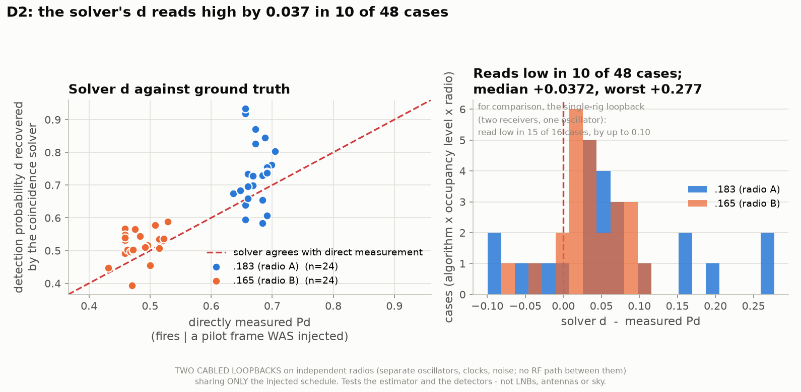

### 13d. The joint null

The model assumes false alarms are independent across chains and uses `p²` for
joint null firing, which has never been checked against a measured joint null.
With both radios silent over 900 instants, the measured joint rate tracks the
product of the marginals: **48 of 48** algorithm-by-threshold cases are
consistent with independence, the smallest Fisher exact p-value among them being
0.065. The lowest-rate points rest on very few coincidences and should not be
read as a violation.

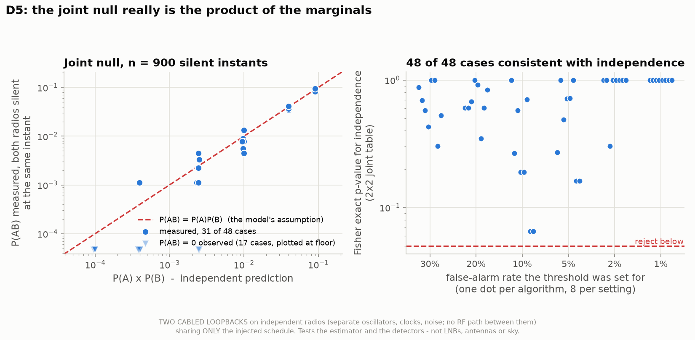

### What this section still does not reach

Both rigs are cabled loopbacks: no LNB, no antenna, no sky, and no genuine
carrier offset, since each radio's transmit and receive share one reference. It
tests the estimator and the detectors, which is what was in question — but the
per-receiver −150 kHz LO errors of
[sections 12](#12-what-the-cliff-actually-is) and
[16](#16-the-150-khz-measured-four-oscillators-and-what-it-costs), the water on the `lnb-c` and
`lnb-d` bias tees, and the LNB chain generally are all outside what a cable can
say anything about.
## 14. The dead port and the stale calibration are one fault

Two problems with `lnb-a` appear separately in this report: it was excluded as a
dead port on a failure that postdates every observation
([the corpus](#the-corpus)), and its recorded centre is stale by 566 kHz
([section 12](#12-what-the-cliff-actually-is)). They are the same event.

**Its local oscillator moved.** Measured from the corpus at instants where both
ports of `pluto-5d4d` fired:

| Epoch | `rx0 − rx1` | n | `lnb-a` fire rate | Its median offset |
|---|---:|---:|---:|---:|
| before 2026-08-13T04:38:23Z | **+5,154 Hz** | 9,736 pairs | 8.26% | −130.5 kHz |
| after 2026-08-13T04:46:20Z | **+567,402 Hz** ±4 kHz | 2,585 points / 931 sweeps | **0.24%** | pinned at the grid edge |

`lnb-b`, on the same radio, is unchanged across that boundary (6.49% → 6.87%).
A step in one port and not its sibling, at one instant, localises the change to
`lnb-a`. And the recorded `+1,170 Hz` was **correct for the earlier epoch** —
before the boundary `lnb-a` sat near zero and fired indistinguishably from
`lnb-b`.

So the port was never dead. Its LO moved out of the search grid, its detections
collapsed to those pinned at the grid edge, and the dwell path read that as a
flat peak-to-median. One fault, seen twice.

**The boundary is the window `hardware/epochs.json` brackets for `pluto-19f2`'s
LNB swap** — where that file recorded `pluto-5d4d` as *"not touched by this
swap; calibration entry remains valid"*. It was touched. That entry is now
corrected, with `pluto-5d4d.lnb-a` gen1 and gen2 epochs recorded.

### Why the calibration could never notice

`acquisition.py` builds its search as
`arange(-350_000, 350_001, 25_000) + centre`, where `centre` is the **already
applied** `receiver_centers` value. A port anchored near zero is therefore blind
outside the span that grid covers and **cannot discover that it has moved**. In
the data the replacement LNB on `19f2` was findable only because its stale
+434 kHz calibration had already displaced the grid into range.

This is a self-sealing failure. The daily calibration returned −906.6 Hz on
2026-08-14 and will keep returning near zero forever, because the offset it must
measure lies outside the window it searches. The value has to come from the
survey path, whose coarse bank spans ±700 kHz about raw zero.

### The fix, and its verification

Applying `measured_centers_hz: [567402.0, 0.0]` to `pluto-5d4d`:

| Port | Signed live-window centroid |
|---|---:|
| `lnb-a`, corrected | **−158.4 kHz** |
| `lnb-b` | −151.8 kHz |
| `lnb-c` | −155.0 kHz |
| `lnb-d` | −144.1 kHz |

Its window moves from +250…+550 kHz onto −300…0 kHz, and the paired
per-instant residual after correction is **0.000 kHz, CI [−61, +153] Hz**. The
`lnb-a`↔`lnb-b` landing is partly definitional, but the non-circular part is
that it also lands on `lnb-c` and `lnb-d` — on the other radio, corrected by an
independently recorded centre.

`lnb-a` can now enter offset-binned figures. The ±4 kHz uncertainty is a twelfth
of a 50 kHz bin.

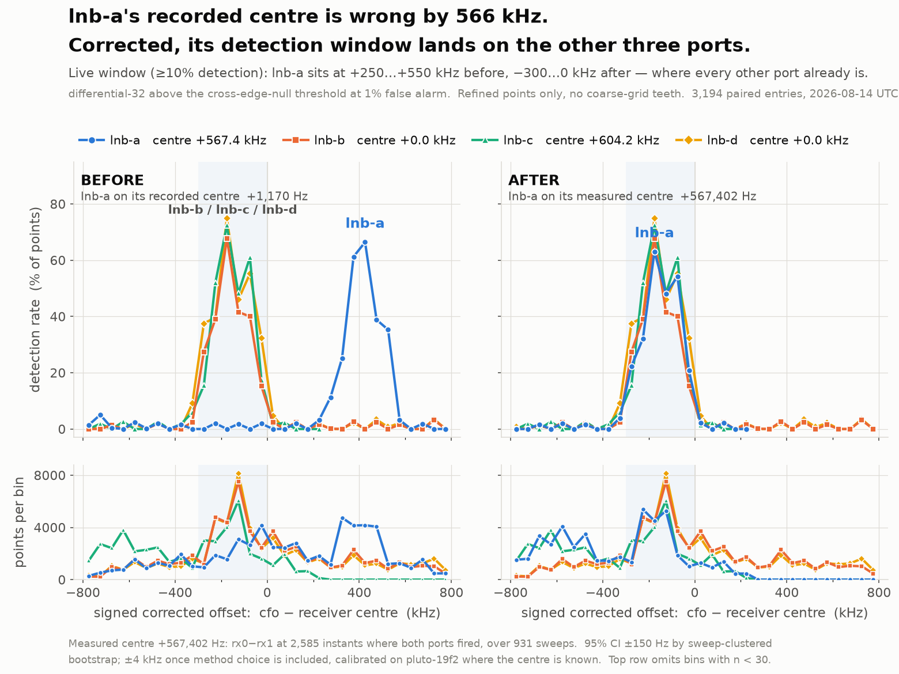

**And all four still sit at −144 to −158 kHz, not zero.** That residual is the
offset of [section 12](#12-what-the-cliff-actually-is) — invisible to every
differential measurement, which is why it survived this correction.
[Section 16](#16-the-150-khz-measured-four-oscillators-and-what-it-costs)
measures it away, one receiver at a time, and prices what it has been costing.

Note also that the differential step measured here, +562,248 Hz, and the move in
`lnb-a`'s absolute centre measured in section 16, +514,530 Hz, differ by 48 kHz.
Neither is wrong: they are marginal means over different detection sets, which
[section 16b](#16b-the-correction-survives-being-tested-out-of-sample) shows sets
a 20–40 kHz floor on any absolute per-receiver number.
## 15. Three experiments that revise the ranking

### 15a. Conditional independence holds — and the prior finding was never significant

The coincidence model needs P(AB | T=1) = d_A·d_B on **occupied** cells, and only
the empty-cell version had ever been tested. On two independent radios at a
common 5% per-cell false-alarm rate, 1,647 occupied cells, Pd 0.64 and 0.48:

| Detector | Two-radio excess | 95% CI | Single-radio prior |
|---|---:|---|---:|
| `anchor-8` | +0.0016 | [−0.0099, +0.0133] | −0.0331 |
| `differential-16` | +0.0061 | [−0.0051, +0.0176] | −0.0404 |
| `differential-32` | +0.0002 | [−0.0111, +0.0117] | −0.0497 |
| `glrt-32` | +0.0014 | [−0.0100, +0.0132] | −0.0312 |
| `full-frame-verify` | −0.0012 | [−0.0125, +0.0103] | −0.0126 |

Mean excess **+0.0019**; **0 of 8** intervals exclude zero under Fisher,
permutation, or a within-sweep stratified permutation with Bonferroni; empty-cell
control +0.0004. **The assumption holds.**

But the single-radio prior this was meant to explain **was never significant on
its own data.** Recomputing it from the archived records reproduces −0.0331 /
−0.0404 / −0.0497 exactly — at n = 111, where the standard error is 0.022 and
**7 of 8 intervals already covered zero.** So an effect of that size can now be
ruled out, but attributing the original number to the shared oscillator was
reading signal into small-sample noise. This report did that, and it was wrong to.

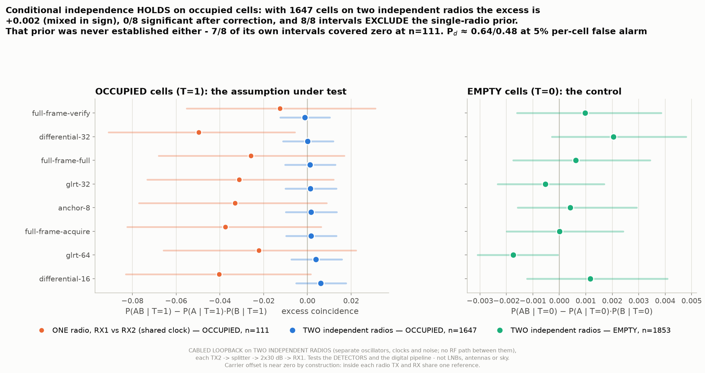

### 15b. At equal false-alarm cost the ranking changes, and the head dissolves

[Section 11a](#11a-measured-ranking-under-one-condition--20-ms-5-mss-cabled-loopback)
ranked the eight at 1% per *point*, which left their per-*cell* rates spread over
6.2–9.8% — so they were not compared at equal operational cost. Redrawing
thresholds on the ladder's own TX-off rungs puts all eight at exactly **5.0% per
cell**. The pipeline reproduces the published SNR50 to **0.0000 dB**, so only the
threshold changed:

| | Order |
|---|---|
| Published (1% per point) | `glrt-32`, `ffv`, `ffa`, `fff`, `glrt-64` \| `anchor-8`, `diff-32`, `diff-16` |
| **Equal 5% per cell** | **`ffv` −18.64, `fff` −18.57, `glrt-32` −18.56, `ffa` −18.46, `glrt-64` −18.39** \| `anchor-8` −17.38, `diff-32` −17.34, `diff-16` −16.94 |

**`glrt-32` falls from first to third.** And the resolution collapses: the
published **21 of 28** pairs becomes **13 of 28** under a max-t family-wise band,
and 17 of 28 under the new calibration. The defensible statement is a partial
order with an unordered head:

> `{ffv, fff, glrt-32, ffa, glrt-64}` — 0.24 dB apart, **no internal pair
> resolved** — beats `{anchor-8, differential-32}`, which beats `differential-16`.

So "`glrt-32` is the most sensitive detector" was never supported. What is
supported is a leading group of five, a trailing pair, and `differential-16` last.

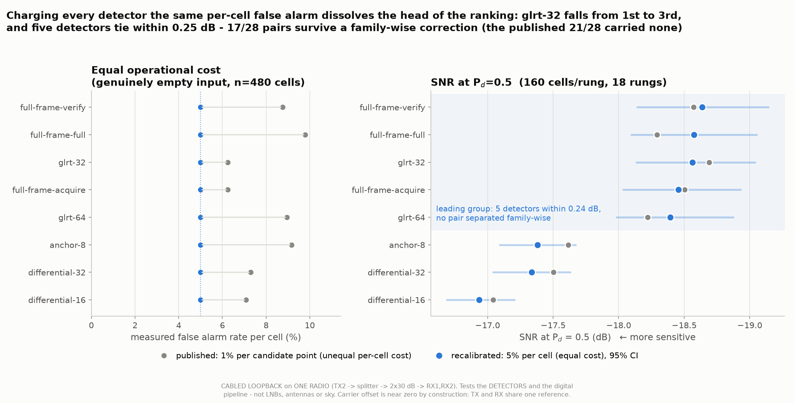

### 15c. And it is condition-dependent

| Arm | Spread | Pairs resolved |
|---|---:|---:|
| 80 ms / 2.5 MS/s | 7.69 dB | 20/28 |
| 80 ms / 1.25 MS/s | 4.92 dB | 16/28 |
| 640 ms / 2.5 MS/s | 5.51 dB | 1/28 |
| **160 ms / 5 MS/s** | **0.68 dB** | **0/28** |

The two-group split survives in all three arms that resolve anything, and
`glrt-32` sits at rank 3, 5 and 5 — consistent with an unordered head. **1.25 MS/s
costs 6.1 dB** against 2.5 MS/s at the same probe, confirming the pilot-band
argument in [section 4](#4-the-dataset-twelve-arms-and-two-geometries-for-free)
by measurement.

The most useful row is the last. At 160 ms / 5 MS/s **nothing resolves at all** —
0 of 28 pairs separate. **As probe length grows, detector
choice stops being an operational choice.** For a survey that can afford the
dwell, this is the finding that matters: pick any of them.

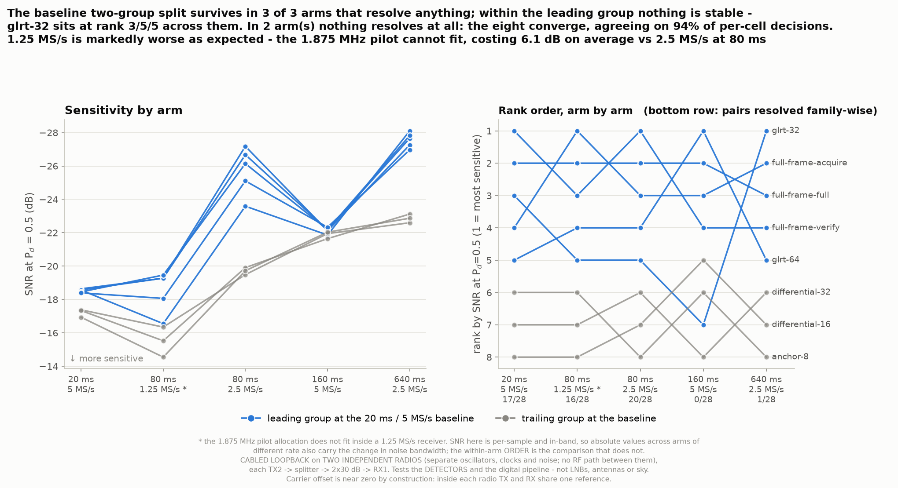

*Caveats carried from the run: the 640 ms / 10 MS/s corner was unreachable on
probe time and capture size, so 640 ms / 2.5 MS/s was substituted; that arm's
trailing-group SNR50 is extrapolated past the ladder top and is not trustworthy,
though only 1 of 28 pairs resolved there anyway. Absolute SNR50 is not comparable
across sample rates because the noise bandwidth changes — only the within-arm
order is clean.*
## 16. The −150 kHz, measured: four oscillators, and what it costs

[Section 12](#12-what-the-cliff-actually-is) argued that the −150 kHz window
centre is each LNB's own local-oscillator error rather than one shared tuning
mistake, and [section 14](#14-the-dead-port-and-the-stale-calibration-are-one-fault)
measured one of those errors the hard way, on `lnb-a`. Neither produced what the
pipeline actually needs: a number per receiver. This section measures all eight
— four ports either side of the LNB swap — checks them out of sample, and prices
what leaving them unmeasured is costing right now.

### 16a. Four independent constants, not one shared error

Two populations can measure an absolute centre, and they are independent of each
other. The **live narrow reports** come from a ±350 kHz search that *is* centred
on each receiver, and are read with the repository's own `_paired_differences`.
The **survey re-scoring** of the corpus uses a fixed ±700 kHz bank about raw zero
and ignores `receiver_centers` entirely. Where the sync corpus also carries a
port it is a third. The bracket below is the spread across those populations,
which is far wider than any of their statistical intervals and is therefore the
honest uncertainty.

| Receiver | Epoch | Absolute centre | Spread across populations | n | ppm at 9.75 GHz |
|---|---|---:|---|---:|---:|
| `lnb-a` (5d4d rx0) | gen1 | **−138,867** | [−149,345, −128,390] | 17,137 | −14.2 |
| `lnb-a` | gen2 | **+375,663** | *single population* | 1,304 | +38.5 |
| `lnb-b` (5d4d rx1) | gen1 | **−146,696** | [−159,852, −133,541] | 13,718 | −15.0 |
| `lnb-b` | gen2 | **−149,146** | [−155,439, −141,969] | 7,103 | −15.3 |
| `lnb-c` (19f2 rx0) | gen1 | **+420,686** | [402,447, 438,925] | 2,027 | +43.1 |
| `lnb-c` | gen2 | **+424,990** | [416,732, 435,332] | 6,173 | +43.6 |
| `lnb-d` (19f2 rx1) | gen1 | **+14,996** | [12,280, 17,712] | 14,602 | +1.5 |
| `lnb-d` | gen2 | **−143,566** | [−149,101, −138,197] | 9,484 | −14.7 |

**Read the `n` column carefully.** It counts every observation examined for that
port-epoch, not every observation that entered the consensus. `lnb-a` gen2 is the
case where those differ and it matters: of its 1,304 observations
only the sync corpus arm is usable, because the live search is blind there and
the survey arm fires at 5.0%. That row rests on **one** population, so treat it
as ±40 kHz. Every other row draws on 2 or more.

**−15.3 to +43.6 ppm.** That is inside an
ordinary consumer LNB specification. None of this is a fault; it is four
oscillators behaving normally and a pipeline that never asked them where they
were.

The swap acts as its own control. `lnb-b`, on the radio nobody touched, moves
**−2.4 kHz** across the boundary. `lnb-a`, on that same untouched
radio, moves **+514.5 kHz** — the fault of
[section 14](#14-the-dead-port-and-the-stale-calibration-are-one-fault), now
visible on an absolute axis. And of the two LNBs that were physically replaced,
`lnb-d` moves **−158.6 kHz** while `lnb-c` moves only
**+4.3 kHz**: a replacement part is a new draw from the same
distribution, not necessarily a different one.

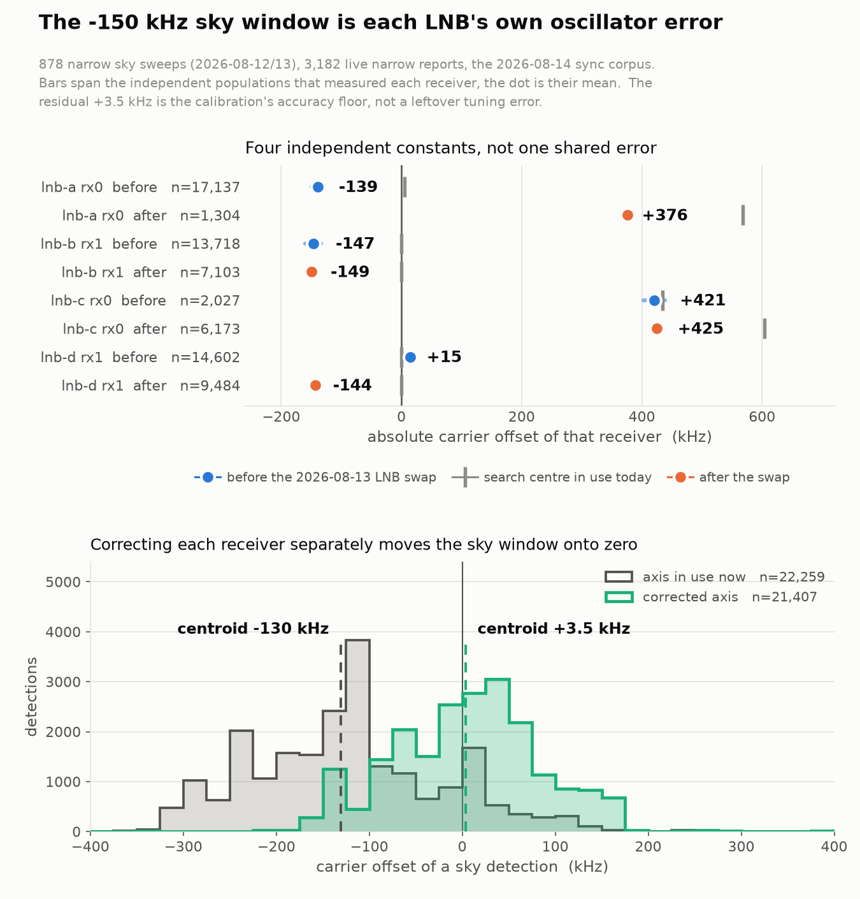

### 16b. The correction survives being tested out of sample

A centre fitted to a population and then measured on that same population proves
nothing. Three tests of increasing strength:

| Test | Centroid of the sky window | Fraction negative | n |
|---|---:|---:|---:|
| The axis in use today | **−130.5 kHz** | 85.0% | 22,259 |
| Half-sample — centres from odd sweeps, measured on even | −4.8 … +9.9 kHz per port | — | — |
| **Out of sample** — centres from the *live* reports, applied to the *survey* re-scoring | **+3.5 kHz** | 45.5% | 21,407 |

The third row shares no detector, no arm and no fitted quantity with what it is
scored on. The window moves onto zero, and the one-sided distribution that
[section 12](#12-what-the-cliff-actually-is) found becomes symmetric. Per port
the out-of-sample residuals span −33.7 to +17.0 kHz. The single exception is
`lnb-a` gen2 at −92.5 kHz, whose corpus detections are censored at the bank edge;
it needs a direct `lo_sweep` once scoring is idle.

**But the differential and the absolute centre are not interchangeable, and this
report should not pretend they are.** Differencing two absolute centres does not
reproduce the measured `rx0 − rx1`. On a *common* population — both receivers
scored on the same dual-candidate checks — the differential is reproduced to
1 kHz. The gap appears only when marginal means from *different* detection sets
are subtracted, because a differential is exact at an instant while a port's
absolute centre is a mean over the sky that port happens to detect, and two ports
do not detect the same sky.

**The consequence is a floor of roughly 20–40 kHz on any absolute per-receiver
number, which more data does not remove.** Search-window truncation was ruled out
as the cause: inverting the truncated mean against an empirical detected-Doppler
density leaves every uncensored estimate unchanged.

### 16c. Miscentring costs detections, and this is measured, not modelled

Twice, one port's applied search centre moved while its partner's did not. The
partner is a time control, so the ratio of the two ports' candidate rates
isolates the effect of miscentring from everything else that changed.

| Contrast | Miscentring | Control | Detections lost |
|---|---:|---|---:|
| `lnb-c` gen2, one applied centre to another | −179.2 kHz | `lnb-d` | **25.5%** |
| `lnb-c` gen1, corrected against uncorrected | +420.7 kHz | `lnb-d` | **66.4%** |
| `lnb-a` across its LO move | +375.7 kHz | `lnb-b` | **97.2%** |

A hard ±350 kHz window would predict near-zero loss at 150 kHz, since the
detected-Doppler density barely reaches ±200 kHz. It does not: the loss is a soft
roll-off of the timing stage and the subband filter, which is precisely why it
had to be measured rather than reasoned about.

**Against the calibration in force today, all four ports are miscentred.** The
live artifact — created 2026-08-14T19:01:37.716871Z from
900 reports, and snapshotted into this report's figures
directory because a timer rewrites it — resolves through `receiver_centers()` to:

| Port | Applied today | Measured | Miscentred by |
|---|---:|---:|---:|
| `lnb-c` | +602,869 | +424,990 | **−177,879** |
| `lnb-b` | 0 | −149,146 | **−149,146** |
| `lnb-d` | 0 | −143,566 | **−143,566** |
| `lnb-a` | −907 | +375,663 | **+376,569** |

`lnb-c` and `lnb-a` sit essentially on top of a measured contrast above, so their
losses are read off directly rather than extrapolated: about
25.5% and 97.2%. `lnb-b` and `lnb-d`
fall between that first row and zero. What is measured is that three healthy
receivers are each paying roughly a quarter of their yield as a tax nobody
noticed, because they still detect.

The survey and corpus paths do not lose detections to this, because their coarse
bank is fixed about raw zero and is never steered by `receiver_centers`. That
detection cost lands entirely on the live dwell path and everything downstream
of it.

### 16c-bis. One radio's agreement check is switched off, and the corpus records it

`survey_scoring` does read `receiver_centers`. Not to place its search — but to
form `bias = centers[0] − centers[1]` for `cross_receiver_checks`, which marks a
pair as agreeing only when `|cfo_difference − bias|` is within
`CROSS_RECEIVER_CFO_HZ`, a 15,000 Hz gate. That check needs only the
*difference*, which is the one thing a differential calibration genuinely
establishes, and its docstring says so. The design is sound.

What defeats it is that the artifact carries **one differential per radio and no
epoch**, while the differential moved by hundreds of kilohertz when the LNBs were
swapped. Reading the bias actually applied out of 5,328 scored
sidecars — not out of any calibration file, because the scoring host's artifact
turns out not to be the one on the share:

| Radio | Bias applied | Measured differential | Residual | Checks | Agree | Rate |
|---|---:|---:|---:|---:|---:|---:|
| `pluto-19f2` | +604,160 | +605,521 | +1,361 | 196,160 | 18,593 | **9.48%** |
| `pluto-5d4d` | +1,170 | +567,402 | **+566,232** | 144,832 | 264 | **0.18%** |

`pluto-19f2` happens to be carrying a bias correct to 1.4 kHz, comfortably inside
the gate, and agrees on 9.48% of its checks. `pluto-5d4d` is
carrying its **pre-swap** differential, wrong by +566,232 Hz — 38
times the gate — and agrees on 264 of 144,832
checks. A factor of 52 between two radios watching the same sky
through the same code.

**That 0.18% is not a measurement of the sky.** No real coincidence
can pass a gate offset by half a megahertz, so what survives is whatever the
false-alarm floor happens to be. On this radio the check is switched off, and
nothing in the sidecar says so — `agrees: false` looks identical whether the sky
was empty or the bias was wrong.

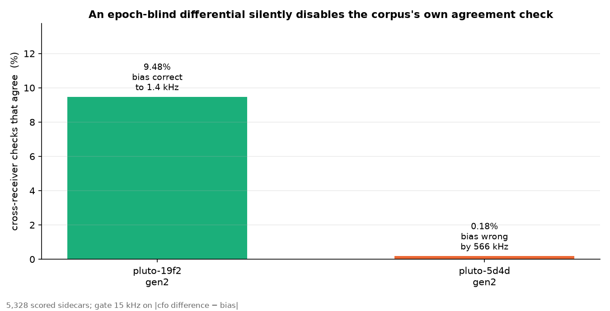

This is not a historical note: the census moved from 5,328 to
5,352 scored entries while this audit was reading it. Every
sidecar written from here on records the same epoch-blind bias. The fix is the
one [16d](#16d-what-to-write-and-the-trap-waiting-for-whoever-writes-it) asks
for, with an epoch bound added — and it needs no re-scoring, because each check
stores `bias_hz` and `cfo_difference_hz` alongside its verdict, so `agrees` can
be recomputed offline once the right differential is known. Until then, **no
`agrees` field on `pluto-5d4d` should be read as evidence about the sky.**

### 16d. What to write, and the trap waiting for whoever writes it

`receiver_centers()` returns `measured_centers_hz` verbatim when present. The
pair below is pinned so that `rx0 − rx1` equals the measured differential —
`survey_scoring.cross_receiver_checks` gates agreement at
`CROSS_RECEIVER_CFO_HZ = 15,000` Hz on exactly that difference — and then slid
bodily so the unavoidable residual is halved between the two ports instead of
dumped on one.

| Radio | `measured_centers_hz` | Residual per port |
|---|---|---:|
| `pluto-19f2` | `[443472.7, -162048.5]` | ∓−18.5 kHz |
| `pluto-5d4d` | `[396959.5, -170442.5]` | ∓−21.3 kHz |

Four things the daily timer cannot do, and one it will actively undo:

1. **It never produces an absolute number.** `measure_mismatch` differences the
   two ports and its docstring says the absolute "is not recoverable here and is
   not needed". It is needed — a per-radio differential leaves both ports free to
   sit 150 kHz off *together*, which is exactly what `lnb-b` and `lnb-d` do.
2. **It cannot find an offset outside its own search**, for the self-sealing
   reason given in [section 14](#14-the-dead-port-and-the-stale-calibration-are-one-fault).
3. **It is currently returning an epoch-blind mixture**, averaging gen1's and
   gen2's differentials together inside one 900-report
   window.
4. **It will erase the fix.** `command_starlink_lnb_calibration` builds its
   artifact from `measure_mismatch` alone and `write_calibration` replaces the
   file wholesale; `measured_centers_hz` is read by `lnb_calibration.py` and
   written nowhere. The snapshot confirms it: neither radio carries the field
   today. `leo-tracker-lnb-calibration.timer` next fires
   **Sat 2026-08-15 11:59:52 PDT** with `--apply`, so writing the values without first
   teaching the command to carry them forward from `previous`, or masking the
   timer, buys less than a day.
## Figures and provenance

Every figure is computed from the read-only corpus at
`/mnt/qnap01/mouse9911/leo/surveys/corpus/sync-*/` and the read-only scan share
at `/mnt/qnap01/mouse9911/leo-scans/`. No value in any of them is typed in by
hand. Each PNG ships with the script that produced it and a JSON sidecar holding
every value it plots, so any number here can be re-derived — or contradicted —
without re-running anything.

| # | Figure | Sidecar | Frozen at | Population behind it |
|---:|---|---|---:|---|
| 1 | [`edge-pilots.png`](figures/edge-pilots.png) | [`edge-pilots.json`](figures/edge-pilots.json) | 2,462 | one capture, ranked over 2,136 target observations in the 640 ms / 10 MS/s arm |
| 2 | [`fire-rate-problem.png`](figures/fire-rate-problem.png) | [`fire-rate-problem.json`](figures/fire-rate-problem.json) | 2,544 | 30,168 target and 15,072 null observations; 1,257 paired sweeps |
| 3 | [`apparatus.png`](figures/apparatus.png) | [`apparatus.json`](figures/apparatus.json) | 2,462 | 9,712 paired tunings in 1,214 scored pairs |
| 4 | [`arm-matrix.png`](figures/arm-matrix.png) | [`arm-matrix.json`](figures/arm-matrix.json) | 2,554 | 7,054 captured sweeps, 6,364 matched-arm |
| 5 | [`geometry.png`](figures/geometry.png) | [`geometry.json`](figures/geometry.json) | 2,554 | 7,054 captured, 6,161 imported pairs, 1,261 scored pairs |
| 6 | [`coincidence-model.png`](figures/coincidence-model.png) | [`coincidence-model.json`](figures/coincidence-model.json) | 2,547 | 36,384 joined matched-arm cells from 1,137 matched-arm sweeps |
| 7 | [`negative-control.png`](figures/negative-control.png) | [`negative-control.json`](figures/negative-control.json) | 2,339 | 16,560 matched-arm cells in each of three joins; 1,035 matched-arm sweeps |
| 8 | [`algorithm-correlation.png`](figures/algorithm-correlation.png) | [`algorithm-correlation.json`](figures/algorithm-correlation.json) | 2,547 | 40,256 live target observations; 1,258 paired sweeps |
| 9 | [`channel-edge-correlation.png`](figures/channel-edge-correlation.png) | [`channel-edge-correlation.json`](figures/channel-edge-correlation.json) | 2,547 | 5,032 receiver-chain passes, `lnb-a` included (1,258 pairs x 4 live receivers) |
| 10 | [`edge-agreement.png`](figures/edge-agreement.png) | [`edge-agreement.json`](figures/edge-agreement.json) | 2,547 | six receiver pairs, n = 10,064 each, `lnb-a` included |
| 11 | [`cfo-cliff.png`](figures/cfo-cliff.png) | [`cfo-cliff.json`](figures/cfo-cliff.json) | 2,339 | 178,399 live target points from 1,146 paired sweeps |
| 12 | [`port-bias.png`](figures/port-bias.png) | [`port-bias.json`](figures/port-bias.json) | 2,547 | 1,258 paired sweeps, 398,435 points, all four ports with `lnb-a` on its **measured** +567,402 Hz centre |
| 13 | [`absolute-centres.png`](figures/absolute-centres.png) | [`absolute-centres.json`](figures/absolute-centres.json) | **not stamped** | narrow sky sweeps and live narrow reports, the 2026-08-14 sync corpus; 22,259 detections before correction and 21,407 after |

Figures 1–6, 8–10 and 13 are new. Figures 7, 11 and 12 are carried unchanged from
[the detailed record](../sync-scan-cross-radio-2026-08-14/REPORT.md) together
with their scripts and sidecars, which is why they carry an earlier freeze.

All the scripts, their sidecars and the extractors that feed them are in
[`figures/`](figures/). Each figure runs in two steps — an extractor that
streams the corpus into a compact local cache, because the capture host is short
of memory, then the figure script itself. The extractors are prefixed by the group
they belong to: `abscal-pipeline-*` feeds Figure 13, `opening-pipeline-*` feeds Figures 1 and 3,
`firerate-pipeline-*` feeds Figures 2 and 6, `heatmaps-pipeline-*` feeds Figures
8 to 10, and `carried-pipeline-*` feeds Figures 7, 11 and 12. Figures 4 and 5
build their own cache on first run. The scripts import the repository's own
estimator from `/home/satpi01/leo-tracker/src`; change that path if the checkout
moves. The caches they build are not committed — they are large, and each is one
command to rebuild.

The census used by each figure is frozen by a snapshot step *before* the figure
computes and re-measured afterwards; both readings, and the list of sidecars
that landed in between, are recorded in each sidecar. Across every run behind
this report the recheck showed **0 sweeps added and 0 sidecars removed** — only
scoring advanced. **Figure 13 is the one exception**: it carries no census stamp,
so its population is bounded by the date ranges named in its own sidecar rather
than by a frozen count, and it should be re-run with a snapshot step before
anyone relies on its `n` values as a closed set. Collection stayed paused throughout, the collector, drain and
import services were neither stopped nor restarted, the radios were not touched,
and all share and NVMe paths were read only.

Raw sweeps and the format README are at `/mnt/qnap01/mouse9911/leo-scans`;
corpus entries at `/mnt/qnap01/mouse9911/leo/surveys/corpus`; collector, drain
and import implementations at `/mnt/leo-nvme/leo-tracker/bin/`. The
authoritative full-corpus estimator run that this report checks itself against
is preserved beside the detailed record as
[`review-full-corpus.txt`](../sync-scan-cross-radio-2026-08-14/review-full-corpus.txt).

### Injection provenance (sections 11, 13, 14)

The sky provenance above does not cover the injection sections, whose raw
records are archived separately at
[`injection-data/`](injection-data/) with a README giving the full rig
description. Summary:

| | |
|---|---|
| Radios | ADALM-Pluto Rev.C, fw `v0.38-plutoplus-spf-libiio-metadata-v5`. `104000bac495…` at `ip:192.168.1.183`; `1040007c4a94…` at `ip:192.168.1.165` |
| Topology | `TX2 → SMA splitter → 2× 30 dB → RX1 and RX2`, closed path, no antenna, no LNB, no RF path between the two radios |
| Waveform | `leo_tracker.radio.beacon.pilots.edge_pilot_frame` — the repository's own pilot frame, not a tone |
| LO / rate / probe | 1,190,312,500 Hz; 5 MS/s; 20 ms |
| Gains | RX manual 40 dB; the digital drive on `.183` and the extra cable loss on `.165` are in the README, not in any sidecar |
| Thresholds | 1% per candidate point, drawn on TX-off input verified indistinguishable from a dark DAC |
| Carrier offset | natural offset near zero by construction (shared reference); offsets in 11c and T3 are **imposed** on the waveform |
| Records | `injection-data/{one-radio,radio-165,two-radio}/*.jsonl.gz`, plus the harnesses and the `analysis.py` helper the figure scripts import |
| Software | this repository at the commit that adds these records |

**Two gaps to be honest about.** The occupancy schedule's seed is recorded in
the run files but the schedule is not separately tabulated here; and no
environmental conditions were logged, which matters for any later attempt to
reproduce a level-dependent result on different hardware.
