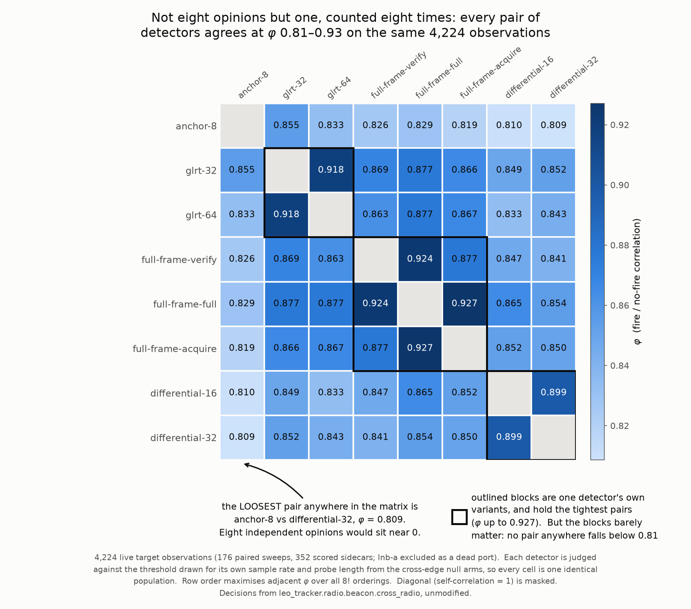
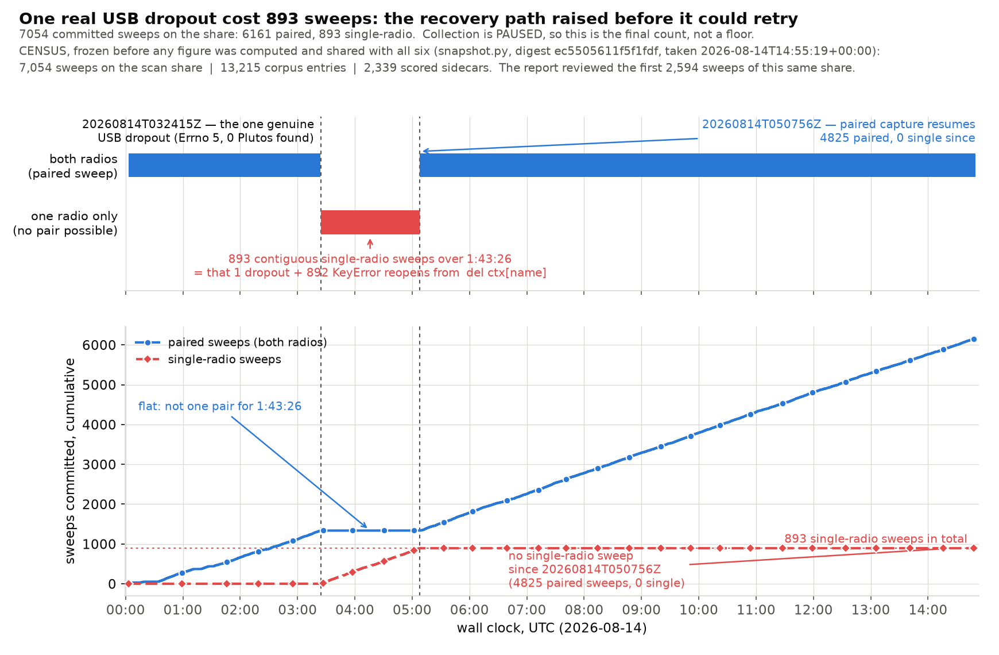
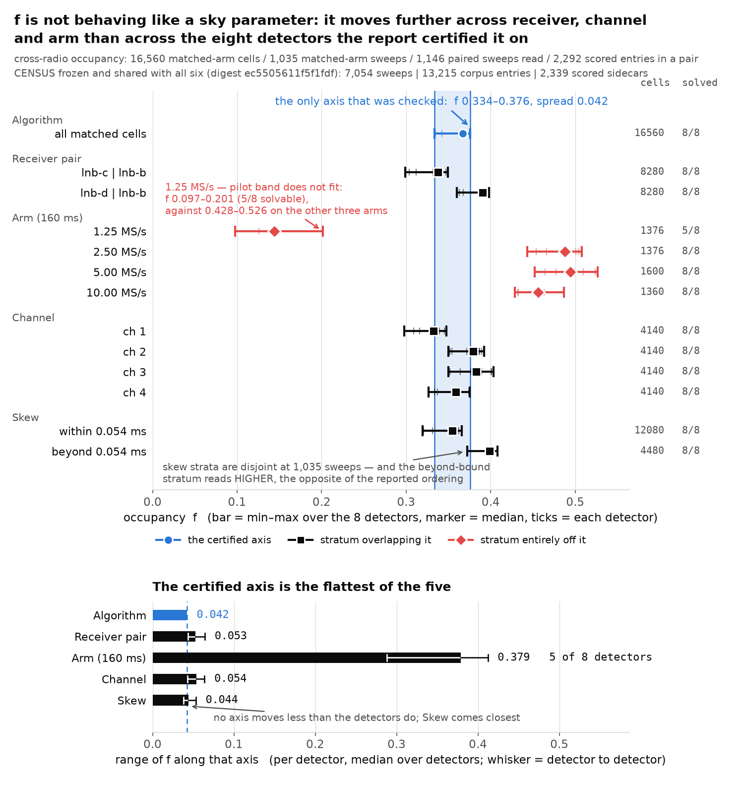

# Cross-radio synchronised scan — retraction and corrected record

Date: 2026-08-14 UTC
Status: **apparatus works and the corpus is sound; every scientific claim made
from it has been withdrawn**

## Executive summary

Two Pluto SDRs were driven from one process, two threads, and a
`threading.Barrier` at every tuning, so both radios sat on the same tuning at
the same instant. The apparatus does what it was built to do: 2,442 committed
paired sweeps were captured to NVMe, shipped to QNAP in byte-verified batches,
imported to corpus form on a timer, and scored by eight detectors. That part
of the work stands.

The findings drawn from it do not. An earlier version of this report claimed
three results. Two independent adversarial reviews returned `SERIOUS_ISSUES`,
and all three claims are withdrawn here:

- **Withdrawn — "six of eight methods agree on sky occupancy f = 0.2278 ±
  0.007, validating the cross-radio coincidence model."** The agreement is not
  evidence. A negative control that joins radio A of one sweep to radio B of a
  *different* sweep, minutes apart, passes the same check. The eight detectors
  correlate with each other at φ 0.82–0.94, so they are near-duplicates and
  their f estimates must agree whatever the input.
- **Withdrawn — "`differential-16` and `differential-32` are miscalibrated;
  implied detection probability d > 1 is impossible."** That rested entirely on
  assuming the nominal 1% false-alarm rate. Measured from the cross-edge null
  arms the rate is ≈6.5%, and at the measured value every method lands in
  physical range. The differentials were never shown to be broken.
- **Withdrawn in its reasoning — "no detection cliff at the pilot guard band;
  only 1.25 MS/s is handicapped."** Re-binned on the bias-corrected offset,
  all three live ports collapse onto one curve and a cliff appears between 350
  and 400 kHz at 2.5, 5.0 *and* 10 MS/s. The guard bands at those rates are
  +312.5, +1562.5 and +4062.5 kHz — a 13× range that does not move the cliff.
  It is a rate-independent ≈350 kHz offset tolerance, which is the CFO search
  span, not the pilot band.

What survives is smaller and mostly instrumental: an LO bias on `lnb-c` large
enough to have been mistaken for a weak receiver, a genuinely handicapped
1.25 MS/s arm, a dead port, a collector bug that cost 893 sweeps, and
synchronisation that is far looser than the analysis assumed. Those are stated
below with the numbers they rest on.

Two facts govern everything that follows, and neither was properly stated in
the withdrawn version:

1. **There is no signal injection at this site.** Every detection probability
   in this report is a *model output* inferred from a coincidence model, never
   measured against a known input. `survey_comparison` says this in its own
   module docstring — "there is no injection here, so there is no Pd, and this
   file refuses to imply one" — and the withdrawn report implied one anyway.
2. **The cross-radio estimator was not shown to beat the within-radio one.**
   Independence of the two radios remains an assumption, not a measurement.

## Claim ledger

Every claim this report or its withdrawn predecessor rests on, what happened to
it, and the one number that decides it. The numbers in this table are the
report's own, taken from the sections below. The figures in [`figures/`](figures/)
were computed from a later, larger snapshot of the same corpus, so a figure's
version of a number can differ from the text's; where it does, the difference is
listed in [Figures and snapshots](#figures-and-snapshots) and nothing is
reconciled silently.

| Claim | Status | The number that decides it | Where |
|---|---|---|---|
| Cross-detector agreement on `f` validates the coincidence model | **Retracted** | all three joins land at or below their own sampling-noise median (0.92× real, 0.68× shifted, 0.78× scrambled), so the check fires on data the model forbids | Retraction 1, Figure 1 |
| The eight detectors are eight independent opinions | **Retracted** | φ 0.82–0.94 between detectors over 2,160 observations | Retraction 1, Figure 2 |
| `differential-16` and `differential-32` are miscalibrated, implied d > 1 | **Retracted** | the false-alarm rate is ≈6.5% measured from the cross-edge nulls, not the 1% assumed | Retraction 2 |
| No detection cliff at the pilot guard band | **Retracted** | the collapse falls between the 300–350 and 350–400 kHz bins at 2.5, 5.0 and 10 MS/s while the guard band moves 13× | Retraction 3, Figure 3 |
| 1.25 MS/s is handicapped | **Stands** | `pilot_band_fits` false on all 1,263 radio-arms at that rate; f = 0.015 on the 160 ms arm | 1.25 MS/s section |
| `lnb-c` is a weak receiver | **Retracted** | `receiver_centers_hz` = +604,159.8 Hz, applied at scoring time; bias-corrected it is the best port at 61.4% (n = 347) | `lnb-c` section, Figure 4 |
| `hardware/epochs.json` +430,700 Hz corroborates that bias | **Retracted** | it belongs to epoch `gen1`, which ended 2026-08-13T04:38:23Z; these scans are all `gen2` | `lnb-c` section |
| `lnb-a` is dead, and excluding it is load-bearing | **Stands; one coincidence unexplained** | flat ≈1.19 peak-to-median at every tuning since 2026-08-13 04:44 UTC | `lnb-a` section, and the audit note under Figure 4 |
| The collector bug cost ~400 sweeps | **Corrected upward to 893** | one genuine USB loss and 892 self-inflicted `KeyError` reopens, one contiguous window | collector section, Figure 5 |
| Synchronisation is adequate | **Open — not a checkable statement yet** | 4,116 of 12,392 paired tunings (33.2%) exceed 0.054 ms, and every one passes the 0.2–0.5 s operator target | synchronisation section |
| Simultaneity matters | **Open — hypothesis, not a result** | within-bound f 0.310–0.372 against beyond-bound 0.220–0.288 (the larger snapshot behind Figure 6 does not reproduce the separation) | simultaneity section, Figure 6 |
| `f` behaves like a sky parameter | **Retracted** | f moves 0.015 to 0.510 across arm and +0.072 across receiver pair — further than across the detectors estimating it | f-strata section, Figure 6 |
| Cross-radio beats within-radio | **Not shown** | f spreads 0.077 on 720 cells and 0.050 on 1,440 cells overlap | closing section |
| Detection probabilities in this report are measured | **Retracted** | there is no injection at this site; every d is a model output | closing section |
| Abandon 2.5 MS/s | **Withdrawn recommendation** | 2.5 MS/s carries the same ≈350 kHz tolerance as 5.0 and 10 MS/s | Retraction 3 |

## What was built

One collector process (`/mnt/leo-nvme/leo-tracker/bin/synccollect.py`, run by
`leo-sync-scan.service`) opens both radios and runs one thread per radio with a
`threading.Barrier` at every tuning. Twelve arms cross probe length
{80, 160, 640} ms with sample rate {1.25, 2.5, 5.0, 10.0} MS/s, drawn uniformly
per sweep. Both radios take the same arm with p = 0.9; the remaining 10% put two
different configurations on the same sky at the same instant. Each radio draws
its edge order (`L` or `U`) independently every sweep, so about half of all
sweeps have the two radios on opposite edges of the same channel simultaneously
and about half have them on the identical tuning.

The twelve arms, and the detection threshold each one carries. Every arm is
scored against its own threshold — the 1% false-alarm order statistic of that
arm's cross-edge null — so no fire in this report is compared against a
threshold drawn for a different arm (`differential-32`, read from
[`figures/cfo-cliff.json`](figures/cfo-cliff.json)):

| Probe | 1.25 MS/s | 2.5 MS/s | 5.0 MS/s | 10.0 MS/s |
|---|---:|---:|---:|---:|
| 80 ms | 0.1029 | 0.0901 | 0.1076 | 0.0948 |
| 160 ms | 0.0831 | 0.0600 | 0.0707 | 0.0721 |
| 640 ms | 0.0525 | 0.0548 | 0.0500 | 0.0441 |

The 1.25 MS/s column is scored like the rest, but its pilot band does not fit
and it is handled separately below. The other three columns are the live rates
every retraction here is argued on.

| Stage | Unit | Function |
|---|---|---|
| Capture | `leo-sync-scan.service` | both radios, one process, barrier per tuning, IQ to NVMe |
| Transfer | `leo-sync-drain.service` | batched rsync to QNAP; a directory appears only after every file matched byte for byte |
| Import | `leo-sync-import.timer` (5 min) | hard-links sweeps into survey-corpus entries |
| Scoring | survey scorer | eight detectors per observation |

`sweep.json` is written last, after both IQ files are closed, so its presence is
the commit marker. All 2,442 sweep directories in the census carried one; there
were zero incomplete directories.

Raw data and the format README are at `/mnt/qnap01/mouse9911/leo-scans`.

### Corpus census

Census taken 2026-08-14T05:36Z. The collector was still running, so every total
here is a floor — the share held 2,485 sweeps three minutes later.

| Quantity | Measured |
|---|---:|
| Sweep directories, all with `sweep.json` | 2,442 |
| Paired sweeps (both radios produced IQ) | 1,549 |
| Single-radio sweeps | 893 |
| `matched_arm` fraction | 0.9066 |
| Distinct arms present | 12 of 12 |
| Declared IQ volume | 347.84 GB |
| Corpus entries imported from these sweeps | 3,959 |
| — from `pluto-19f2` / `pluto-5d4d` | 2,426 / 1,533 |
| Corpus entries scored at census | 320 |
| Scored observations | 7,680 (5,120 target, 2,560 cross-edge null) |

The 2,426 − 1,533 = 893 entry deficit on `pluto-5d4d` is exactly the
single-radio outage described below; the two counts agree independently.

The eight scoring methods present on every observation are `anchor-8`,
`coarse-A`, `coarse-E`, `differential-16`, `differential-32`, `full-frame-300`,
`glrt-32` and `glrt-64`. Those are the *proposers*, the methods that write a
certificate. Every place a certificate claims is then re-scored by eight
*confirmers*, and it is the confirmer scores that the coincidence estimator
reads — so the confirmer names are the ones the figures in this report carry.
The two lists differ in three entries, because `adjudicated` returns the
300-symbol statistic three ways: the full pilot set and the disjoint ACQUIRE and
VERIFY halves (`src/leo_tracker/radio/beacon/survey_scoring.py`).

| Layer | Field in `scores.json` | The eight names |
|---|---|---|
| Proposer | `observations[].certificates[].method` | `anchor-8`, `coarse-A`, `coarse-E`, `differential-16`, `differential-32`, `full-frame-300`, `glrt-32`, `glrt-64` |
| Confirmer | `observations[].points[].methods` | `anchor-8`, `differential-16`, `differential-32`, `full-frame-acquire`, `full-frame-full`, `full-frame-verify`, `glrt-32`, `glrt-64` |

## Retraction 1 — cross-detector agreement on f is not evidence

The withdrawn claim was that six of eight methods agreeing on f = 0.2278 ±
0.007 validated the cross-radio coincidence model. Two controls kill it.

Recomputed on 2,464 matched-arm cells in each join (154 paired sweeps, 352
scored sidecars). Thresholds and the empty-sky rate `p` are drawn **once** from
the cross-edge null arms and held fixed across all three, so the join is the
only thing that changes:

| Join | Model can hold? | f range | spread | vs its own noise median |
|---|---|---|---:|---:|
| Real: radio A and radio B of one sweep, same instant | yes | 0.255–0.302 | 0.047 | 0.92× |
| Radio B shifted by two instants within one sweep | **no** | 0.644–0.710 | 0.066 | 0.68× |
| Radio A to radio B of a *different* sweep, median 24 min apart | **no** | 0.795–0.894 | 0.099 | 0.78× |

The last column is the argument. Each join's spread is compared against the
sampling noise *for that join*, resampled 200×, and all three land **at or
below their own noise median** — the scrambled join, where the two radios never
shared sky at all, further below it than the real one. By the verdict's own
standard, "within sampling noise" fires on every join, including the two the
model forbids. A test that cannot fail is not a test.

Note what the raw spreads do *not* show: the scrambled join has the widest
spread of the three, not the narrowest. An earlier draft of this section
claimed the shifted control came out numerically tighter than the real join.
It does not, and that framing is withdrawn. The refutation does not need it —
it rests on every join clearing its own noise floor.

Meanwhile f itself moves 3× across the joins, from 0.27 to 0.79. The joins
really are different data; the estimator is not simply returning the same
answer three times.


***Figure 1 — the check cannot fail.*** *Same estimator, same 2,464 matched-arm
cells, same thresholds and same empty-sky rate in all three joins; only the
pairing changes. Left: f moves 3× across the joins — mean 0.285 real, 0.679
shifted, 0.838 scrambled — so these really are different data, and the eight
detectors stay clustered on all three. Right: each join's observed spread
(0.047, 0.066, 0.099) against the p05–p95 band of 200 joint resamples of that
same join; every one lands at or below its own noise median (0.051, 0.097,
0.126), the scrambled join furthest below at 0.78×. The panel title's "just as
tightly" is about tightness relative to each join's own sampling noise, not the
raw spreads, which grow from 0.047 to 0.099. Population: 154 paired sweeps, 352
scored sidecars; scrambled partners are a median 1,446.5 s apart, minimum
235 s.
Estimator `leo_tracker.radio.beacon.cross_radio`, unmodified; every plotted
value is in [`figures/negative-control.json`](figures/negative-control.json).*

The root cause is that the eight detectors are not eight independent opinions.
Over 2,160 observations they correlate with each other at φ 0.82–0.94. They
are near-duplicates, so their f estimates must agree whatever the input,
including on inputs where the model being validated is known to be wrong.

The corollary is uncomfortable and is stated rather than buried: **"which
detector is best" may be the wrong question at this corpus size.** At φ
0.82–0.94 the eight are not distinguishable, and any ranking among them is
reading noise.



***Figure 2 — why the check cannot fail.*** *φ between every pair of the eight
confirmers, on the same 4,224 live target observations (176 paired sweeps, 352
scored sidecars, `lnb-a` excluded, no missing verdicts). No pair anywhere in the
matrix falls below φ = 0.809 — `anchor-8` against `differential-32` — and the
tightest is 0.927, `full-frame-full` against `full-frame-acquire`; the mean over
the 28 pairs is 0.858. Eight independent opinions would sit near 0.
Near-duplicates are obliged to return near-identical f whatever they are fed,
which is exactly what the controls above show. Row order maximises adjacent φ
over all 8! = 40,320 orderings, which is why the outlined same-family blocks
land on the diagonal. Values in
[`figures/method-correlation.json`](figures/method-correlation.json). The text
above quotes φ 0.82–0.94 over 2,160 observations, measured on an earlier,
smaller snapshot; the conclusion is the same either way.*

## Retraction 2 — the differentials were never shown to be miscalibrated

The withdrawn claim was that `differential-16` and `differential-32` implied a
detection probability d > 1, which is impossible, and that their effective
false-alarm rate was 2–3× the nominal 1%.

That inference assumed the nominal rate. The repository carries it as a
default, not a measurement — `DEFAULT_FALSE_ALARM_RATE = 0.01` in
`src/leo_tracker/radio/beacon/survey_comparison.py` — and the same module
already warns that "a threshold from a finite null bounds a false-alarm rate;
it does not pin one."

Measured from the cross-edge null arms, the effective rate is ≈6.5%. At the
measured value every method, including both differentials, lands in physical
range. The impossible d > 1 was an artefact of the assumed denominator. The
differentials are not exonerated by this — nothing here shows them to be good
— but the specific charge against them is withdrawn.

Per detector, measured on the cross-edge null arms of 176 paired sweeps (352
scored sidecars; 96 thresholds drawn, one per detector per (sample rate, probe
length); [`figures/negative-control.json`](figures/negative-control.json)):

| Detector | Assumed | Measured null firing rate per cell |
|---|---:|---:|
| `anchor-8` | 1.00% | 6.48% |
| `differential-16` | 1.00% | 6.48% |
| `differential-32` | 1.00% | 6.63% |
| `full-frame-acquire` | 1.00% | 6.86% |
| `full-frame-full` | 1.00% | 6.81% |
| `full-frame-verify` | 1.00% | 6.81% |
| `glrt-32` | 1.00% | 5.78% |
| `glrt-64` | 1.00% | 6.53% |
| **mean of the eight** | **1.00%** | **6.55%** |

Every detector sits near 6.5%, within a 1.1-point band. Nothing in that column
singles the differentials out; the gap is between the assumption and the whole
instrument.

## Retraction 3 — there is a cliff, and it is the CFO search span

The withdrawn claim was that there is no detection cliff at the pilot guard
band and that only 1.25 MS/s is handicapped. The conclusion that 1.25 MS/s is
handicapped survives (see below); the reasoning about the guard band does not.

The pipeline already computes a bias-corrected offset — `residual_cfo_hz`,
populated on 38,400 certificates in the scored census — and it had never been
used as a binning axis. Re-binned on it, all three live ports collapse onto one
curve and a cliff appears at every rate whose pilot band fits.

`differential-32` detection percentage by corrected-offset bin (bins 50 kHz
wide, 0–450 kHz):

| MS/s | 0–50 | 50–100 | 100–150 | 150–200 | 200–250 | 250–300 | 300–350 | 350–400 | 400–450 |
|---:|---:|---:|---:|---:|---:|---:|---:|---:|---:|
| 2.5 | 10.6 | 25.3 | 36.4 | 45.3 | 39.0 | 40.0 | 26.7 | 0.0 | 1.2 |
| 5.0 | 17.0 | 33.5 | 43.6 | 55.9 | 31.0 | 19.7 | 12.1 | 2.0 | 1.9 |
| 10.0 | 24.1 | 49.0 | 50.6 | 60.4 | 38.9 | 28.6 | 10.8 | 1.6 | 1.8 |

The collapse falls between the 300–350 and 350–400 kHz bins in all three rows.
The pilot guard bands at those rates, read from the scored records, are:

| Sample rate | `pilot_guard_hz` | `pilot_band_fits` |
|---:|---:|---|
| 1.25 MS/s | −312,500 | false |
| 2.5 MS/s | +312,500 | true |
| 5.0 MS/s | +1,562,500 | true |
| 10.0 MS/s | +4,062,500 | true |

The guard spans a 13× range across the three live rates and the cliff does not
move. A rate-independent ≈350 kHz tolerance is the CFO search span, not the
pilot band.


***Figure 3 — the cliff does not move with the guard.*** *`differential-32`,
fired against its own (sample rate, probe length) cross-edge-null 1% threshold
and binned on the pipeline's bias-corrected offset, over 176 paired sweeps. In
the 350–400 kHz bin the rate collapses at every live rate: 21.6% → 2.5% at
2.5 MS/s (n 287 → 120), 11.9% → 1.2% at 5.0 MS/s (n 943 → 404), 12.7% → 1.2% at
10 MS/s (n 656 → 247). The three guards span 13×, and two of them are never
reached at all — the largest corrected offset anywhere in the corpus is
1,414.1 kHz, well inside both. All nine (rate, probe length) cells collapse in
the same bin, so the cliff is not an artefact of pooling probe lengths within a
rate. Crosses are the nine values quoted per rate in the table above, plotted
against the recomputed lines rather than instead of them; they track within 10.8
points everywhere and put the cliff in the same bin. Lower panel is n per bin,
with a dotted line at n = 150 below which a bin is too thin to lean on. Values
in [`figures/cfo-cliff.json`](figures/cfo-cliff.json).*

The withdrawn report reached a partly correct destination by an
argument the data does not support, which is worse than being wrong, because it
would have survived review unexamined.

## What survives and is actionable

The four receivers and what each one's status rests on, before the sections that
argue them:

| Receiver | Radio, input | `receiver_centers_hz` applied at scoring | Status in this corpus |
|---|---|---:|---|
| `lnb-c` | `pluto-19f2` rx0 | +604,159.8 | live; large LO bias, best port once corrected |
| `lnb-d` | `pluto-19f2` rx1 | 0.0 | live; no bias |
| `lnb-a` | `pluto-5d4d` rx0 | +1,170.0 | excluded as dead from 2026-08-13 04:44 UTC |
| `lnb-b` | `pluto-5d4d` rx1 | 0.0 | live; no bias |

### `lnb-c` carries a large LO bias and is the best port on site


***Figure 4 — `lnb-c` is shifted, not deaf.*** *5 MS/s, `differential-32`, 176
paired sweeps. On the raw axis `lnb-c` reads 1.2% (n = 402) in the 100–200 kHz
bin where the other two ports peak, because its whole response has moved to
400–500 kHz (54.9%, n = 541) — its +604.2 kHz LO bias. Bias-corrected it is the
strongest port in that bin: 60.6% (n = 487) against `lnb-b` 36.5% (n = 705) and
`lnb-d` 40.7% (n = 762), a real 1.5× port difference that survives the
correction rather than being created by it. `lnb-b` and `lnb-d` carry zero bias,
so their two panels are identical by construction and only `lnb-c` moves. Values
in [`figures/port-bias.json`](figures/port-bias.json).*

***Audit note carried by the figure, recorded here and not resolved.***
*`lnb-a` is excluded because `cross_radio.DEAD_RECEIVERS` records it as flat
≈1.19 at every tuning. Scored on `differential-32`, this corpus does not
reproduce that: `lnb-a` fires on 12.47% of its 9,276 target points against
`lnb-b`'s 14.50% of 9,250, and its cross-edge null is not silence — median
0.0182 and p99 0.0799, against `lnb-b`'s 0.0198 and 0.0831. The exclusion is
applied throughout this report regardless, and the section below is left as
written; the disagreement belongs in the record
([`figures/lnb-a-check.py`](figures/lnb-a-check.py)).*

The scored records apply `receiver_centers_hz` at scoring time. Two distinct
values appear across the census, one per radio:

| Radio | Receivers | `receiver_centers_hz` |
|---|---|---|
| `pluto-19f2` | `lnb-c`, `lnb-d` | `[604159.8, 0.0]` |
| `pluto-5d4d` | `lnb-a`, `lnb-b` | `[1170.0, 0.0]` |

`lnb-c` therefore sits +604.2 kHz off. That is well past the ≈350 kHz tolerance
found above, which is enough to make a healthy port look dead. It is **not** a
weak receiver. Bias-corrected it is the best port on site:

| Port | 5 MS/s, corrected offset 100–200 kHz | n |
|---|---:|---:|
| `lnb-c` | 61.4% | 347 |
| `lnb-b` | 41.7% | 458 |

**Correction to the brief that produced this report.** `hardware/epochs.json`
records `lnb-c` at +430,700 Hz (n = 13, SE 12,600), and that was offered as
independent corroboration of the +604.2 kHz figure. It is not. That measurement
belongs to epoch `pluto-19f2.lnb-cd.gen1`, which ended 2026-08-13T04:38:23Z; the
units were replaced and epoch `gen2` begins 2026-08-13T04:46:20Z with
`"measured": null` and a pending action to run `lo_sweep` once ~40 post-swap
probes exist. These scans are all `gen2`. The +430,700 Hz number describes a
*different physical unit*. The epochs file itself warns about exactly this
trap: "Receiver labels are reused across hardware changes… Split on capture
start time, not on label." The +604.2 kHz value stands on its own — it is
recorded directly in the corpus and was applied at scoring time — but it has
one measurement behind it, not two.

Operational fix: correct the bias, or widen the CFO search past 350 kHz.
**Do not abandon 2.5 MS/s.** That was the earlier, wrong recommendation and it
followed from the mis-binned analysis in Retraction 3.

### 1.25 MS/s is genuinely poor

f = 0.015 on the 160 ms arm. The mechanism is not subtle: the eight edge-pilot
subcarriers span 1.875 MHz and only 1.25 MHz is sampled, so `pilot_guard_hz` is
negative — −312,500 Hz, exactly the (1.875 − 1.25)/2 overhang — and
`pilot_band_fits` is `false` on all 1,263 radio-arms at that rate. The radio
returns healthy-looking IQ regardless. These arms must not be pooled with arms
that fit.

### `lnb-a` is dead

`lnb-a` (rx0 on `pluto-5d4d`) died at 2026-08-13 04:44 UTC, returning a flat
≈1.19 peak-to-median at every tuning — no signal path rather than a weak one.
It is excluded from both the target and the null arms throughout. That
exclusion is load-bearing: a dead port's null is silence, and leaving it in
would drag every threshold down and inflate every detection rate scored against
those thresholds.

One coincidence is recorded without a claim attached. The `lnb-c`/`lnb-d` swap
on the *other* radio has an uncertainty window of 04:38:23Z–04:46:20Z on
2026-08-13 in `hardware/epochs.json`, and `lnb-a` died at 04:44 UTC — inside
it, on a radio the swap did not touch. Physical work on site at that moment is
a plausible common cause and should be checked against the bench log before
`lnb-a` is written off as a component failure.

### The collector bug cost 893 sweeps, not ~400



***Figure 5 — one dropout, 1:43:26 without a single pair.*** *Committed sweeps
on the share at the 2026-08-14T06:51Z read: 3,069, of which 2,176 paired and 893
single-radio. The 893 are one contiguous run from 20260814T032415Z to
20260814T050741Z. The genuine event is one USB loss at the start of it — the
`OSError: [Errno 5] Input/output error` behind the `found 0` reopen quoted
below; the other 892 reopen failures are the `KeyError` the bug turned that
single dropout into. Paired capture resumes at 20260814T050756Z and all 840
sweeps after it are paired, none single. The collector was live during the read,
so both totals are floors. Values in
[`figures/outage-timeline.json`](figures/outage-timeline.json).*

A USB dropout wedged the collector's reopen path. The reopen block deleted the
context with `del ctx[name]`, which raised before the retry below it could ever
run, turning one dropped USB device into a permanently dead radio. It is fixed
by using `ctx.pop(name, None)`; the live collector now carries the fix and the
comment explaining it.

The measured extent is larger and earlier than the brief for this report
stated, and the corrected figures are:

| | Stated in brief | Measured |
|---|---|---|
| Failed reopens | 888 | 893 |
| Single-radio sweeps | ~400 | 893 |
| Window | 04:18 – 05:07 UTC | 03:24:15Z – 05:07:41Z |
| Episodes | 1 | 1 (contiguous, no gaps) |

`grep -c` on `/mnt/leo-nvme/leo-tracker/sync-scans/collector.log` gives 893
failed reopens, of which **exactly one** is the genuine hardware event —
`reopen pluto-5d4d FAILED: expected one USB Pluto with serial …5d4d, found 0` —
and the other **892** are `reopen pluto-5d4d FAILED: 'pluto-5d4d'`, the
`KeyError` from the bug. One real USB dropout produced 892 self-inflicted
failures. The surviving radio was `pluto-19f2` in all 893 cases.

Those 893 sweeps are single-radio and cannot form pairs. Paired capture is
restored and verified: the single-radio run is one contiguous block and every
sweep after 2026-08-14T05:07:41Z is paired.

### Synchronisation is looser than the analysis assumed

Skew is recorded at **barrier release**, not at first sample, and is therefore
a **lower bound** on the true sample-start offset. The collector computes it as
`1000*abs(x-y)` over the two radios' barrier arrival times.

Two independent measurements, both reported because they disagree:

| Population | median | max | over 0.054 ms |
|---|---:|---:|---|
| First 87 sweeps (the withdrawn analysis) | 0.0436 ms | 8.3409 ms | 200 of 696 (28.7%) |
| All 1,549 paired sweeps (this census) | 0.0460 ms | 11.5125 ms | 4,116 of 12,392 (33.2%) |

The whole-corpus recheck is worse than the subset in both tail and failure
rate. Per-sweep medians give 0.0449 ms; p90 is 0.0881 ms and p99 is 2.0620 ms.

Two caveats belong with these numbers.

**Which specification.** Against the 0.054 ms bound used by the coincidence
analysis, a third of all paired tunings fail. Against the operator target of
0.2–0.5 s recorded in the share README, every tuning passes by four orders of
magnitude. The bound the coincidence model actually requires has not been
derived, so "worse than specified" is true of one specification and false of
the other. Deriving the required bound is a prerequisite for interpreting any
of this.

**The recorded skew does not see the dominant term.** Same-order and
opposite-order sweeps have almost identical barrier-release skew — median
0.0455 ms (n = 5,952 tunings) against 0.0463 ms (n = 6,440). The share README
states that the true sample-start offset is ≈0.2–0.8 ms on same-order sweeps
and ≈4 ms on opposite-order sweeps, because the two radios write different
local-oscillator frequencies after the barrier releases and those writes take
different times. A ≈5× difference in the real offset appears as a 2% difference
in the recorded one. The recorded number is measuring the barrier, not the
radios.

### Simultaneity appears to matter — as a hypothesis, not a result

Cells within the skew bound give f 0.310–0.372; cells beyond it give f
0.220–0.288. The intervals do not overlap. Given everything above — that the
detectors are near-duplicates, that f is not behaving like a sky parameter, and
that the recorded skew is a lower bound blind to the dominant term — this is
the next experiment, not a finding.

*Figure note. Recomputed on the larger snapshot behind Figure 6 — 199
matched-arm sweeps, 3,184 cells — the two intervals overlap: 0.248–0.320 within
against 0.246–0.298 beyond. The paragraph above is left exactly as written; the
disagreement is recorded, not resolved. See Figure 6 and its second caption.*

### f is not behaving like a sky parameter



***Figure 6 — f moves further across the instrument than across the
estimators.*** *3,184 matched-arm cells, 199 matched-arm sweeps, 454 scored
corpus entries; corpus read 2026-08-14T06:26Z. The certified axis — the range of
f across the eight detectors with the cells held fixed — is 0.056. Three of the
four axes nobody checked are wider: receiver pair 0.066 (mean gap +0.065, same
sign in 8 of 8 detectors, cluster bootstrap over sweeps +0.044…+0.085, 0 of 300
draws ≤ 0), channel 0.115, arm 0.388. The 1.25 MS/s arm sits entirely off the
certified band at f 0.032–0.067, with only 2 of 8 detectors solvable on it.
Values in [`figures/f-strata.json`](figures/f-strata.json).*

*Skew is the one axis flatter than the certified one, at 0.024, and on this
snapshot its two strata overlap: f 0.248–0.320 within the 0.054 ms bound (2,544
cells) against 0.246–0.298 beyond it (640 cells). The non-overlapping split
reported in the simultaneity section above was measured on an earlier, smaller
snapshot and is not reproduced here.
[`figures/f-strata-skew-vs-corpus.json`](figures/f-strata-skew-vs-corpus.json)
walks the corpus up in steps: the two strata are disjoint through about 90
paired sweeps and overlapping at every size beyond, which is what a sampling
artefact looks like.*

If f were sky occupancy it should be roughly invariant across the instrument
and vary with the sky. It does the opposite. It moves more across instrumental
factors than across the detectors that are supposed to be estimating it:

| Factor | Movement in f |
|---|---|
| Receiver pair | +0.072, same sign in 8 of 8 |
| Arm | 0.015 to 0.510 |
| Channel | 0.211 to 0.436 |
| Algorithm | smallest of the four |

A parameter that is stable across estimators and unstable across the hardware
is a property of the hardware.

## What this corpus cannot decide

Stated plainly, because the withdrawn version did not state it.

**There is no signal injection at this site.** No detection probability in this
report was measured against a known input. Every one is a model output inferred
from a coincidence model whose assumptions are the thing in question. Where
this report writes "detection %", read "rate at which this detector fired,
under a threshold calibrated on a finite null, on sky whose contents are
unknown."

**Cross-radio was not shown to beat within-radio.** This was the entire
motivation for building the two-radio apparatus, and the corpus does not
support it:

| Estimator | cells | f spread | φ |
|---|---:|---:|---|
| Within radio (`lnb-c` \| `lnb-d`) | 720 | 0.077 | 0.49–0.59 |
| Cross radio | 1,440 | 0.050 | 0.52–0.58 |

The spreads overlap, and cross-radio has twice the cells, which accounts for
most of the apparent difference. The physical argument for independence —
separate LNBs, separate Plutos, separate USB controllers on separate buses —
remains sound as an argument. It remains an **assumption**, not a measurement,
and the substitute-for-injection role the share README assigns to cross-radio
agreement is not yet earned.

**The detectors are not distinguishable at this corpus size.** φ 0.82–0.94.

## What to run next

1. **Measure the `gen2` LO offsets.** `hardware/epochs.json` has a pending
   action to run `lo_sweep` on epoch `pluto-19f2.lnb-cd.gen2` once ~40 post-swap
   probes exist. The corpus now has far more than 40. Do this first: it turns
   the +604.2 kHz figure from one number into a measurement with an error bar,
   and it is the only item here that is cheap, decisive, and blocked on nothing.
2. **Widen the CFO search past 350 kHz and re-score one arm.** If the cliff is
   the search span, widening it should move the cliff and lift `lnb-c` further.
   If the cliff does not move, the ≈350 kHz explanation is wrong and should be
   abandoned rather than patched.
3. **Fix the skew measurement before using skew as a covariate.** Move the
   retune before the barrier so the recorded number is the sample-start offset
   rather than the barrier-release offset, and bump the schema version so
   records say which build produced them. Until then the
   within-bound/beyond-bound split above cannot be interpreted.
4. **Derive the skew bound the coincidence model actually needs.** 0.054 ms and
   0.2–0.5 s cannot both be the requirement. Until one of them is derived from
   the model, "synchronisation is adequate" is not a checkable statement.
5. **Stop treating the eight detectors as eight votes.** At φ 0.82–0.94 they
   are close to one detector counted eight times. Either pick a genuinely
   different statistic — the `frame_max` combiner already carried beside every
   conditioned score is the obvious candidate — or report one detector and its
   null, and drop the agreement framing entirely.
6. **Settle injection.** Every limitation in this report traces back to having
   no known input. A single injected tone of known amplitude at a known offset
   would convert the whole corpus from model output to measurement. This is the
   highest-value item on the list and the only one that changes what the
   apparatus is capable of proving.
7. **Check the bench log for 2026-08-13 04:38–04:46 UTC** before writing
   `lnb-a` off as a component failure.

## Provenance and reproduction

Raw sweeps and the format README: `/mnt/qnap01/mouse9911/leo-scans`
(read-only from the analysis host). Corpus entries:
`/mnt/qnap01/mouse9911/leo/surveys/corpus`. Collector, drain and import
implementations: `/mnt/leo-nvme/leo-tracker/bin/`.

Every count in the census section was read from the share at 2026-08-14T05:36Z
by walking `sweep.json`. The census is reproducible with:

```bash
# committed sweeps, paired vs single, matched-arm fraction, skew
nice -n 15 python3 - <<'PY'
import json, glob, os, statistics
rows = []
for d in sorted(glob.glob("/mnt/qnap01/mouse9911/leo-scans/sync-*")):
    p = os.path.join(d, "sweep.json")
    if not os.path.exists(p):
        continue
    s = json.load(open(p))
    live = [r for r, v in s["radios"].items() if not v.get("error")]
    rows.append((s["utc"], len(live), s))
print("committed", len(rows))
print("paired", sum(1 for r in rows if r[1] == 2),
      "single", sum(1 for r in rows if r[1] < 2))
print("matched_arm", sum(1 for r in rows if r[2].get("matched_arm")) / len(rows))
per = [v for r in rows if r[1] == 2 for v in r[2]["skew_ms"]["per_tuning"]]
print("skew median %.4f ms  max %.4f ms  over 0.054 ms %d/%d"
      % (statistics.median(per), max(per),
         sum(1 for v in per if v > 0.054), len(per)))
PY

# the outage: one genuine USB loss, 892 self-inflicted KeyErrors
nice -n 15 grep -c "FAILED: expected one USB Pluto" \
  /mnt/leo-nvme/leo-tracker/sync-scans/collector.log
nice -n 15 grep -c "FAILED: 'pluto-5d4d'" \
  /mnt/leo-nvme/leo-tracker/sync-scans/collector.log

# the LO bias, as applied at scoring time
nice -n 15 python3 -c "import json; print(json.load(open(
  '/mnt/qnap01/mouse9911/leo/surveys/corpus'
  '/sync-20260814T000315Z-pluto-19f2/scores.json'))['receiver_centers_hz'])"
```

### Figures and snapshots

Every figure is computed from the read-only corpus at
`/mnt/qnap01/mouse9911/leo/surveys/corpus/sync-*/`; no value in any of them is
typed in by hand. Each PNG ships with the script that produced it and a JSON
sidecar holding every value it plots, so any number in a figure can be
re-derived — or contradicted — without re-running anything.

| Figure | Script | Sidecar | Population behind it |
|---|---|---|---|
| 1 negative-control | `negative-control.py`, `extract_lite.py` | `negative-control.json` | 2,464 matched-arm cells in each of three joins; 154 paired sweeps, 352 scored sidecars |
| 2 method-correlation | `method-correlation.py`, `extract_lite.py` | `method-correlation.json` | 4,224 live target observations; 176 paired sweeps, 352 scored sidecars |
| 3 cfo-cliff | `cfo-cliff.py`, `extract.py` | `cfo-cliff.json` | candidate points from 176 paired sweeps, binned on corrected offset |
| 4 port-bias | `port-bias.py`, `extract.py` | `port-bias.json` | the same 176 paired sweeps, 5 MS/s only |
| 5 outage-timeline | `outage-timeline.py` | `outage-timeline.json` | 3,069 committed sweeps and 893 reopen failures in `collector.log` |
| 6 f-strata | `f-strata.py`, `extract_cells.py`, `fcore.py` | `f-strata.json` | 3,184 matched-arm cells; 199 matched-arm sweeps of 227 paired read, 454 scored entries |

All of these live in [`figures/`](figures/). Each runs in two steps — an
extractor that streams the corpus into a compact local cache, because this host
has 4 GB of RAM and a live collector on it, then the figure script itself:

```bash
nice -n 15 python3 extract.py       && nice -n 15 python3 cfo-cliff.py   # and port-bias.py
nice -n 15 python3 extract_lite.py  && nice -n 15 python3 negative-control.py
nice -n 15 python3 extract_cells.py && nice -n 15 python3 f-strata.py
nice -n 15 python3 outage-timeline.py
```

The scripts import the repository's own estimator from
`/home/satpi01/leo-tracker/src`; change that path if the checkout moves. The
caches they build (`cfo-port-corpus.npz`, `cells.json.gz`, and the
`extract_lite.py` mirror, whose root the `LITE_ROOT` environment variable
overrides) are not committed — they are large and each is one command to rebuild.

**The corpus is live, so rebuilding gives a later snapshot than any number here.**
The census section was read at 05:36Z with 320 entries scored; the figures were
computed between 06:26Z and 06:51Z, by which time 352 to 458 were. Levels move
with the snapshot. Where a figure disagrees with the text above, both are
recorded and neither is quietly edited to match the other:

| Quantity | In the text above | Recomputed for the figure | Effect on the conclusion |
|---|---|---|---|
| φ between detectors | 0.82–0.94 over 2,160 observations | 0.809–0.927 over 4,224 observations | none — all 28 pairs still ≥ 0.81 |
| `lnb-c` / `lnb-b` at 5 MS/s, corrected 100–200 kHz | 61.4% (n = 347) / 41.7% (n = 458) | 60.6% (n = 487) / 36.5% (n = 705) | none — `lnb-c` is still the best port |
| detection % by corrected-offset bin | the 27 values in Retraction 3 | within 10.8 points of them everywhere, same cliff bin in all three rows | none |
| f across receiver pair | +0.072, same sign in 8 of 8 | +0.065, same sign in 8 of 8, bootstrap +0.044…+0.085 | none |
| f across arm | 0.015 to 0.510 | 0.032 to 0.455, per-detector excursion 0.388 | none — arm is still the widest axis |
| f across channel | 0.211 to 0.436 | 0.188 to 0.372, per-detector excursion 0.115 | none |
| f within vs beyond the 0.054 ms skew bound | 0.310–0.372 against 0.220–0.288, non-overlapping | 0.248–0.320 against 0.246–0.298, overlapping | **the separation does not survive the larger corpus** |
| `lnb-a` as a dead port | flat ≈1.19 peak-to-median at every tuning | fires on 12.47% of 9,276 target points against `lnb-b`'s 14.50%; null median 0.0182 / p99 0.0799 against 0.0198 / 0.0831 | **the exclusion is applied but not reproduced by this corpus** |
| committed sweeps | 2,442 at 05:36Z | 3,069 at 06:51Z, the same 893 single-radio | none — the census totals were floors |

The collector, drain and import services were running throughout and were not
stopped, started or restarted for this report; the radios were not touched. All
share and NVMe paths were read only.

## Status of the withdrawn report

The superseded version of these findings should not be cited. Its three
headline claims are withdrawn in full, and its recommendation to abandon
2.5 MS/s is withdrawn with them. The apparatus, the transfer chain, the corpus
and the format documentation are unaffected by the retraction and remain
usable. The corrected record is this document.
